*Copyright 2026 Google LLC*

*Licensed under the Apache License, Version 2.0 (the "License");
you may not use this file except in compliance with the License.
You may obtain a copy of the License at*

*http://www.apache.org/licenses/LICENSE-2.0*

*Unless required by applicable law or agreed to in writing, software
distributed under the License is distributed on an "AS IS" BASIS,
WITHOUT WARRANTIES OR CONDITIONS OF ANY KIND, either express or implied.
See the License for the specific language governing permissions and
limitations under the License.*


<hr>

# Technical Solution 3: Introduction to Iceberg and Hive lakehouse catalog managed service on Google Cloud  

## 1.0. About the lab

### 1.1. Abstract
This lab is **introductory** in nature and showcases running Apache Spark applications on Google Cloud Platform on the managed product - **Serverless Managed Service for Apache Spark**, with the serverless managed **Lakehouse runtime catalog** as the lakehouse metastore for **Iceberg catalog** and **Hive catalog**. The goal of the lab is to demystify **Lakehouse runtime catalog** through a (zero fluff, zero dazzle) minimum viable end to end example of frozen yogurt (froyo) retail sales analysis to accelerate adoption. This hands-on lab complements the blog post [Lakehouse Demystified - Part 4: Just enough about Lakehouse runtime catalog](TODO).

Note: Lakehouse Hive runtime catalog is a private preview feature. Contact your account team for allow-listing.

|  |  | 
| -- | :--- | 
| Technical Focus| **Lakehouse runtime catalog for Iceberg and Hive** |
| Use case |  Frozen yogurt sales analysis |
| Domain |  Retail |
| Process | Data curation and analysis |
| Dataset | Froyo sales - synthetically generated |
| Lakehouse compute engine | Apache Spark on Serverless Managed Service for Apache Spark |


#### What to expect:

In this lab, you will provision the foundational Google Cloud services for the lab and create Iceberg and Hive catalogs in the Lakehouse runtime catalog service. You will then use Spark to read, transform, and analyze the froyo sales data, registering the structured data as tables in these lakehouse catalogs.

<hr>

### 1.2. Lab format

- Includes Terraform for provisioning automation
- Is fully scripted - the entire solution is provided, and with instructions
- Is self-paced/self-service

<hr>


### 1.3. Duration
The hands-on lab takes ~1 hour or less to complete

<hr>

### 1.4. Prerequisites

- A pre-created project
- You *may* need to have organization admin rights or someone who can alter policies for you, project owner privileges or work with privileged users to complete provisioning.

<hr>

### 1.5. Resources provisioned
Covered in subsequent sections - 3.3 and 3.4. 

<hr>

### 1.6. Audience

- A quick read for architects
- Targeted for hands on practitioners, especially data engineers

<hr>

### 1.7. What's covered

| Functionality | Feature | 
| -- | :--- | 
| Provisioning Automation | Terraform for enabling Google APIs, service account creation, IAM permissions, organizational policy updates, network and firewall rules creation, storage buckets creation, file uploads to buckets |
| Data engineering & analysis |  Spark notebooks on Colab in BigQuery Studio |
|  Metastore |  Lakehouse Iceberg catalog for Iceberg and Hive - create and use |
|  Code generation |  Data Science Agent in BigQuery Studio Colab notebook   |
|  Table format Iceberg |  Apache Iceberg 101 with froyo data |
|  Lakehouse governance |  a) End User Credentials and Credential Vending authentication modes<br>b) Table ACLs for authorization<br>c) Entries in Knowledge Catalog<br>d) Data lineage captured in Knowledge Catalog |

<hr>

### 1.8. Lab Architecture

#### 1.8.1. Lakehouse Reference Architecture

Please refer to the [Lakehouse Demystified - Part 2](https://medium.com/google-cloud/lakehouse-demystified-part-2-just-enough-managed-spark-serverless-on-google-cloud-for-batch-6ac3e5051794) blog post for an explanation.

   
<br><br>

<hr>

#### 1.8.2. Lab Solution Architecture

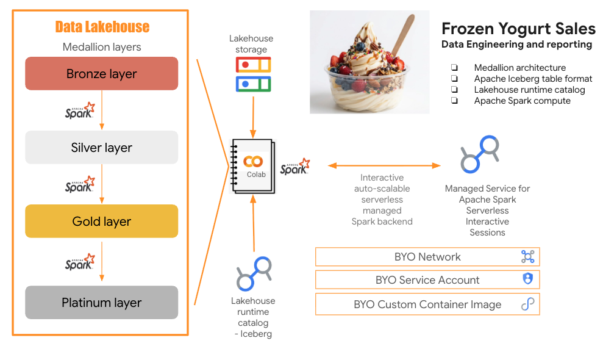   
<br><br>

We will build the medallion architecture with Apache Spark, and from silver layer and upwards, we will persist to Apache Iceberg format, with tables registered into Lakehouse Iceberg runtime catalog. We will ue frozen yogurt retail sales data generated with Gemini for the lab, and the platinum layer will imclude a number of reports generated with code assistance from Data Science Agent in Colab notebooks.


<hr>

### 1.9. Lab Flow

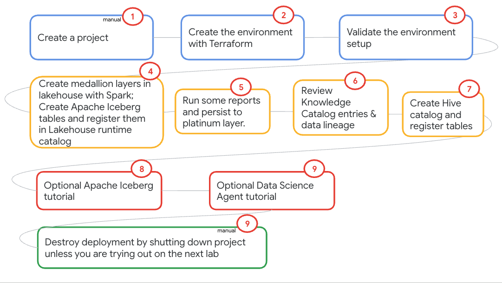   
<br><br>

<hr>

### 1.10. The data 

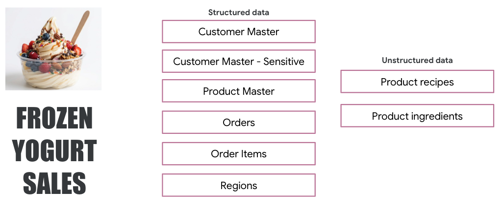   
<br><br>

<hr>

### 1.11. The relationships between the data entities

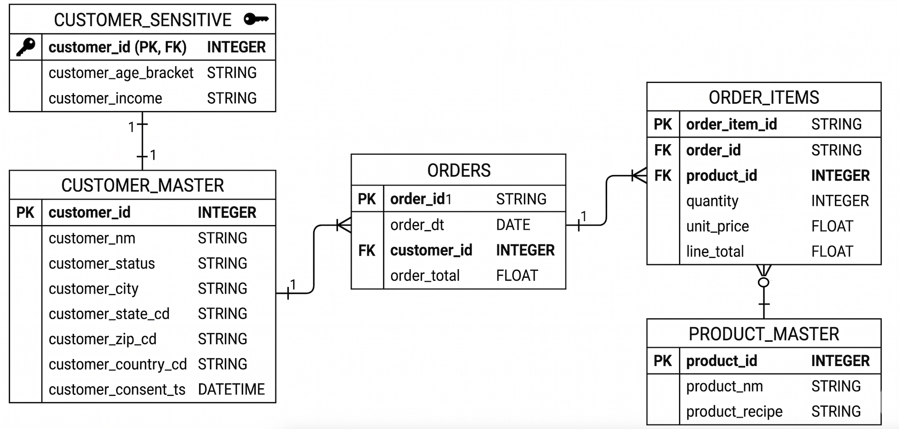   
<br><br>

<hr>


### 1.12. Table of contents

|#| Content | 
| -- | :--- | 
|1| [[INFORMATIONAL] Lakehouse reference architecture](./ts3-manual.md#181-lakehouse-reference-architecture) | 
|2| [[ABOUT THE LAB] Lab solution architecture](./ts3-manual.md#182-lab-solution-architecture) | 
|3| [[ABOUT THE LAB] Lab flow](./ts3-manual.md#19-lab-flow) | 
|4| [[ABOUT THE LAB] The data used in the lab](./ts3-manual.md#110-the-data) | 
|5| [[ABOUT THE LAB] ER diagram of the lab data](./ts3-manual.md#111-the-relationships-between-the-data-entities) | 
|6| [[ABOUT THE LAKEHOUSE RUNTIME CATALOG] Product highlights](./ts3-manual.md#2-product-highlights) | 
|7| [[LAB SETUP] Lab setup with Terraform](./ts3-manual.md#3-lab-setup) | 
|8| [[LAB SETUP] Lab resources provisioned](./ts3-manual.md#35-explore-the-resources-provisioned) | 
|9| [[INFORMATIONAL] Authentication modes for Lakehouse runtime catalog](./ts3-manual.md#451-authentication-modes-supported-with-lakehouse-runtime-catalog) | 
|10| [[INFORMATIONAL] Spark session configruation for **End User Credentials** authentication mode](./ts3-manual.md#451-end-user-credentials-authentication-mode)| 
|11| [[INFORMATIONAL] Spark session configruation for **Credential Vending** authentication mode](./ts3-manual.md#453-spark-session-configuration-for-credential-vending-authentication-mode)| 
|12| [[INFORMATIONAL] Authenticating with End User Credentials - what's involved](./ts3-manual.md#454-authenticating-with-end-user-credentials---whats-involved)|
|13| [[INFORMATIONAL] Authenticating with Credential Vending - what's involved](./ts3-manual.md#455-authenticating-with-credential-vending---whats-involved) |
|14| [[INFORMATIONAL] Authorization - out of the box IAM roles](./ts3-manual.md#461-authorization---out-of-the-box-iam-roles)|
|15| [[INFORMATIONAL] Access Control List (ACLs)](./ts3-manual.md#461-authorization---out-of-the-box-iam-roles)|
|16| [[INFORMATIONAL] Abolsutely minimal access with just read only to one table - what's involved](./ts3-manual.md#463-abolsutely-minimal-access-with-just-read-only-to-one-table---whats-involved) |
|17| [[ICEBERG CATALOG LAB] Lakehouse Iceberg runtime catalog lab - pictorial overview](./ts3-manual.md#43-lab-content---pictorial-overview) | 
|18| [[ICEBERG CATALOG LAB] Medallion architecture with Lakehouse runtime catalog for Iceberg with end user credentials](./ts3-manual.md#432-create-a-medallion-architecture-with-lakehouse-runtime-catalog-for-iceberg-as-the-metastore) | 
|21| [[ICEBERG CATALOG LAB] Out of the box data entry creation into Knowledge Catalog for Apache Iceberg tables in the Lakehouse runtime catalog](./ts3-manual.md#472-automated-knowledge-catalog-entry-creation) | 
|20| [[ICEBERG CATALOG LAB] Out of the box data lineage for Apache Iceberg tables in the Lakehouse runtime catalog](./ts3-manual.md#473-automated-lineage-capture-in-knowledge-catalog) | 
|21| [[ICEBERG CATALOG LAB] Apache Iceberg table format primer](./ts3-manual.md#433-optional-apache-iceberg-tutorial) | 
|22| [[BONUS] Prompt based data anaysis with Data Science Agent in Colab notebook - a primer](./ts3-manual.md#434-optional-data-analysis-lab-with-data-science-agent-in-colab-notebooks) | 
|23| [[HIVE CATALOG LAB] Lakehouse Hive runtime catalog lab](./ts3-manual.md#5-lab-for-hive-catalog) | 

<hr>

### 1.13. For success

Read the lab - narrative below, review the code, and then start trying out the lab.

<hr>


<hr>

# 2. Product Highlights


## Lakehouse runtime catalog

This hands-on lab complements the blog post [Lakehouse Demystified - Part 4: Just enough about Lakehouse runtime catalog](TODO) - reading the blog is recommended for full understanding of the product. The product documentation can be found [here](https://docs.cloud.google.com/lakehouse/docs/about-lakehouse-catalogs).

<hr>


# 3. Lab setup

<hr>

## 3.1. Clone this repo in Cloud Shell

```
git clone git@github.com:GoogleCloudPlatform/lakehouse-solutions.git
```

<hr>

## 3.2. Initialize active gcloud configuration

Run the following commands in Cloud Shell to authenticate and configure your active project:

1. Initialization:
```
gcloud init
```

2. Set the active project target:
```
gcloud config set project <YOUR_PROJECT_ID>
```

3. Set the quota project for ADC (Application Default Credentials):
```
gcloud auth application-default set-quota-project <YOUR_PROJECT_ID>
```

<hr>

## 3.3. Provisioning automation of foundational services with Terraform 

The Terraform in this section updates organization policies and enables Google APIs. The organization policy updates are needed for the Google Argolis environment but may not be needed in your environment - check with your administrator. If not needed, remove the section for organization policy updates.

1. Paste this in Cloud Shell
```
PROJECT_ID=`gcloud config list --format "value(core.project)" 2>/dev/null`

cd ~/lakehouse-solutions-build/solutions/spark-serverless-features/provisioning-automation/foundations-tf
```

2. Run the Terraform for organization policy edits and enabling Google APIs
```
terraform init
terraform apply \
  -var="project_id=${PROJECT_ID}" \
  -auto-approve >> spark-serverless-features-tf-foundations.output
```

Wait till the provisioning completes - ~5 minutes. In a separate cloud shell tab, you can tail the output file for execution state through completion-

```
tail -f  ~/lakehouse-solutions-build/solutions/spark-serverless-features/provisioning-automation/foundations-tf/spark-serverless-features-tf-foundations.output
```

<hr>

## 3.4. Provisioning automation of compute and data services with Terraform

### 3.4.1. Resources provisioned
In this section, we will provision-

#### 3.4.1.1. Network, subnet, firewall rule

   
<br><br>

   
<br><br>

   
<br><br>

<hr>


#### 3.4.1.2. Storage buckets for code, datasets, and for use with the services

   
<br><br>

<hr>

#### 3.4.1.3. User Managed Service Account (UMSA)

   
<br><br>


<hr>

#### 3.4.1.4. Requisite IAM permissions for the UMSA and yourself* 
*IAM permissions for yourself in case you want to go the console route instead of the programmatic route.<br>


   
<br><br>

Permissions for you to act as service account.

   
<br><br>

   
<br><br>

   
<br><br>


<hr>

#### 3.4.1.5. Copy of code, data, etc into buckets


   
<br><br>


   
<br><br>

<hr>

#### 3.4.1.6. Iceberg catalog in Lakehouse runtime catalog service


   
<br><br>

<hr>

#### 3.4.1.7. Hive catalog in Lakehouse runtime catalog service

This is a private preview feature and there is no UI component yet and the list command is yet to be released. You can however check the catalog out via Spark - this is part of the lab.

<hr>

#### 3.4.1.8. Managed Service for Apache Airflow** 
**Aiflow environment has been set up for the next solution that features data engineering pipeline on Managed Service for Apache Airflow

   
<br><br>

<hr>


### 3.4.2. Run the terraform scripts
Paste this in Cloud Shell after editing the GCP region variable to match your nearest region-
```
cd ~/lakehouse-solutions-build/solutions/spark-serverless-features/provisioning-automation/core-tf/terraform

PROJECT_ID=`gcloud config list --format "value(core.project)" 2>/dev/null`
PROJECT_NBR=`gcloud projects describe $PROJECT_ID | grep projectNumber | cut -d':' -f2 |  tr -d "'" | xargs`
PROJECT_NAME=`gcloud projects describe ${PROJECT_ID} | grep name | cut -d':' -f2 | xargs`
GCP_ACCOUNT_NAME=`gcloud auth list --filter=status:ACTIVE --format="value(account)"`
GCP_REGION="us-central1"
DEPLOYER_ACCOUNT_NAME=$GCP_ACCOUNT_NAME
ORG_ID=`gcloud organizations list --format="value(name)"`
S8S_SPARK_RUNTIME_VERSION="2.3"

```

2. Run the Terraform for provisioning the rest of the environment
```
terraform init
terraform apply \
  -var="project_id=${PROJECT_ID}" \
  -var="project_name=${PROJECT_NAME}" \
  -var="project_number=${PROJECT_NBR}" \
  -var="gcp_account_name=${GCP_ACCOUNT_NAME}" \
  -var="deployment_service_account_name=${DEPLOYER_ACCOUNT_NAME}" \
  -var="org_id=${ORG_ID}" \
  -var="spark_runtime_version=${S8S_SPARK_RUNTIME_VERSION}" \
  -var="gcp_region=${GCP_REGION}" \
  -auto-approve >> spark-serverless-features-tf-core.output
  
```

Takes ~50 minutes to complete. In a separate cloud shell tab, you can tail the output file for execution state through completion-

```
tail -f ~/lakehouse-solutions-build/solutions/spark-serverless-features/provisioning-automation/core-tf/terraform/spark-serverless-features-tf-core.output
```

<br>

<hr>

## 3.5. Explore the resources provisioned

Refer section 3.4 and browse all the services provisioned. In this section we will just explore the data and code.


Paste the following variables in Cloud Shell-
```
PROJECT_ID=`gcloud config list --format "value(core.project)" 2>/dev/null`
PROJECT_NBR=`gcloud projects describe $PROJECT_ID | grep projectNumber | cut -d':' -f2 |  tr -d "'" | xargs`
DATA_BUCKET="froyo-lakehouse-staging-${PROJECT_NBR}"
CODE_BUCKET="froyo-lab-code-bucket-${PROJECT_NBR}"
```

<br>

<hr>

### 3.5.1. GCS bucket for code

Run this command in Cloud Shell-
```
gcloud storage ls -r "gs://froyo-lab-code-bucket-$PROJECT_NBR"
```

   
<br><br>

<hr>

### 3.5.2. GCS bucket for structured data

Run this command in Cloud Shell-
```
gcloud storage  ls -r "gs://$DATA_BUCKET/froyo-data"
```

   
<br><br>

<hr>


### 3.5.3. GCS bucket for unstructured data - froyo recipes

Run this command in Cloud Shell-
```
gcloud storage  ls -r  "gs://$DATA_BUCKET/froyo-recipe-pdfs"
```


   
<br><br>


   
<br><br>

   
<br><br>

<hr>

### 3.5.4. GCS bucket for unstructured data - froyo recipe ingredients*
We will use this in a future lab.<br>

Run this command in Cloud Shell-
```
gcloud storage  ls -r  "gs://$DATA_BUCKET/froyo-recipe-ingredients-pdfs"
```


   
<br><br>


   
<br><br>


   
<br><br>

<hr>
<hr>

# 4. Lab for Iceberg Catalog

1. This lab has a notebook that you will upload to BigQuery Studio (Colab) and execute.<br>
2. Behind the scenes it uses Managed Spark Serverless - Interactive Sessions.<br>
3. Authentication is with End User Credentials (EUC) - as yourself.<br>
4. Authorization is not part of the lab but is explained with commands and screenshots.


## 4.1. Upload the notebook

Go to BigQuery Studio and upload the [notebook](../provisioning-automation/core-tf/notebooks/lrc_iceberg_catalog_tutorial.ipynb) as shown below.

a) Copy the notebook URL below.
https://github.com/GoogleCloudPlatform/lakehouse-solutions/blob/main/solutions/spark-serverless-features/provisioning-automation/core-tf/notebooks/lrc_iceberg_catalog_tutorial.ipynb


b) Go to BigQuery Studio and upload it

   
<br><br>

<hr>

Use this URL to upload notebook from URL:<br>
https://github.com/GoogleCloudPlatform/lakehouse-solutions/blob/main/solutions/spark-serverless-features/provisioning-automation/core-tf/notebooks/lrc_iceberg_catalog_tutorial.ipynb

   
<br><br>

<hr>

## 4.2. Create a runtime, and connect to it

   
<br><br>

<hr>

   
<br><br>

<hr>

This is what it looks like after you are connected to a runtime.
   
<br><br>

<hr>


## 4.3. Lab content - pictorial overview

This lab uses synthetically generated frozen yogurt sales - retail dataset. As part of the lab, we will curate data and run some reports.

<hr>

### 4.3.1. Setup and create Iceberg catalog namespace

   
<br><br>

<hr>

### 4.3.2. Create a medallion architecture with Lakehouse runtime catalog for Iceberg as the metastore

We will create 4 layers of medallion architecture-
1. Bronze: Data as is from source
2. Silver: Curated data with cleansing, and transformations applied
3. Gold: Consumable data - denormalized/optimized for analysis
4. Platinum: Data Mart with reports 

   
<br><br>

<hr>

### 4.3.3. [Optional] Apache Iceberg tutorial

A 101 on Apache Iceberg
   
<br><br>

<hr>

### 4.3.4. [Optional] Data analysis lab with Data Science Agent in Colab notebooks

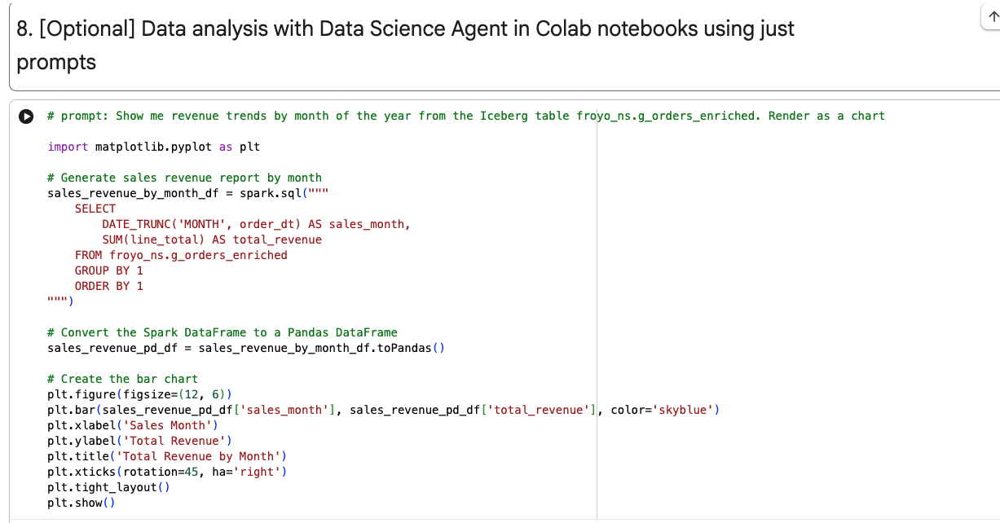   
<br><br>

<hr>


## 4.4. Run through the lab

Execute each section cell by cell for an immersive learning experience.

<hr>

## 4.5. Authentication against Lakehouse runtime catalog

### 4.5.1. Authentication modes supported with Lakehouse runtime catalog

| |  |  |
| -- | :--- | :--- | 
| 1 | End User Credentials | as yourself - great for autinng individual access | 
| 2 | Service Account | many users can impersonate a single non-human application principal | 
| 3 | Credential vending | Credential vending for the Lakehouse runtime catalog lets you delegate storage access and apply fine-grained permissions to your data files. This capability lets you manage Identity and Access Management (IAM) policies at the table level for tables stored in Cloud Storage - you give access to the tables in the catalog, not to the storage. |

<hr>


### 4.5.2. Spark session configuration for **End User Credentials** authentication mode
The following are Spark session configurations, specific to Managed Spark Serverless - interactive sessions.
```
from google.cloud.dataproc_spark_connect import DataprocSparkSession
from google.cloud.dataproc_v1 import Session
from pyspark.sql import functions as F

REST_API_VERSION="v1beta" # for lineage

# Create the Dataproc Serverless session.
s8s_spark_session = Session()

# Serverless runtime at authoring was 3.0 with Iceberg 1.10
s8s_spark_session.runtime_config.properties[f"spark.sql.defaultCatalog"] = ICEBERG_CATALOG_NAME
s8s_spark_session.runtime_config.properties[f"spark.sql.catalog.{ICEBERG_CATALOG_NAME}"] = "org.apache.iceberg.spark.SparkCatalog"
s8s_spark_session.runtime_config.properties[f"spark.sql.catalog.{ICEBERG_CATALOG_NAME}.type"] = "rest"
s8s_spark_session.runtime_config.properties[f"spark.sql.catalog.{ICEBERG_CATALOG_NAME}.uri"] = f"https://biglake.googleapis.com/iceberg/{REST_API_VERSION}/restcatalog"
s8s_spark_session.runtime_config.properties[f"spark.sql.catalog.{ICEBERG_CATALOG_NAME}.warehouse"] = f"gs://{ICEBERG_LAKEHOUSE_BUCKET_NAME}"
s8s_spark_session.runtime_config.properties[f"spark.sql.catalog.{ICEBERG_CATALOG_NAME}.io-impl"] = "org.apache.iceberg.gcp.gcs.GCSFileIO"
s8s_spark_session.runtime_config.properties[f"spark.sql.catalog.{ICEBERG_CATALOG_NAME}.header.x-goog-user-project"] = PROJECT_ID
s8s_spark_session.runtime_config.properties[f"spark.sql.catalog.{ICEBERG_CATALOG_NAME}.rest.auth.type"] = "org.apache.iceberg.gcp.auth.GoogleAuthManager"
s8s_spark_session.runtime_config.properties[f"spark.sql.extensions"] = "org.apache.iceberg.spark.extensions.IcebergSparkSessionExtensions"
s8s_spark_session.runtime_config.properties[f"spark.sql.catalog.{ICEBERG_CATALOG_NAME}.rest-metrics-reporting-enabled"] = "false"
s8s_spark_session.runtime_config.properties["spark.dataproc.lineage.enabled"] = "true"
s8s_spark_session.runtime_config.properties["spark.openlineage.transport.type"] = "gcplineage"
s8s_spark_session.runtime_config.properties["spark.extraListeners"] = "io.openlineage.spark.agent.OpenLineageSparkListener"
s8s_spark_session.runtime_config.properties["spark.sql.repl.eagerEval.enabled"] = "True" # Property values should be strings
s8s_spark_session.runtime_config.properties["spark.openlineage.namespace"] = "froyo_spark_jobs"
s8s_spark_session.runtime_config.properties["spark.log.level.io.openlineage"] = "DEBUG"


spark = (DataprocSparkSession.builder
    .appName(APP_NAME)
    .dataprocSessionConfig(s8s_spark_session)
    .getOrCreate())
```


### 4.5.3. Spark session configuration for **Credential Vending** authentication mode
The following are Spark session configurations, and in the example below, specific to Managed Spark Serverless - interactive sessions.
```
from google.cloud.dataproc_spark_connect import DataprocSparkSession
from google.cloud.dataproc_v1 import Session
from pyspark.sql import functions as F

REST_API_VERSION="v1beta"

# Create the Dataproc Serverless session.
s8s_spark_session = Session()

# Serverless runtime at authoring was 3.0 with Iceberg 1.10
s8s_spark_session.runtime_config.properties[f"spark.sql.defaultCatalog"] = ICEBERG_CATALOG_NAME
s8s_spark_session.runtime_config.properties[f"spark.sql.catalog.{ICEBERG_CATALOG_NAME}"] = "org.apache.iceberg.spark.SparkCatalog"
s8s_spark_session.runtime_config.properties[f"spark.sql.catalog.{ICEBERG_CATALOG_NAME}.type"] = "rest"
s8s_spark_session.runtime_config.properties[f"spark.sql.catalog.{ICEBERG_CATALOG_NAME}.uri"] = f"https://biglake.googleapis.com/iceberg/{REST_API_VERSION}/restcatalog"
s8s_spark_session.runtime_config.properties[f"spark.sql.catalog.{ICEBERG_CATALOG_NAME}.warehouse"] = f"gs://{ICEBERG_LAKEHOUSE_BUCKET_NAME}"
s8s_spark_session.runtime_config.properties[f"spark.sql.catalog.{ICEBERG_CATALOG_NAME}.io-impl"] = "org.apache.iceberg.gcp.gcs.GCSFileIO"
s8s_spark_session.runtime_config.properties[f"spark.sql.catalog.{ICEBERG_CATALOG_NAME}.header.x-goog-user-project"] = PROJECT_ID
s8s_spark_session.runtime_config.properties[f"spark.sql.catalog.{ICEBERG_CATALOG_NAME}.rest.auth.type"] = "org.apache.iceberg.gcp.auth.GoogleAuthManager"
s8s_spark_session.runtime_config.properties[f"spark.sql.extensions"] = "org.apache.iceberg.spark.extensions.IcebergSparkSessionExtensions"
s8s_spark_session.runtime_config.properties[f"spark.sql.catalog.{ICEBERG_CATALOG_NAME}.rest-metrics-reporting-enabled"] = "false"
s8s_spark_session.runtime_config.properties["spark.dataproc.lineage.enabled"] = "true"
s8s_spark_session.runtime_config.properties["spark.openlineage.transport.type"] = "gcplineage"
s8s_spark_session.runtime_config.properties["spark.extraListeners"] = "io.openlineage.spark.agent.OpenLineageSparkListener"
s8s_spark_session.runtime_config.properties["spark.sql.repl.eagerEval.enabled"] = "True" # Property values should be strings
s8s_spark_session.runtime_config.properties["spark.openlineage.namespace"] = "froyo_spark_jobs"
s8s_spark_session.runtime_config.properties["spark.log.level.io.openlineage"] = "DEBUG"


spark = (DataprocSparkSession.builder
    .appName(APP_NAME)
    .dataprocSessionConfig(s8s_spark_session)
    .getOrCreate())
```


<hr>

### 4.5.4. Authenticating with End User Credentials - what's involved
In the lab you executed, *we authenticated to tables and data in storage as ourselves using end user credentials*.
And access was granted at project level.

<hr>

### 4.5.5. Authenticating with credential vending - what's involved

1. You need to create a catalog with credential vending enabled OR update your catalog to support it

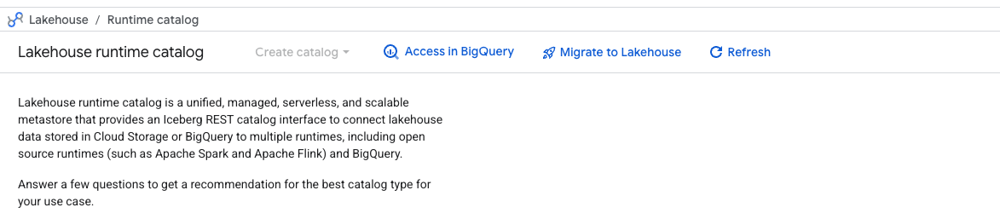   
<br><br>


2. Once enabled, a service account is created by default. This service account is not visible in IAM as its owned by the product - not the consumer project (your project).

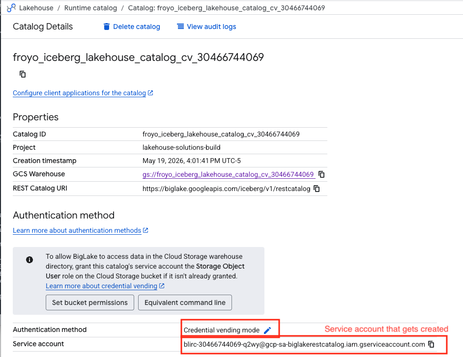   
<br><br>


3. This service account needs to be granted storage object user roles

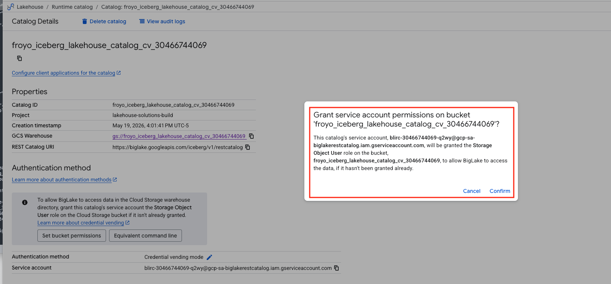   
<br><br>

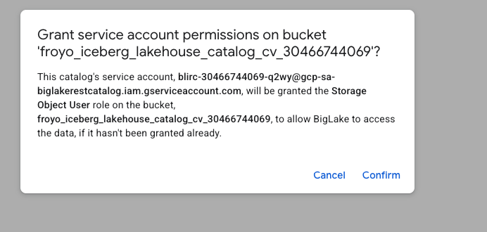   
<br><br>


6. You still need table ACLs to minimize access, but you dont need to grant storage access to your users.

<br>

8. In terms of Spark session configs including credential vending, the following is the list:

```
from google.cloud.dataproc_spark_connect import DataprocSparkSession
from google.cloud.dataproc_v1 import Session
from pyspark.sql import functions as F

REST_API_VERSION="v1beta"

# Create the Dataproc Serverless session.
s8s_spark_session = Session()

# Serverless runtime at authoring was 3.0 with Iceberg 1.10
s8s_spark_session.runtime_config.properties["spark.sql.defaultCatalog"] = ICEBERG_CATALOG_NAME
s8s_spark_session.runtime_config.properties[f"spark.sql.catalog.{ICEBERG_CATALOG_NAME}"] = "org.apache.iceberg.spark.SparkCatalog"
s8s_spark_session.runtime_config.properties[f"spark.sql.catalog.{ICEBERG_CATALOG_NAME}.type"] = "rest"
s8s_spark_session.runtime_config.properties[f"spark.sql.catalog.{ICEBERG_CATALOG_NAME}.uri"] = f"https://biglake.googleapis.com/iceberg/{REST_API_VERSION}/restcatalog"
s8s_spark_session.runtime_config.properties[f"spark.sql.catalog.{ICEBERG_CATALOG_NAME}.warehouse"] = f"gs://{ICEBERG_LAKEHOUSE_BUCKET_NAME}"
s8s_spark_session.runtime_config.properties[f"spark.sql.catalog.{ICEBERG_CATALOG_NAME}.io-impl"] = "org.apache.iceberg.gcp.gcs.GCSFileIO"
s8s_spark_session.runtime_config.properties[f"spark.sql.catalog.{ICEBERG_CATALOG_NAME}.header.x-goog-user-project"] = PROJECT_ID
s8s_spark_session.runtime_config.properties[f"spark.sql.catalog.{ICEBERG_CATALOG_NAME}.rest.auth.type"] = "org.apache.iceberg.gcp.auth.GoogleAuthManager"
s8s_spark_session.runtime_config.properties["spark.sql.extensions"] = "org.apache.iceberg.spark.extensions.IcebergSparkSessionExtensions"
s8s_spark_session.runtime_config.properties[f"spark.sql.catalog.{ICEBERG_CATALOG_NAME}.rest-metrics-reporting-enabled"] = "false"
s8s_spark_session.runtime_config.properties[f"spark.sql.catalog.{ICEBERG_CATALOG_NAME}.header.X-Iceberg-Access-Delegation"] = "vended-credentials"
s8s_spark_session.runtime_config.properties[f"spark.sql.catalog.{ICEBERG_CATALOG_NAME}.gcs.oauth2.refresh-credentials-endpoint"] = "https://oauth2.googleapis.com/token"
s8s_spark_session.runtime_config.properties["spark.dataproc.lineage.enabled"] = "true"
s8s_spark_session.runtime_config.properties["spark.openlineage.transport.type"] = "gcplineage"
s8s_spark_session.runtime_config.properties["spark.extraListeners"] = "io.openlineage.spark.agent.OpenLineageSparkListener"
s8s_spark_session.runtime_config.properties["spark.sql.repl.eagerEval.enabled"] = "True" # Property values should be strings
s8s_spark_session.runtime_config.properties["spark.openlineage.namespace"] = "froyo_spark_jobs"
s8s_spark_session.runtime_config.properties["spark.log.level.io.openlineage"] = "DEBUG"


spark = (DataprocSparkSession.builder
    .appName(APP_NAME)
    .dataprocSessionConfig(s8s_spark_session)
    .getOrCreate())

```

<hr>

## 4.6. Authorization 

### 4.6.1. Authorization - out of the box IAM roles
There are fundamentally 3 out of the box [IAM roles](https://docs.cloud.google.com/lakehouse/docs/iam-roles#lakehouse-roles). These can be applied with ACLs.
| |  |  | | 
| -- | :--- | :--- | :--- | 
| 1 | Lakehouse administrator | roles/biglake.admin | Provides full access to all lakehouse resources | 
| 2 | Lakehouse editor | roles/biglake.editor | Provides read and write access to all lakehouse resources | 
| 3 | Lakehouse viewer | roles/biglake.admin | Provides read-only access to all lakehouse resources |

<hr>

### 4.6.2. Access Control List (ACLs)
The IAM roles in the section above can be applied with [ACLs at a project, catalog, namespace or table level](https://docs.cloud.google.com/lakehouse/docs/manage-tables-acl) to a user or an IAM group.

<hr>


### 4.6.3. Abolsutely minimal access with just read only to one table - what's involved

If you want to give a user, just barebones access to read a specific table with no other access in the Google Cloud project, here is how you do it.

**NOTE**: Avoid giving the user blanket project viewer access, prefer resource specific access.

1. With EUC authentication mode, in addition to access to Lakehouse (formerly called Biglake), we need to give the user storage object viewer - ```roles/storage.objectViewer``` at project level or Lakehouse bucket level.
2. With credential vending authentication mode, the user does not need access to the Lakehouse storage bucket whatsoever
3. If you want the user to be able to run queries against the Iceberg tables in BigQuery with PCNT syntax, they need - ```roles/bigquery.jobUser``` 
4. Finaly - to apply read access to just one single table, you need create a policy file and then apply the policy as shown below. Modify the role to `roles/biglake.editor` or `roles/biglake.admin` as needed, and the member to `group` if you dont want to set at `user` level.

Here is an example:<br>
We want to give a user called Biscuit read access to the Lakehouse Iceberg table `p_rdm_revenue_by_month` in the `froyo_ns` Iceberg namespace within the Lakehouse runtime catalog for Iceberg - `froyo_iceberg_lakehouse_catalog_30466744069`<br>
1. Create the policy file (`lrci-policy-json`) with the user or group (replace 'user:' with 'group:' for group access)<br>
```
{
  "bindings": [
    {
      "role": "roles/biglake.viewer",
      "members": [
        "user:biscuit@akhanolkar.altostrat.com",
      ]
    },
  ],
  "etag": "ACAB",
  "version": 1
}
````

2. Apply the policy
```
gcloud alpha biglake iceberg tables set-iam-policy p_rdm_revenue_by_month lrci-policy.json --catalog="froyo_iceberg_lakehouse_catalog_30466744069" --namespace="froyo_ns"
```

3. With this, Biscuit can only access this one table and query it and does not have access to any other namespace or table.

<hr>

## 4.7. Knowledge Catalog - automated entry creation and lineage capture

### 4.7.1. Spark - lineage configuration

1. For lineage to be captured, we need the **Knowledge Catalog lineage API** to be enabled.<br>
In the hands on lab, the lineage API is enabled already

2. When authoring Spark code, we need the appropriate **Spark configs for lineage capture** in place.<br>
The below is specific to Managed Spark Serverless Interactive Sessions.

```
from google.cloud.dataproc_spark_connect import DataprocSparkSession
from google.cloud.dataproc_v1 import Session
from pyspark.sql import functions as F

REST_API_VERSION="v1beta"

# Create the Dataproc Serverless session.
s8s_spark_session = Session()

# Serverless runtime at authoring was 3.0 with Iceberg 1.10
s8s_spark_session.runtime_config.properties[f"spark.sql.defaultCatalog"] = ICEBERG_CATALOG_NAME
s8s_spark_session.runtime_config.properties[f"spark.sql.catalog.{ICEBERG_CATALOG_NAME}"] = "org.apache.iceberg.spark.SparkCatalog"
s8s_spark_session.runtime_config.properties[f"spark.sql.catalog.{ICEBERG_CATALOG_NAME}.type"] = "rest"
s8s_spark_session.runtime_config.properties[f"spark.sql.catalog.{ICEBERG_CATALOG_NAME}.uri"] = f"https://biglake.googleapis.com/iceberg/{REST_API_VERSION}/restcatalog"
s8s_spark_session.runtime_config.properties[f"spark.sql.catalog.{ICEBERG_CATALOG_NAME}.warehouse"] = f"gs://{ICEBERG_LAKEHOUSE_BUCKET_NAME}"
s8s_spark_session.runtime_config.properties[f"spark.sql.catalog.{ICEBERG_CATALOG_NAME}.io-impl"] = "org.apache.iceberg.gcp.gcs.GCSFileIO"
s8s_spark_session.runtime_config.properties[f"spark.sql.catalog.{ICEBERG_CATALOG_NAME}.header.x-goog-user-project"] = PROJECT_ID
s8s_spark_session.runtime_config.properties[f"spark.sql.catalog.{ICEBERG_CATALOG_NAME}.rest.auth.type"] = "org.apache.iceberg.gcp.auth.GoogleAuthManager"
s8s_spark_session.runtime_config.properties[f"spark.sql.extensions"] = "org.apache.iceberg.spark.extensions.IcebergSparkSessionExtensions"
s8s_spark_session.runtime_config.properties[f"spark.sql.catalog.{ICEBERG_CATALOG_NAME}.rest-metrics-reporting-enabled"] = "false"

# Lineage configs
s8s_spark_session.runtime_config.properties["spark.dataproc.lineage.enabled"] = "true" # Lineage specific
s8s_spark_session.runtime_config.properties["spark.openlineage.transport.type"] = "gcplineage" # Lineage specific
s8s_spark_session.runtime_config.properties["spark.extraListeners"] = "io.openlineage.spark.agent.OpenLineageSparkListener" # Lineage specific
s8s_spark_session.runtime_config.properties["spark.sql.repl.eagerEval.enabled"] = "True" # Property values should be strings # Lineage specific
s8s_spark_session.runtime_config.properties["spark.openlineage.namespace"] = "froyo_spark_jobs" # Lineage specific
s8s_spark_session.runtime_config.properties["spark.log.level.io.openlineage"] = "DEBUG" # Lineage specific

spark = (DataprocSparkSession.builder
    .appName(APP_NAME)
    .dataprocSessionConfig(s8s_spark_session)
    .getOrCreate())

```

<hr>

### 4.7.2. Automated Knowledge Catalog entry creation


1. Catalog entries:
When a Lakehouse runtime catalog is created, an entry is created in Knowledge Catalog automatically


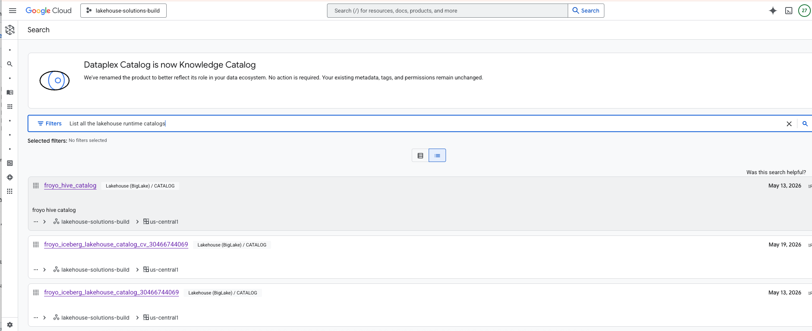   
<br><br>


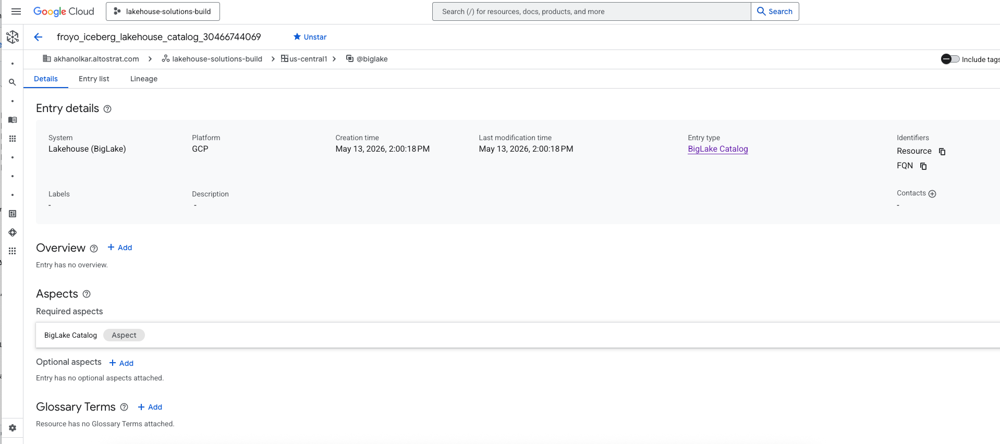   
<br><br>

3. Namespace entries:
When a Iceberg namespace is created in the Lakehouse runtime catalog, an entry is created in Knowledge Catalog automatically

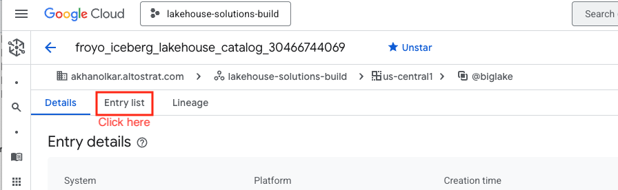   
<br><br>


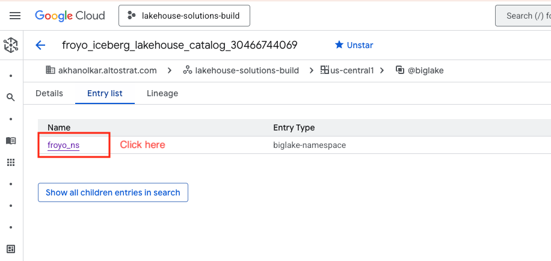   
<br><br>

5. Table entries:
When a table is registered into a Iceberg namespace is created in the Lakehouse runtime catalog, an entry is created in Knowledge Catalog automatically

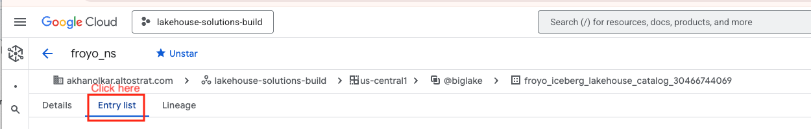   
<br><br>


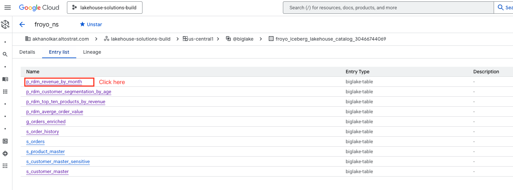   
<br><br>

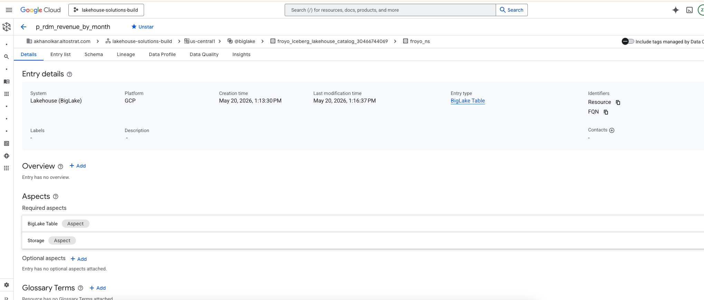   
<br><br>


   
<br><br>

<hr>

### 4.7.3. Automated lineage capture in Knowledge Catalog

You can review lineage in your lab environment by following the screenshots below.<br>

If you click on the entry for the table, and then on 'Lineage' you can see the lineage as shown below.

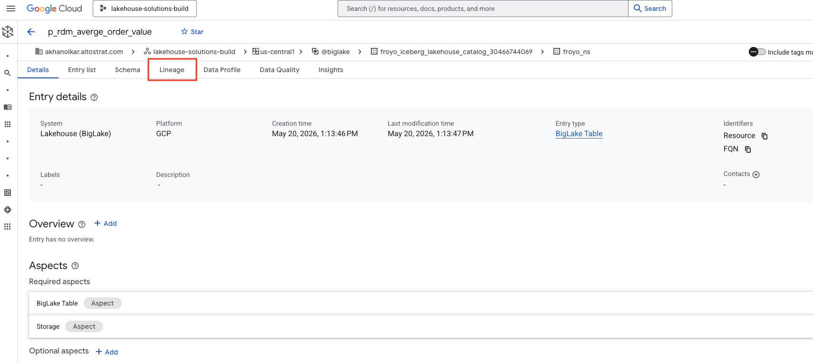   
<br><br>

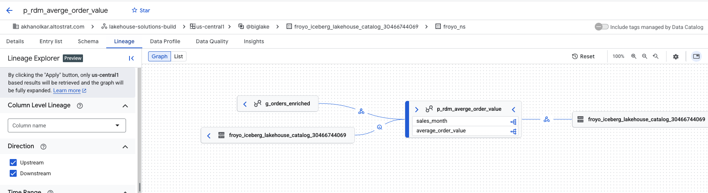   
<br><br>

Here is another one that shows upstream and downstream with many tables - all from the lab.

   
<br><br>

<hr>
<hr>

# 5. Lab for Hive Catalog

This is a **private preview feature** in mid-May 2026.Reach out to your Google Cloud account team to be **allow-listed** to try this feature out.

## 5.1. Lab content
In this lab, we will:
1. Create a bucket for the Hive warehouse
2. Create a catalog
3. Create a database in the catalog
4. Create a table (on froyo parquet data) registered in the catalog
5. Run some queries

## 5.2. Pictorial overview of the lab

   
<br><br>

   
<br><br>

<hr>

## 5.3. Lab

1. Upload the notebook [here](../provisioning-automation/core-tf/notebooks/lrc_hive_catalog_tutorial.ipynb) to BigQuery Studio as shown in the previous section
2. Run through the notebook in entirety

##### =====================================================================================================
##### THIS CONCLUDES THE LAB FOR LAKEHOUSE RUNTIME CATALOG
##### SHUT DOWN THE LAB TO AVOID BILLING UNLESS YOU ARE WORKING ON SUBSEQUENT LABS
##### =====================================================================================================
