*Copyright 2026 Google LLC*

*Licensed under the Apache License, Version 2.0 (the "License");
you may not use this file except in compliance with the License.
You may obtain a copy of the License at*

*http://www.apache.org/licenses/LICENSE-2.0*

*Unless required by applicable law or agreed to in writing, software
distributed under the License is distributed on an "AS IS" BASIS,
WITHOUT WARRANTIES OR CONDITIONS OF ANY KIND, either express or implied.
See the License for the specific language governing permissions and
limitations under the License.*


<hr>

# Technical Solution 3: Introduction to Iceberg and Hive lakehouse metastores  

## 1.0. About the lab

### 1.1. Abstract
This lab is **introductory** in nature and showcases running Apache Spark applications on Google Cloud Platform on the managed product - **Serverless Managed Service for Apache Spark**, with the serverless managed **Lakehouse runtime catalog** as the lakehouse metastore for **Iceberg catalog** and **Hive catalog**. The goal of the lab is to demystify **Lakehouse runtime catalog** through a (zero fluff, zero dazzle) minimum viable end to end example of frozen yogurt (froyo) retail sales analysis to accelerate adoption. This hands-on lab complements the blog post [Lakehouse Demystified - Part 4: Just enough about Lakehouse runtime catalog](TODO).

|  |  | 
| -- | :--- | 
| Technical Focus| **Lakehouse runtime catalog for Iceberg and Hive** |
| Use case |  Frozen yogurt sales analysis |
| Domain |  Retail |
| Process | Data curation and analysis |
| Dataset | Froyo sales - synthetically generated |
| Lakehouse compute engine | Apache Spark on Serverless Managed Service for Apache Spark|


#### What to expect:

In this lab, you will provision the foundational Google Cloud services for the lab and create Iceberg and Hive catalogs in the Lakehouse runtime catalog service. You will then use Spark to read, transform, and analyze the froyo sales data, registering the structured data as tables in these lakehouse catalogs.

<hr>

### 1.2. Lab format

- Includes Terraform for provisioning automation
- Is fully scripted - the entire solution is provided, and with instructions
- Is self-paced/self-service

<hr>


### 1.3. Duration
The hands-on lab takes ~1 hour or less to complete

<hr>

### 1.4. Prerequisites

- A pre-created project
- You *may* need to have organization admin rights or someone who can alter policies for you, project owner privileges or work with privileged users to complete provisioning.

<hr>

### 1.5. Resources provisioned
Covered in subsequent sections - 3.3 and 3.4. 

<hr>

### 1.6. Audience

- A quick read for architects
- Targeted for hands on practitioners, especially data engineers

<hr>

### 1.7. What's covered

| Functionality | Feature | 
| -- | :--- | 
| Provisioning Automation | Terraform for enabling Google APIs, service account creation, IAM permissions, organizational policy updates, network and firewall rules creation, storage buckets creation, file uploads to buckets |
| Data engineering & analysis |  Spark notebooks on Colab in BigQuery Studio |
|  Metastore |  Lakehouse Iceberg catalog for Iceberg and Hive - create and use |
|  Code generation |  Data Science Agent in BigQuery Studio Colab notebook   |
|  Table format Iceberg |  Apache Iceberg 101 with froyo data |

<hr>

### 1.8. Lab Architecture

#### 1.8.1. Lakehouse Reference Architecture

Please refer to the [Lakehouse Demystified - Part 2](https://medium.com/google-cloud/lakehouse-demystified-part-2-just-enough-managed-spark-serverless-on-google-cloud-for-batch-6ac3e5051794) blog post for an explanation.

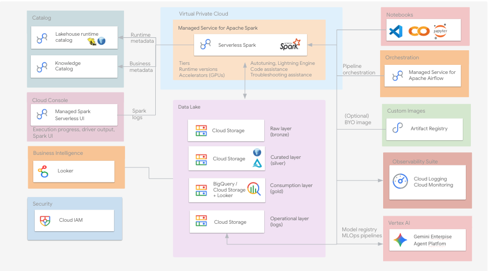   
<br><br>

<hr>

#### 1.8.2. Solution Architecture

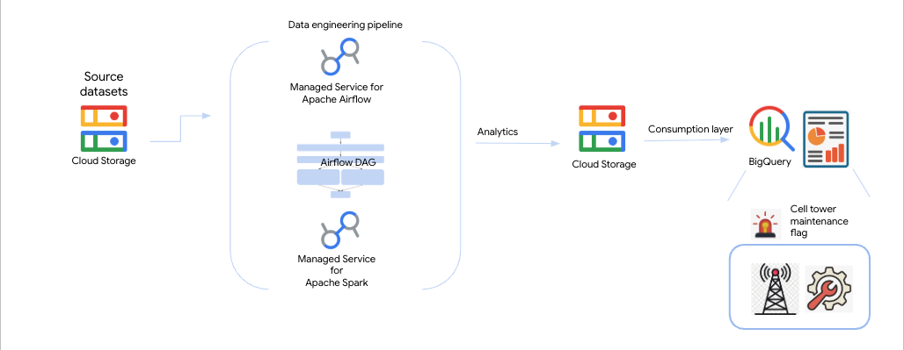   
<br><br>

<hr>

### 1.9. Lab Flow

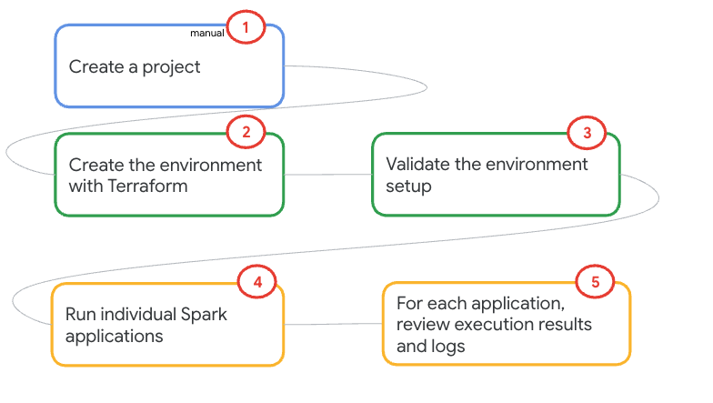   
<br><br>

<hr>

### 1.10. The data

   
<br><br>

<hr>

### 1.11. The relationships between the data entities

   
<br><br>

<hr>


### 1.12. For success

Read the lab - narrative below, review the code, and then start trying out the lab.

<hr>


<hr>

# 2. Product Highlights


## Lakehouse runtime catalog

This hands-on lab complements the blog post [Lakehouse Demystified - Part 4: Just enough about Lakehouse runtime catalog](TODO) - reading the blog is recommended for full understanding of the product. The product documentation can be found [here](https://docs.cloud.google.com/lakehouse/docs/about-lakehouse-catalogs).

<hr>


# 3. Lab setup

<hr>

## 3.1. Clone this repo in Cloud Shell

```
git clone git@github.com:GoogleCloudPlatform/lakehouse-solutions.git
```

<hr>

## 3.2. Initialize active gcloud configuration

Run the following commands in Cloud Shell to authenticate and configure your active project:

1. Initialization:
```
gcloud init
```

2. Set the active project target:
```
gcloud config set project <YOUR_PROJECT_ID>
```

3. Set the quota project for ADC (Application Default Credentials):
```
gcloud auth application-default set-quota-project <YOUR_PROJECT_ID>
```

<hr>

## 3.3. Provisioning automation of foundational services with Terraform 

The Terraform in this section updates organization policies and enables Google APIs. The organization policy updates are needed for the Google Argolis environment but may not be needed in your environment - check with your administrator. If not needed, remove the section for organization policy updates.

1. Paste this in Cloud Shell
```
PROJECT_ID=`gcloud config list --format "value(core.project)" 2>/dev/null`

cd ~/lakehouse-solutions-build/solutions/spark-serverless-features/provisioning-automation/foundations-tf
```

2. Run the Terraform for organization policy edits and enabling Google APIs
```
terraform init
terraform apply \
  -var="project_id=${PROJECT_ID}" \
  -auto-approve >> spark-serverless-features-tf-foundations.output
```

Wait till the provisioning completes - ~5 minutes. In a separate cloud shell tab, you can tail the output file for execution state through completion-

```
tail -f  ~/lakehouse-solutions-build/solutions/spark-serverless-features/provisioning-automation/foundations-tf/spark-serverless-features-tf-foundations.output
```

<hr>

## 3.4. Provisioning automation of compute and data services with Terraform

### 3.4.1. Resources provisioned
In this section, we will provision-

#### 3.4.1.1. Network, subnet, firewall rule

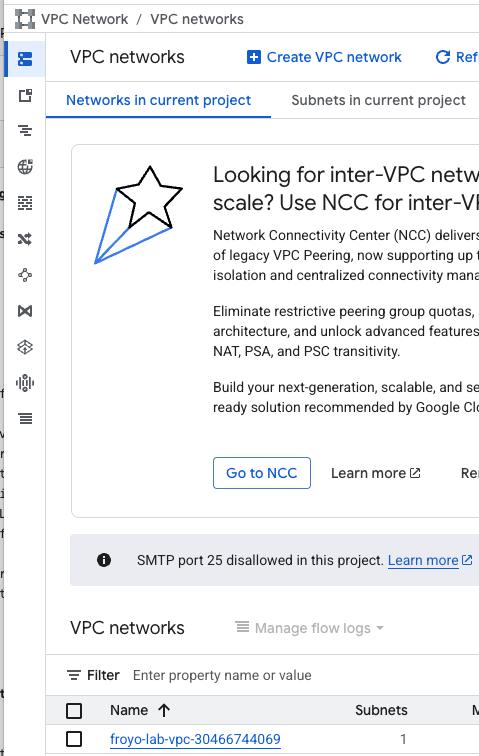   
<br><br>

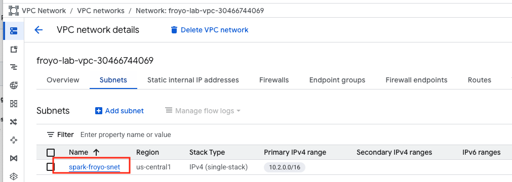   
<br><br>

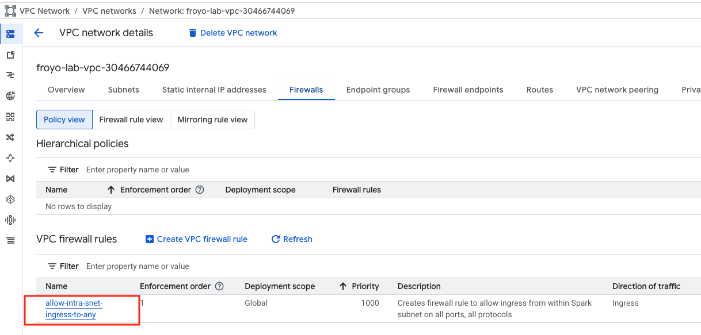   
<br><br>

<hr>


#### 3.4.1.2. Storage buckets for code, datasets, and for use with the services

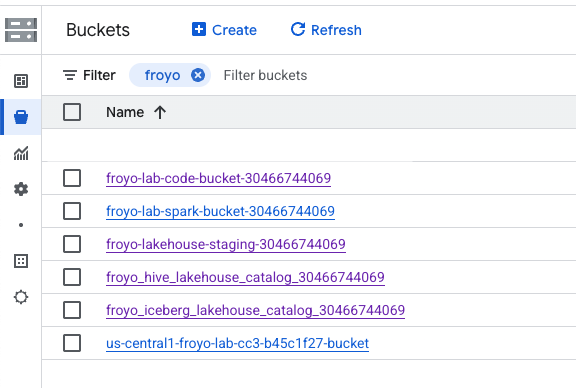   
<br><br>

<hr>

#### 3.4.1.3. User Managed Service Account (UMSA)

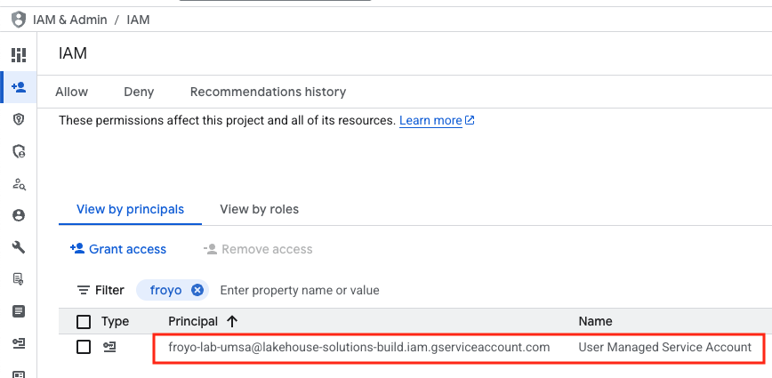   
<br><br>


<hr>

#### 3.4.1.4. Requisite IAM permissions for the UMSA and yourself* 
*IAM permissions for yourself in case you want to go the console route instead of the programmatic route.<br>


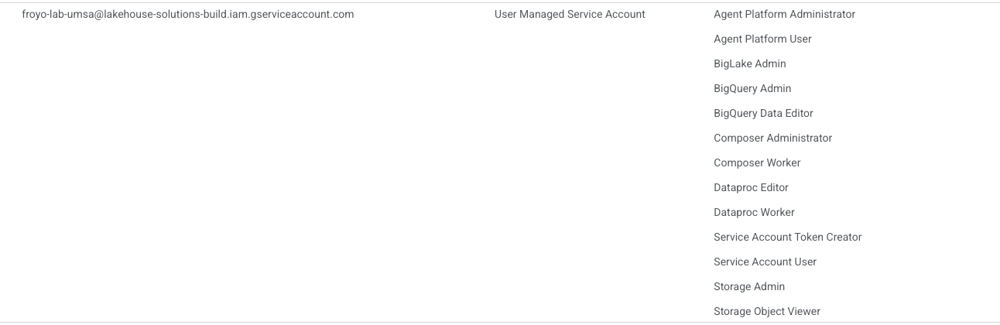   
<br><br>

Permissions for you to act as service account.

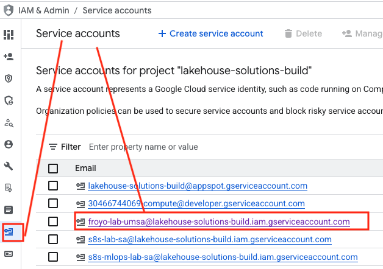   
<br><br>

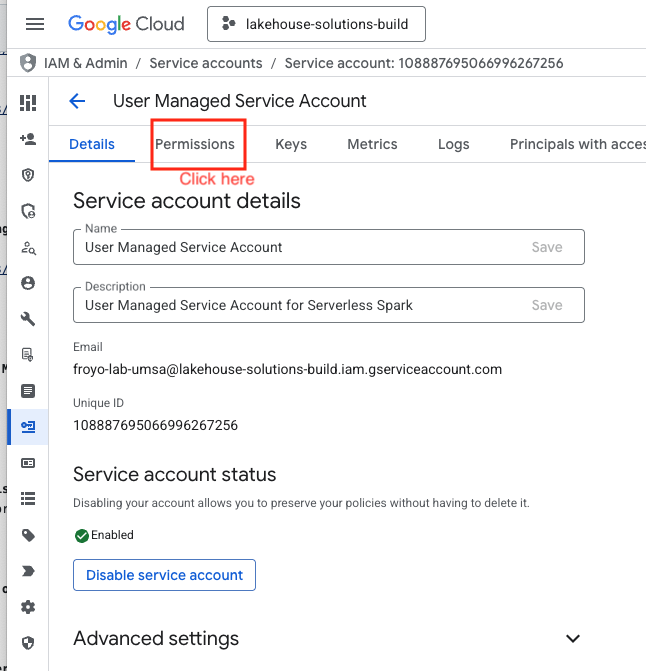   
<br><br>

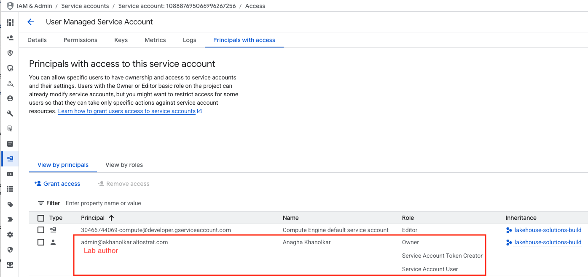   
<br><br>


<hr>

#### 3.4.1.5. Copy of code, data, etc into buckets


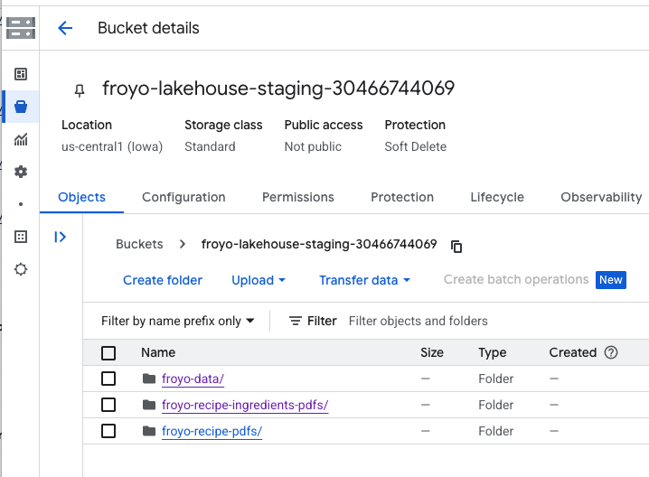   
<br><br>


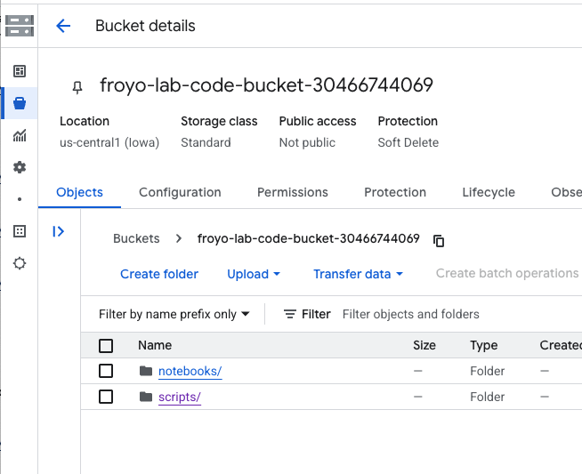   
<br><br>

<hr>

#### 3.4.1.6. Iceberg catalog in Lakehouse runtime catalog service


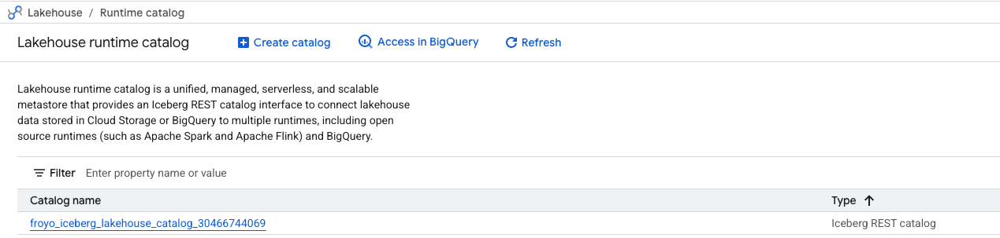   
<br><br>

<hr>

#### 3.4.1.7. Hive catalog in Lakehouse runtime catalog service

This is a private preview feature and there is no UI component yet and the list command is yet to be released. You can however check the catalog out via Spark - this is part of the lab.

<hr>

#### 3.4.1.8. Managed Service for Apache Airflow** 
**Aiflow environment has been set up for the next solution that features data engineering pipeline on Managed Service for Apache Airflow

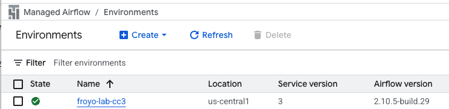   
<br><br>

<hr>


### 3.4.2. Run the terraform scripts
Paste this in Cloud Shell after editing the GCP region variable to match your nearest region-
```
cd ~/lakehouse-solutions-build/solutions/spark-serverless-features/provisioning-automation/core-tf/terraform

PROJECT_ID=`gcloud config list --format "value(core.project)" 2>/dev/null`
PROJECT_NBR=`gcloud projects describe $PROJECT_ID | grep projectNumber | cut -d':' -f2 |  tr -d "'" | xargs`
PROJECT_NAME=`gcloud projects describe ${PROJECT_ID} | grep name | cut -d':' -f2 | xargs`
GCP_ACCOUNT_NAME=`gcloud auth list --filter=status:ACTIVE --format="value(account)"`
GCP_REGION="us-central1"
DEPLOYER_ACCOUNT_NAME=$GCP_ACCOUNT_NAME
ORG_ID=`gcloud organizations list --format="value(name)"`
S8S_SPARK_RUNTIME_VERSION="2.3"

```

2. Run the Terraform for provisioning the rest of the environment
```
terraform init
terraform apply \
  -var="project_id=${PROJECT_ID}" \
  -var="project_name=${PROJECT_NAME}" \
  -var="project_number=${PROJECT_NBR}" \
  -var="gcp_account_name=${GCP_ACCOUNT_NAME}" \
  -var="deployment_service_account_name=${DEPLOYER_ACCOUNT_NAME}" \
  -var="org_id=${ORG_ID}" \
  -var="spark_runtime_version=${S8S_SPARK_RUNTIME_VERSION}" \
  -var="gcp_region=${GCP_REGION}" \
  -auto-approve >> spark-serverless-features-tf-core.output
  
```

Takes ~50 minutes to complete. In a separate cloud shell tab, you can tail the output file for execution state through completion-

```
tail -f ~/lakehouse-solutions-build/solutions/spark-serverless-features/provisioning-automation/core-tf/terraform/spark-serverless-features-tf-core.output
```

<br>

<hr>

## 3.5. Explore the resources provisioned

Refer section 3.4 and browse all the services provisioned. In this section we will just explore the data and code.


Paste the following variables in Cloud Shell-
```
PROJECT_ID=`gcloud config list --format "value(core.project)" 2>/dev/null`
PROJECT_NBR=`gcloud projects describe $PROJECT_ID | grep projectNumber | cut -d':' -f2 |  tr -d "'" | xargs`
DATA_BUCKET="froyo-lakehouse-staging-${PROJECT_NBR}"
CODE_BUCKET="froyo-lab-code-bucket-${PROJECT_NBR}"
```

<br>

<hr>

### 3.5.1. GCS bucket for code

Run this command in Cloud Shell-
```
gcloud storage ls -r "gs://froyo-lab-code-bucket-$PROJECT_NBR"
```

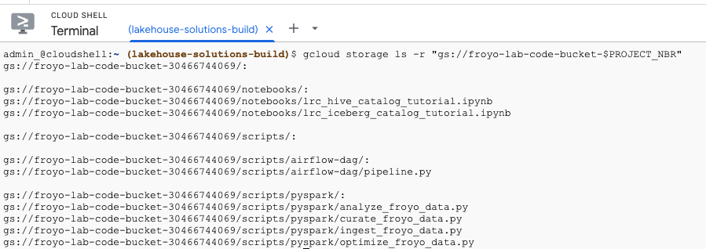   
<br><br>

<hr>

### 3.5.2. GCS bucket for structured data

Run this command in Cloud Shell-
```
gcloud storage  ls -r "gs://$DATA_BUCKET/froyo-data"
```

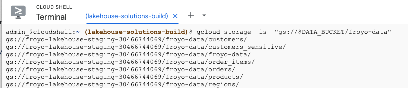   
<br><br>

<hr>


### 3.5.3. GCS bucket for unstructured data - froyo recipes

Run this command in Cloud Shell-
```
gcloud storage  ls -r  "gs://$DATA_BUCKET/froyo-recipe-pdfs"
```


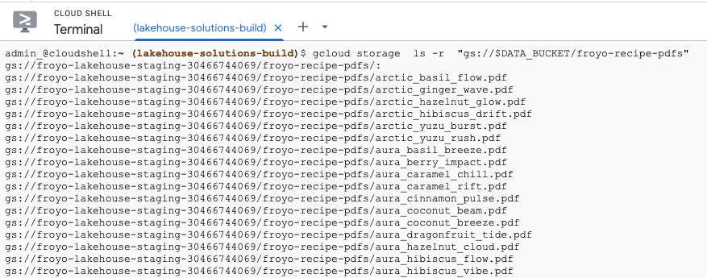   
<br><br>


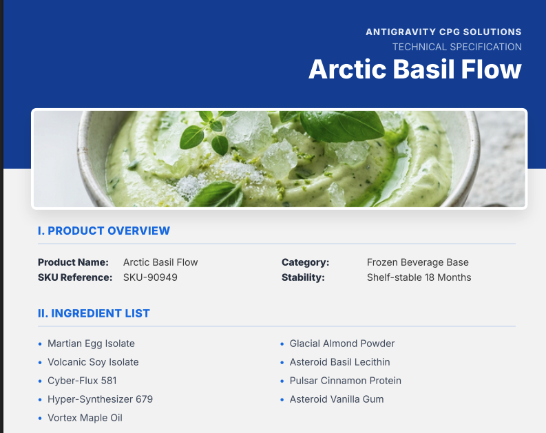   
<br><br>

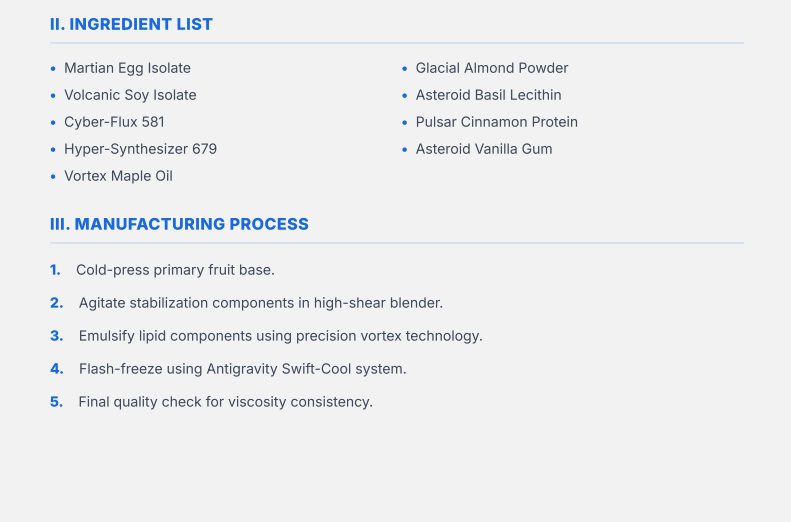   
<br><br>

<hr>

### 3.5.4. GCS bucket for unstructured data - froyo recipe ingredients*
We will use this in a future lab.<br>

Run this command in Cloud Shell-
```
gcloud storage  ls -r  "gs://$DATA_BUCKET/froyo-recipe-ingredients-pdfs"
```


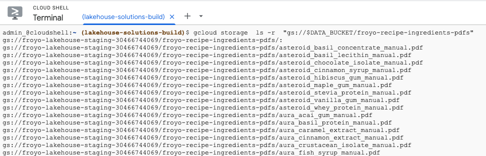   
<br><br>


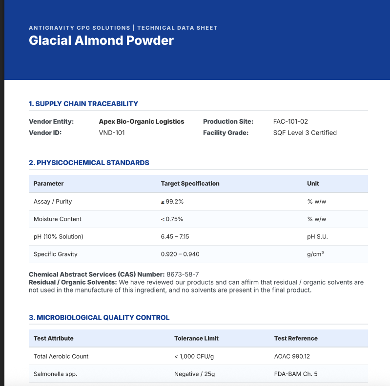   
<br><br>


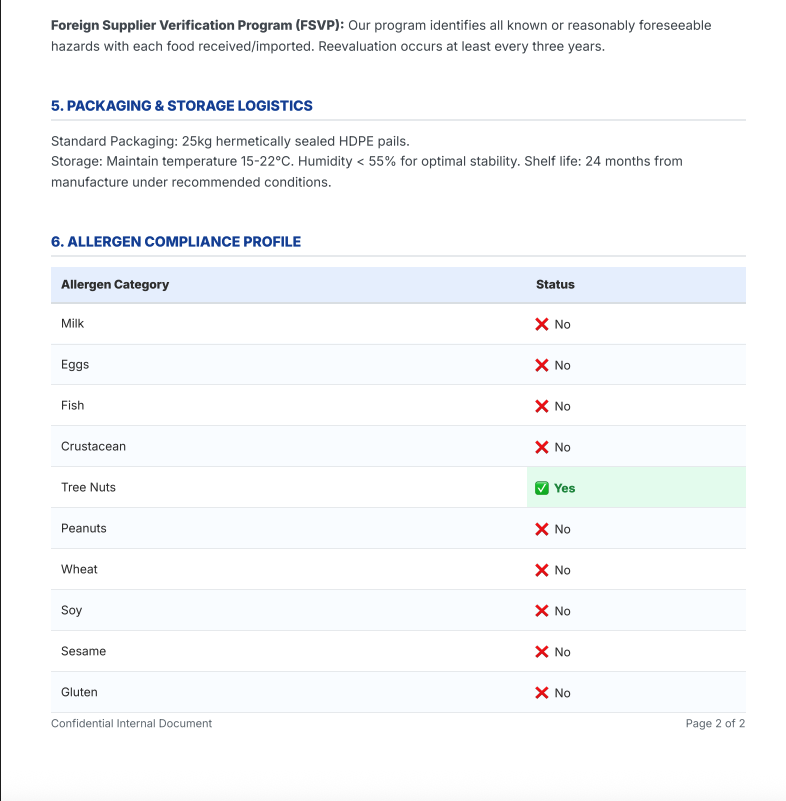   
<br><br>

<hr>
<hr>

# 4. Lab for Iceberg Catalog

This lab has a notebook that you will upload to BigQuery Studio (Colab) and execute.
Behind the scenes it uses Managed Spark Serverless - Interactive Sessions.

## 4.1. Upload the notebook

Go to BigQuery Studio and upload the [notebook](https://github.com/GoogleCloudPlatform/lakehouse-solutions/blob/TS3/solutions/spark-serverless-features/provisioning-automation/core-tf/notebooks/lrc_iceberg_catalog_tutorial.ipynb) as shown below.

a) Copy the notebook URL below.
https://github.com/GoogleCloudPlatform/lakehouse-solutions/blob/main/solutions/spark-serverless-features/provisioning-automation/core-tf/notebooks/lrc_iceberg_catalog_tutorial.ipynb


b) Go to BigQuery Studio and upload it

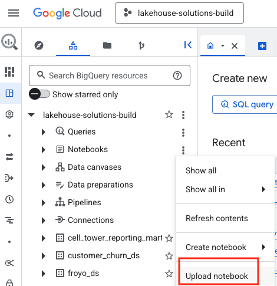   
<br><br>

<hr>

Use this URL to upload notebook from URL:<br>
https://github.com/GoogleCloudPlatform/lakehouse-solutions/blob/main/solutions/spark-serverless-features/provisioning-automation/core-tf/notebooks/lrc_iceberg_catalog_tutorial.ipynb

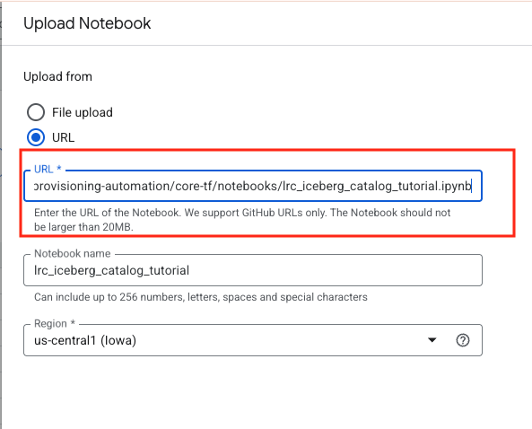   
<br><br>

## 4.2. Create a runtime, and connect to it

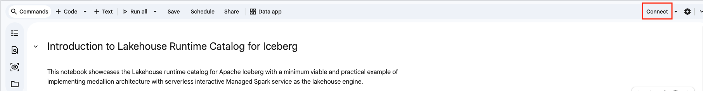   
<br><br>

<hr>

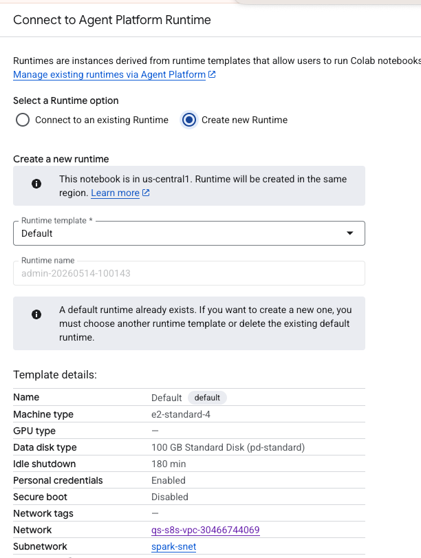   
<br><br>

<hr>

This is what it looks like after you are connected to a runtime.
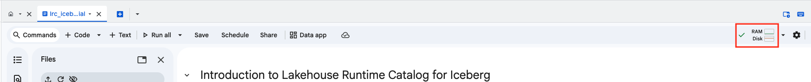   
<br><br>

<hr>


## 4.3. Lab content - pictorial overview

This lab uses synthetically generated frozen yogurt sales - retail dataset. As part of the lab, we will curate data and run some reports.

### 4.3.1. Setup and create Iceberg catalog namespace

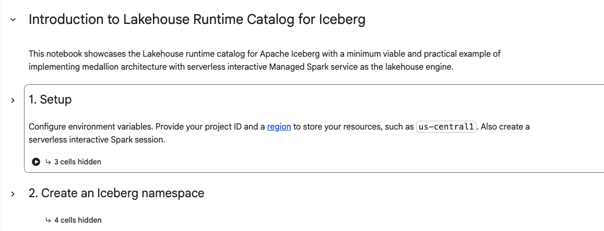   
<br><br>

### 4.3.2. Create a medallion architecture with Lakehouse runtime catalog for Iceberg as the metastore

We will create 4 layers of medallion architecture-
1. Bronze: Data as is from source
2. Silver: Curated data with cleansing, and transformations applied
3. Gold: Consumable data - denormalized/optimized for analysis
4. Platinum: Data Mart with reports 

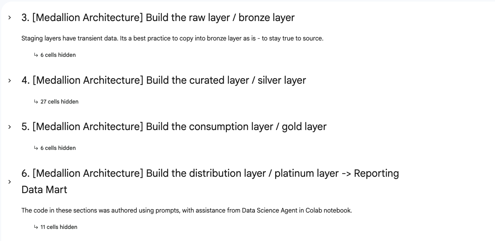   
<br><br>

### 4.3.3. [Optional] Apache Iceberg tutorial

A 101 on Apache Iceberh
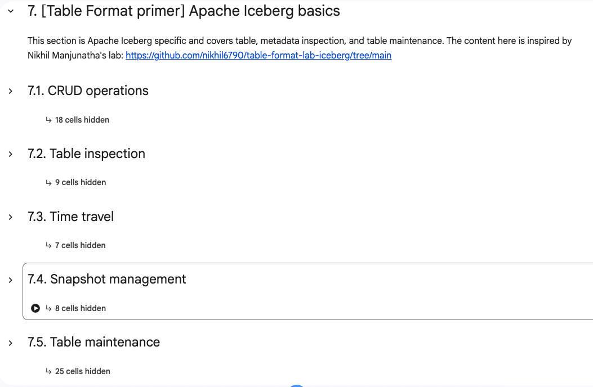   
<br><br>

### 4.3.4. [Optional] Data analysis lab with Data Science Agent in Colab notebooks

   
<br><br>


## 4.4. Run through the lab

Execute each section cell by cell for an immersive learning experience.

<hr>
<hr>

# 5. Lab for Hive Catalog

This is a **private preview feature** in mid-May 2026.Reach out to your Google Cloud account team to be **allow-listed** to try this feature out.

In this lab, we will:
1. Create a bucket for the Hive warehouse
2. Create a catalog
3. Create a database in the catalog
4. Create a table (on froyo parquet data) registered in the catalog
5. Run some queries

The following is a **pictorial overview** of the lab.

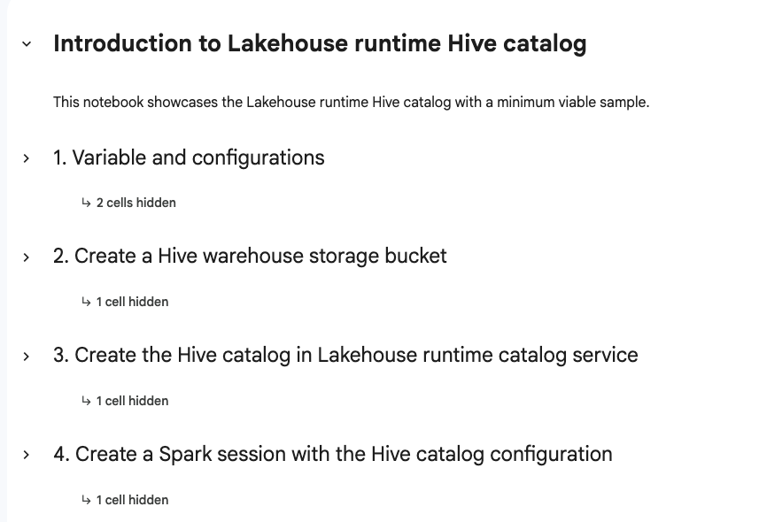   
<br><br>

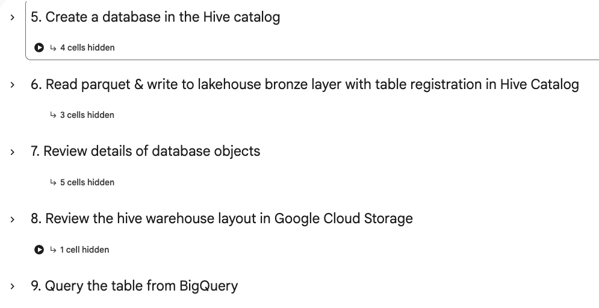   
<br><br>

<hr>

##### =====================================================================================================
##### THIS CONCLUDES THE LAB FOR LAKEHOUSE RUNTIME CATALOG
##### SHUT DOWN THE LAB TO AVOID BILLING UNLESS YOU ARE WORKING ON SUBSEQUENT LABS
##### =====================================================================================================
