# Technical Solution 4: Introduction to lakehouse pipeline orchestration with Managed Service for Apache Airflow


# LAB

## L1. [Optional] Run the Pyspark scripts for bronze layer ingestion 

### L1.1. Variables

```
# Google Cloud environment configuration
export PROJECT_ID=`gcloud config list --format "value(core.project)" 2>/dev/null`
export PROJECT_NBR=`gcloud projects describe $PROJECT_ID | grep projectNumber | cut -d':' -f2 |  tr -d "'" | xargs`
export REGION="us-central1"
export SUBNET_URI="projects/${PROJECT_ID}/regions/${REGION}/subnetworks/spark-froyo-snet"
export SERVICE_ACCOUNT="froyo-lab-umsa@${PROJECT_ID}.iam.gserviceaccount.com"
export SPARK_RUNTIME_VERSION="3.0"

# Bucket and script configuration
export CODE_BUCKET="froyo-lab-code-bucket-$PROJECT_NBR"
export BRONZE_LAYER_PROCESSING_SCRIPT_PATH="gs://${CODE_BUCKET}/scripts/pyspark/bronze_layer_ingestion.py"
export STAGING_BUCKET_NAME="froyo-lakehouse-staging-$PROJECT_NBR"
export LAKEHOUSE_BUCKET_NAME="froyo_iceberg_lakehouse_catalog_$PROJECT_NBR"
```

### L1.2. Test the script for customer data ingestion

```
export DATA_ENTITY_NAME="customers" 

gcloud dataproc batches submit pyspark ${BRONZE_LAYER_PROCESSING_SCRIPT_PATH} \
    --project=${PROJECT_ID} \
    --region=${REGION} \
    --batch="bronze-ingestion-${DATA_ENTITY_NAME}-$(date +%s)" \
    --version=${SPARK_RUNTIME_VERSION} \
    --subnet=${SUBNET_URI} \
    --service-account=${SERVICE_ACCOUNT} \
    --properties="spark.sql.adaptive.enabled=true,spark.sql.adaptive.advisoryPartitionSizeInBytes=128mb,spark.sql.adaptive.coalescePartitions.enabled=true" \
    -- \
    ${PROJECT_ID} \
    ${STAGING_BUCKET_NAME} \
    ${LAKEHOUSE_BUCKET_NAME} \
    ${DATA_ENTITY_NAME}

```

### L1.3. Test the script for customer sensitive data ingestion

```
export DATA_ENTITY_NAME="customers_sensitive" 
BATCH_ID=`echo $DATA_ENTITY_NAME | tr '_' '-'`


gcloud dataproc batches submit pyspark ${BRONZE_LAYER_PROCESSING_SCRIPT_PATH} \
    --project=${PROJECT_ID} \
    --region=${REGION} \
    --batch="bronze-ingestion-${BATCH_ID}-$(date +%s)" \
    --version=${SPARK_RUNTIME_VERSION} \
    --subnet=${SUBNET_URI} \
    --service-account=${SERVICE_ACCOUNT} \
    --properties="spark.sql.adaptive.enabled=true,spark.sql.adaptive.advisoryPartitionSizeInBytes=128mb,spark.sql.adaptive.coalescePartitions.enabled=true" \
    -- \
    ${PROJECT_ID} \
    ${STAGING_BUCKET_NAME} \
    ${LAKEHOUSE_BUCKET_NAME} \
    ${DATA_ENTITY_NAME}
```

### L1.4. Test the script for product data ingestion

```
export DATA_ENTITY_NAME="products" 
BATCH_ID=`echo $DATA_ENTITY_NAME | tr '_' '-'`

gcloud dataproc batches submit pyspark ${BRONZE_LAYER_PROCESSING_SCRIPT_PATH} \
    --project=${PROJECT_ID} \
    --region=${REGION} \
    --batch="bronze-ingestion-${BATCH_ID}-$(date +%s)" \
    --version=${SPARK_RUNTIME_VERSION} \
    --subnet=${SUBNET_URI} \
    --service-account=${SERVICE_ACCOUNT} \
    --properties="spark.sql.adaptive.enabled=true,spark.sql.adaptive.advisoryPartitionSizeInBytes=128mb,spark.sql.adaptive.coalescePartitions.enabled=true" \
    -- \
    ${PROJECT_ID} \
    ${STAGING_BUCKET_NAME} \
    ${LAKEHOUSE_BUCKET_NAME} \
    ${DATA_ENTITY_NAME}
```

### L1.5. Test the script for order data ingestion

```
export DATA_ENTITY_NAME="orders" 
BATCH_ID=`echo $DATA_ENTITY_NAME | tr '_' '-'`


gcloud dataproc batches submit pyspark ${BRONZE_LAYER_PROCESSING_SCRIPT_PATH} \
    --project=${PROJECT_ID} \
    --region=${REGION} \
    --batch="bronze-ingestion-${BATCH_ID}-$(date +%s)" \
    --version=${SPARK_RUNTIME_VERSION} \
    --subnet=${SUBNET_URI} \
    --service-account=${SERVICE_ACCOUNT} \
    --properties="spark.sql.adaptive.enabled=true,spark.sql.adaptive.advisoryPartitionSizeInBytes=128mb,spark.sql.adaptive.coalescePartitions.enabled=true" \
    -- \
    ${PROJECT_ID} \
    ${STAGING_BUCKET_NAME} \
    ${LAKEHOUSE_BUCKET_NAME} \
    ${DATA_ENTITY_NAME}
```


### L1.6. Test the script for order items data ingestion

```
export DATA_ENTITY_NAME="order_items" 
BATCH_ID=`echo $DATA_ENTITY_NAME | tr '_' '-'`


gcloud dataproc batches submit pyspark ${BRONZE_LAYER_PROCESSING_SCRIPT_PATH} \
    --project=${PROJECT_ID} \
    --region=${REGION} \
    --batch="bronze-ingestion-${BATCH_ID}-$(date +%s)" \
    --version=${SPARK_RUNTIME_VERSION} \
    --subnet=${SUBNET_URI} \
    --service-account=${SERVICE_ACCOUNT} \
    --properties="spark.sql.adaptive.enabled=true,spark.sql.adaptive.advisoryPartitionSizeInBytes=128mb,spark.sql.adaptive.coalescePartitions.enabled=true" \
    -- \
    ${PROJECT_ID} \
    ${STAGING_BUCKET_NAME} \
    ${LAKEHOUSE_BUCKET_NAME} \
    ${DATA_ENTITY_NAME}
```

### L1.7. Test the script for regions data ingestion

```
export DATA_ENTITY_NAME="regions" 
BATCH_ID=`echo $DATA_ENTITY_NAME | tr '_' '-'`


gcloud dataproc batches submit pyspark ${BRONZE_LAYER_PROCESSING_SCRIPT_PATH} \
    --project=${PROJECT_ID} \
    --region=${REGION} \
    --batch="bronze-ingestion-${BATCH_ID}-$(date +%s)" \
    --version=${SPARK_RUNTIME_VERSION} \
    --subnet=${SUBNET_URI} \
    --service-account=${SERVICE_ACCOUNT} \
    --properties="spark.sql.adaptive.enabled=true,spark.sql.adaptive.advisoryPartitionSizeInBytes=128mb,spark.sql.adaptive.coalescePartitions.enabled=true" \
    -- \
    ${PROJECT_ID} \
    ${STAGING_BUCKET_NAME} \
    ${LAKEHOUSE_BUCKET_NAME} \
    ${DATA_ENTITY_NAME} 
```

<hr>


## L2. [Optional] Run the Pyspark scripts for silver layer curation

### L2.1. Variables

```
# Google Cloud environment configuration
export PROJECT_ID=`gcloud config list --format "value(core.project)" 2>/dev/null`
export PROJECT_NBR=`gcloud projects describe $PROJECT_ID | grep projectNumber | cut -d':' -f2 |  tr -d "'" | xargs`
export REGION="us-central1"
export SUBNET_URI="projects/${PROJECT_ID}/regions/${REGION}/subnetworks/spark-froyo-snet"
export SERVICE_ACCOUNT="froyo-lab-umsa@${PROJECT_ID}.iam.gserviceaccount.com"
export SPARK_RUNTIME_VERSION="3.0"

# Bucket and script configuration
export CODE_BUCKET="froyo-lab-code-bucket-$PROJECT_NBR"
export SILVER_LAYER_PROCESSING_SCRIPT_PATH="gs://${CODE_BUCKET}/scripts/pyspark/silver_layer_curation.py"
export LAKEHOUSE_BUCKET_NAME="froyo_iceberg_lakehouse_catalog_$PROJECT_NBR"
export STAGING_BUCKET_NAME="froyo-lakehouse-staging-$PROJECT_NBR"
export ICEBERG_CATALOG_NAME="froyo_iceberg_lakehouse_catalog_$PROJECT_NBR"
export REST_API_VERSION="v1beta"
export SPARK_PROPERTIES="spark.sql.adaptive.enabled=true,spark.sql.adaptive.advisoryPartitionSizeInBytes=128mb,spark.sql.adaptive.coalescePartitions.enabled=true,spark.sql.defaultCatalog=$ICEBERG_CATALOG_NAME,spark.sql.catalog.$ICEBERG_CATALOG_NAME=org.apache.iceberg.spark.SparkCatalog,spark.sql.catalog.$ICEBERG_CATALOG_NAME.type=rest,spark.sql.catalog.$ICEBERG_CATALOG_NAME.uri=https://biglake.googleapis.com/iceberg/$REST_API_VERSION/restcatalog,spark.sql.catalog.$ICEBERG_CATALOG_NAME.warehouse=gs://$LAKEHOUSE_BUCKET_NAME,spark.sql.catalog.$ICEBERG_CATALOG_NAME.io-impl=org.apache.iceberg.gcp.gcs.GCSFileIO,spark.sql.catalog.$ICEBERG_CATALOG_NAME.header.x-goog-user-project=$PROJECT_ID,spark.sql.catalog.$ICEBERG_CATALOG_NAME.rest.auth.type=org.apache.iceberg.gcp.auth.GoogleAuthManager,spark.sql.extensions=org.apache.iceberg.spark.extensions.IcebergSparkSessionExtensions,
spark.sql.catalog.$ICEBERG_CATALOG_NAME.rest-metrics-reporting-enabled=false,spark.dataproc.lineage.enabled=true,spark.openlineage.transport.type=gcplineage,spark.extraListeners=io.openlineage.spark.agent.OpenLineageSparkListener,spark.sql.repl.eagerEval.enabled=True, spark.openlineage.namespace=froyo_spark_jobs"

```


### L2.1. Curate customer master data

```
export DATA_ENTITY_NAME="customers" 
BATCH_ID=`echo $DATA_ENTITY_NAME | tr '_' '-'`


gcloud dataproc batches submit pyspark ${SILVER_LAYER_PROCESSING_SCRIPT_PATH} \
    --project=${PROJECT_ID} \
    --region=${REGION} \
    --batch="silver-curation-${BATCH_ID}-$(date +%s)" \
    --version=${SPARK_RUNTIME_VERSION} \
    --subnet=${SUBNET_URI} \
    --service-account=${SERVICE_ACCOUNT} \
    --properties="${SPARK_PROPERTIES}" \
    -- \
    ${PROJECT_ID} \
    ${STAGING_BUCKET_NAME} \
    ${LAKEHOUSE_BUCKET_NAME} \
    ${DATA_ENTITY_NAME}
```

### L2.2. Curate customer sensitive data

```
export DATA_ENTITY_NAME="customers_sensitive" 
BATCH_ID=`echo $DATA_ENTITY_NAME | tr '_' '-'`


gcloud dataproc batches submit pyspark ${SILVER_LAYER_PROCESSING_SCRIPT_PATH} \
    --project=${PROJECT_ID} \
    --region=${REGION} \
    --batch="silver-curation-${BATCH_ID}-$(date +%s)" \
    --version=${SPARK_RUNTIME_VERSION} \
    --subnet=${SUBNET_URI} \
    --service-account=${SERVICE_ACCOUNT} \
    --properties="${SPARK_PROPERTIES}" \
    -- \
    ${PROJECT_ID} \
    ${STAGING_BUCKET_NAME} \
    ${LAKEHOUSE_BUCKET_NAME} \
    ${DATA_ENTITY_NAME}
```

### L2.3. Curate product data

```
export DATA_ENTITY_NAME="products" 
BATCH_ID=`echo $DATA_ENTITY_NAME | tr '_' '-'`


gcloud dataproc batches submit pyspark ${SILVER_LAYER_PROCESSING_SCRIPT_PATH} \
    --project=${PROJECT_ID} \
    --region=${REGION} \
    --batch="silver-curation-${BATCH_ID}-$(date +%s)" \
    --version=${SPARK_RUNTIME_VERSION} \
    --subnet=${SUBNET_URI} \
    --service-account=${SERVICE_ACCOUNT} \
    --properties="${SPARK_PROPERTIES}" \
    -- \
    ${PROJECT_ID} \
    ${STAGING_BUCKET_NAME} \
    ${LAKEHOUSE_BUCKET_NAME} \
    ${DATA_ENTITY_NAME}
```

### L2.4. Curate orders data

```
export DATA_ENTITY_NAME="orders" 
BATCH_ID=`echo $DATA_ENTITY_NAME | tr '_' '-'`


gcloud dataproc batches submit pyspark ${SILVER_LAYER_PROCESSING_SCRIPT_PATH} \
    --project=${PROJECT_ID} \
    --region=${REGION} \
    --batch="silver-curation-${BATCH_ID}-$(date +%s)" \
    --version=${SPARK_RUNTIME_VERSION} \
    --subnet=${SUBNET_URI} \
    --service-account=${SERVICE_ACCOUNT} \
    --properties="${SPARK_PROPERTIES}" \
    -- \
    ${PROJECT_ID} \
    ${STAGING_BUCKET_NAME} \
    ${LAKEHOUSE_BUCKET_NAME} \
    ${DATA_ENTITY_NAME}
```

<hr>

## L3. [Optional] Run the Pyspark scripts for gold layer aggregation

### L3.1. Variables

```
# Google Cloud environment configuration
export PROJECT_ID=`gcloud config list --format "value(core.project)" 2>/dev/null`
export PROJECT_NBR=`gcloud projects describe $PROJECT_ID | grep projectNumber | cut -d':' -f2 |  tr -d "'" | xargs`
export REGION="us-central1"
export SUBNET_URI="projects/${PROJECT_ID}/regions/${REGION}/subnetworks/spark-froyo-snet"
export SERVICE_ACCOUNT="froyo-lab-umsa@${PROJECT_ID}.iam.gserviceaccount.com"
export SPARK_RUNTIME_VERSION="3.0"
export REST_API_VERSION="v1beta"

# Bucket and script configuration
export CODE_BUCKET="froyo-lab-code-bucket-$PROJECT_NBR"
export GOLD_LAYER_PROCESSING_SCRIPT_PATH="gs://${CODE_BUCKET}/scripts/pyspark/gold_layer_aggregation.py"
export LAKEHOUSE_BUCKET_NAME="froyo_iceberg_lakehouse_catalog_$PROJECT_NBR"
export ICEBERG_CATALOG_NAME="froyo_iceberg_lakehouse_catalog_$PROJECT_NBR"
export SPARK_PROPERTIES="spark.sql.adaptive.enabled=true,spark.sql.adaptive.advisoryPartitionSizeInBytes=128mb,spark.sql.adaptive.coalescePartitions.enabled=true,spark.sql.defaultCatalog=$ICEBERG_CATALOG_NAME,spark.sql.catalog.$ICEBERG_CATALOG_NAME=org.apache.iceberg.spark.SparkCatalog,spark.sql.catalog.$ICEBERG_CATALOG_NAME.type=rest,spark.sql.catalog.$ICEBERG_CATALOG_NAME.uri=https://biglake.googleapis.com/iceberg/$REST_API_VERSION/restcatalog,spark.sql.catalog.$ICEBERG_CATALOG_NAME.warehouse=gs://$LAKEHOUSE_BUCKET_NAME,spark.sql.catalog.$ICEBERG_CATALOG_NAME.io-impl=org.apache.iceberg.gcp.gcs.GCSFileIO,spark.sql.catalog.$ICEBERG_CATALOG_NAME.header.x-goog-user-project=$PROJECT_ID,spark.sql.catalog.$ICEBERG_CATALOG_NAME.rest.auth.type=org.apache.iceberg.gcp.auth.GoogleAuthManager,spark.sql.extensions=org.apache.iceberg.spark.extensions.IcebergSparkSessionExtensions,
spark.sql.catalog.$ICEBERG_CATALOG_NAME.rest-metrics-reporting-enabled=false,spark.dataproc.lineage.enabled=true,spark.openlineage.transport.type=gcplineage,spark.extraListeners=io.openlineage.spark.agent.OpenLineageSparkListener,spark.sql.repl.eagerEval.enabled=True, spark.openlineage.namespace=froyo_spark_jobs"

```

### L3.2. Aggregate orders

```
BATCH_ID="gold-layer-aggregation"

gcloud dataproc batches submit pyspark ${GOLD_LAYER_PROCESSING_SCRIPT_PATH} \
    --project=${PROJECT_ID} \
    --region=${REGION} \
    --batch="${BATCH_ID}-$(date +%s)" \
    --version=${SPARK_RUNTIME_VERSION} \
    --subnet=${SUBNET_URI} \
    --service-account=${SERVICE_ACCOUNT} \
    --properties="${SPARK_PROPERTIES}" 
```

<hr>

## L4. [Optional] Run the Pyspark scripts for platinum layer reporting

### L4.1. Variables

```
# Google Cloud environment configuration
export PROJECT_ID=`gcloud config list --format "value(core.project)" 2>/dev/null`
export PROJECT_NBR=`gcloud projects describe $PROJECT_ID | grep projectNumber | cut -d':' -f2 |  tr -d "'" | xargs`
export REGION="us-central1"
export SUBNET_URI="projects/${PROJECT_ID}/regions/${REGION}/subnetworks/spark-froyo-snet"
export SERVICE_ACCOUNT="froyo-lab-umsa@${PROJECT_ID}.iam.gserviceaccount.com"
export SPARK_RUNTIME_VERSION="3.0"
export REST_API_VERSION="v1beta"

# Bucket and script configuration
export CODE_BUCKET="froyo-lab-code-bucket-$PROJECT_NBR"
export PLATINUM_LAYER_PROCESSING_SCRIPT_PATH="gs://${CODE_BUCKET}/scripts/pyspark/platinum_layer_reporting.py"
export LAKEHOUSE_BUCKET_NAME="froyo_iceberg_lakehouse_catalog_$PROJECT_NBR"
export ICEBERG_CATALOG_NAME="froyo_iceberg_lakehouse_catalog_$PROJECT_NBR"
export SPARK_PROPERTIES="spark.sql.adaptive.enabled=true,spark.sql.adaptive.advisoryPartitionSizeInBytes=128mb,spark.sql.adaptive.coalescePartitions.enabled=true,spark.sql.defaultCatalog=$ICEBERG_CATALOG_NAME,spark.sql.catalog.$ICEBERG_CATALOG_NAME=org.apache.iceberg.spark.SparkCatalog,spark.sql.catalog.$ICEBERG_CATALOG_NAME.type=rest,spark.sql.catalog.$ICEBERG_CATALOG_NAME.uri=https://biglake.googleapis.com/iceberg/$REST_API_VERSION/restcatalog,spark.sql.catalog.$ICEBERG_CATALOG_NAME.warehouse=gs://$LAKEHOUSE_BUCKET_NAME,spark.sql.catalog.$ICEBERG_CATALOG_NAME.io-impl=org.apache.iceberg.gcp.gcs.GCSFileIO,spark.sql.catalog.$ICEBERG_CATALOG_NAME.header.x-goog-user-project=$PROJECT_ID,spark.sql.catalog.$ICEBERG_CATALOG_NAME.rest.auth.type=org.apache.iceberg.gcp.auth.GoogleAuthManager,spark.sql.extensions=org.apache.iceberg.spark.extensions.IcebergSparkSessionExtensions,
spark.sql.catalog.$ICEBERG_CATALOG_NAME.rest-metrics-reporting-enabled=false,spark.dataproc.lineage.enabled=true,spark.openlineage.transport.type=gcplineage,spark.extraListeners=io.openlineage.spark.agent.OpenLineageSparkListener,spark.sql.repl.eagerEval.enabled=True, spark.openlineage.namespace=froyo_spark_jobs"

```

### L4.2. Generate 'Revenue By Month' report

```
REPORT_NAME="REVENUE_BY_MONTH"
BATCH_ID="platinum-layer-reporting"

gcloud dataproc batches submit pyspark ${PLATINUM_LAYER_PROCESSING_SCRIPT_PATH} \
    --project=${PROJECT_ID} \
    --region=${REGION} \
    --batch="${BATCH_ID}-$(date +%s)" \
    --version=${SPARK_RUNTIME_VERSION} \
    --subnet=${SUBNET_URI} \
    --service-account=${SERVICE_ACCOUNT} \
    --properties="${SPARK_PROPERTIES}"  -- \
    ${REPORT_NAME} 
```

### L4.3. Generate 'Average Order Value' report

```
REPORT_NAME="AVERAGE_ORDER_VALUE"
BATCH_ID="platinum-layer-reporting"

gcloud dataproc batches submit pyspark ${PLATINUM_LAYER_PROCESSING_SCRIPT_PATH} \
    --project=${PROJECT_ID} \
    --region=${REGION} \
    --batch="${BATCH_ID}-$(date +%s)" \
    --version=${SPARK_RUNTIME_VERSION} \
    --subnet=${SUBNET_URI} \
    --service-account=${SERVICE_ACCOUNT} \
    --properties="${SPARK_PROPERTIES}"  -- \
    ${REPORT_NAME} 
```


### L4.4. Generate 'Top Ten Products' report

```
REPORT_NAME="TOP_TEN_PRODUCTS"
BATCH_ID="platinum-layer-reporting"

gcloud dataproc batches submit pyspark ${PLATINUM_LAYER_PROCESSING_SCRIPT_PATH} \
    --project=${PROJECT_ID} \
    --region=${REGION} \
    --batch="${BATCH_ID}-$(date +%s)" \
    --version=${SPARK_RUNTIME_VERSION} \
    --subnet=${SUBNET_URI} \
    --service-account=${SERVICE_ACCOUNT} \
    --properties="${SPARK_PROPERTIES}"  -- \
    ${REPORT_NAME} 
```


### L4.5. Generate 'Customer Segmentation' report

```
REPORT_NAME="CUSTOMER_SEGMENTATION"
BATCH_ID="platinum-layer-reporting"

gcloud dataproc batches submit pyspark ${PLATINUM_LAYER_PROCESSING_SCRIPT_PATH} \
    --project=${PROJECT_ID} \
    --region=${REGION} \
    --batch="${BATCH_ID}-$(date +%s)" \
    --version=${SPARK_RUNTIME_VERSION} \
    --subnet=${SUBNET_URI} \
    --service-account=${SERVICE_ACCOUNT} \
    --properties="${SPARK_PROPERTIES}"  -- \
    ${REPORT_NAME} 
```

<hr>

## L5. Run the DAG in Managed Servive for Apache Airflow

### L5.1. Navigate to Managed Service for Apache Airflow
Search for Airflow in the [cloud console](https://console.cloud.google.com)

   
<br><br>

### L5.2. Study the Airflow environment

Click on the various tabs to familairize yourself with the UI and the environment specs automatically created for you via Terraform in technical solution 3.

#### L5.2.1. Review the environment configuration tab

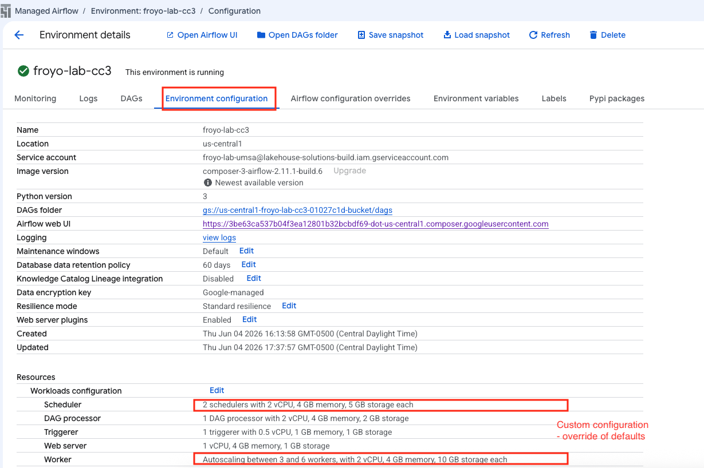   
<br><br>

   
<br><br>

<hr>


#### L5.2. Review the Airflow configuration overrides tab

   
<br><br>

<hr>

#### L5.3. Review the environment variables tab

   
<br><br>

<hr>


#### L5.4. Review the labels tab

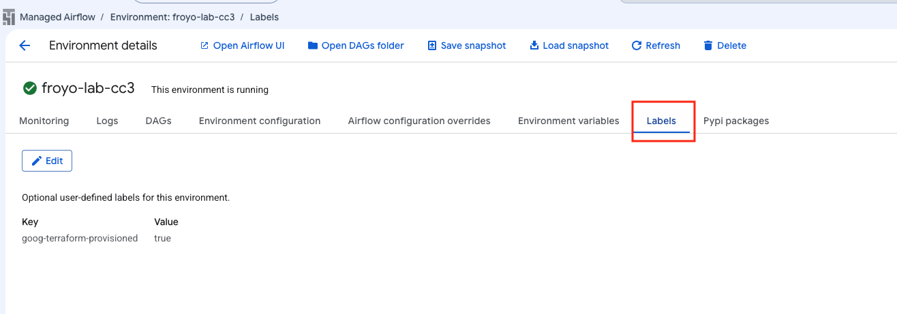   
<br><br>

<hr>


#### L5.5. Review the Pypi packages tab

   
<br><br>

<hr>


#### L5.6. Review the monitoring tab - overview

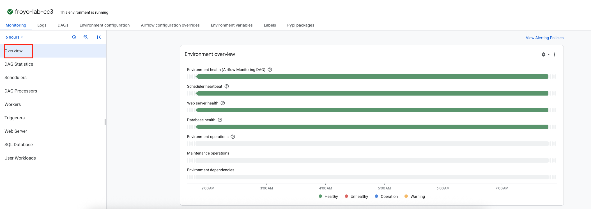   
<br><br>

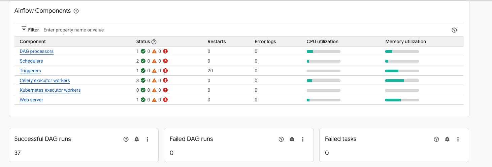   
<br><br>

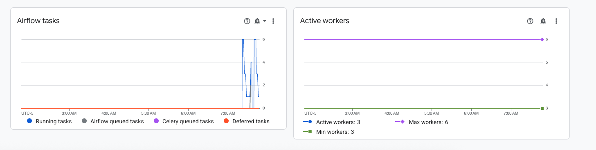   
<br><br>

<hr>


#### L5.7. Review the monitoring tab - DAG statistics

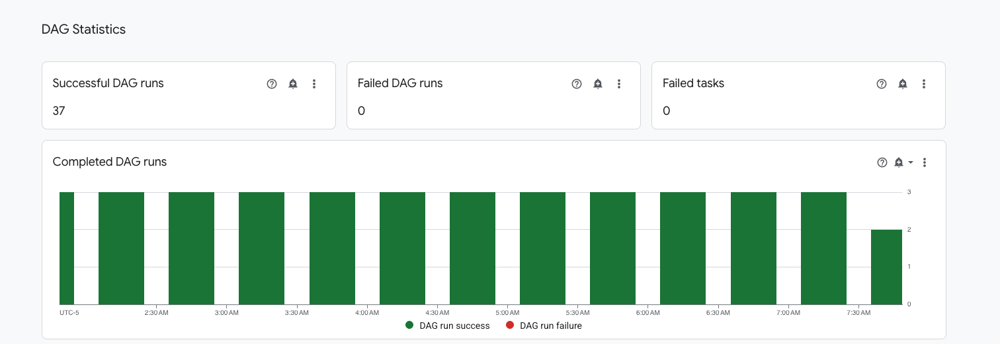   
<br><br>

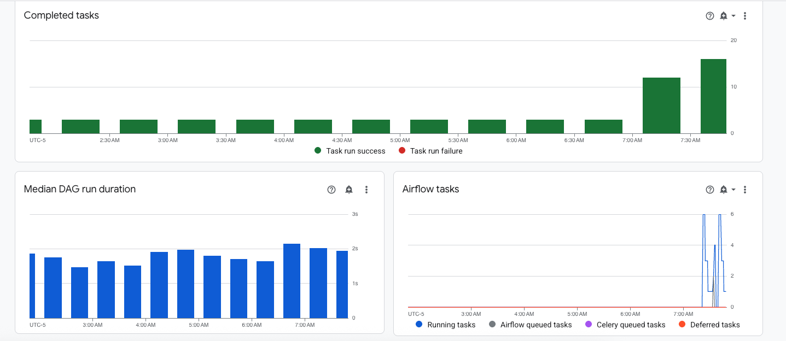   
<br><br>

   
<br><br>

<hr>

#### L5.8. Review the monitoring tab - schedulers

   
<br><br>

   
<br><br>

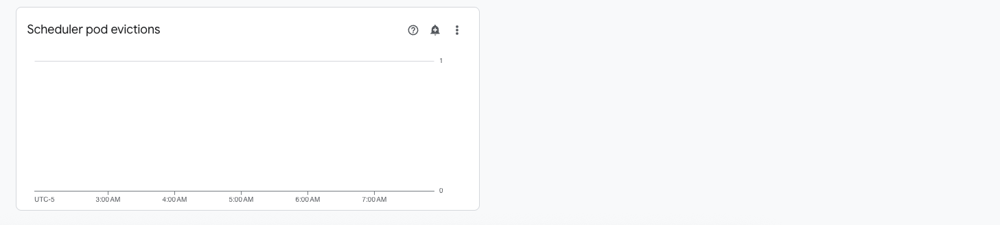   
<br><br>

<hr>

#### L5.9. Review the monitoring tab - DAG processors

   
<br><br>

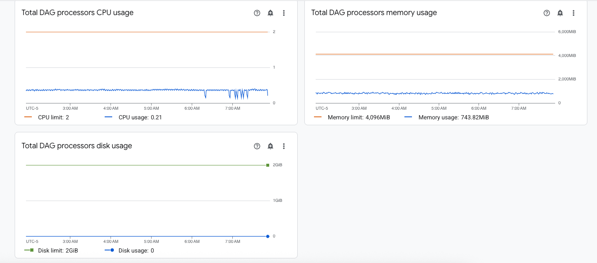   
<br><br>

<hr>

#### L5.10. Review the monitoring tab - workers

   
<br><br>

   
<br><br>

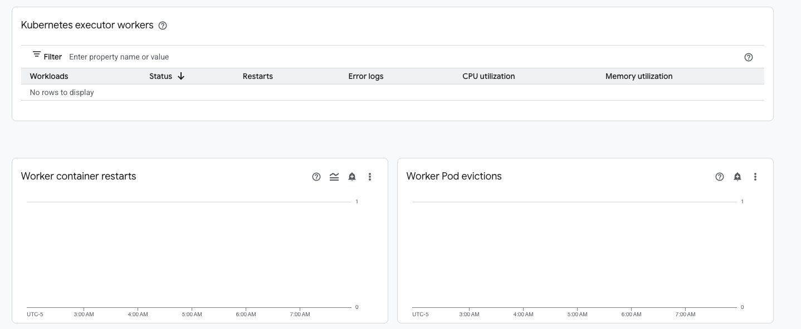   
<br><br>

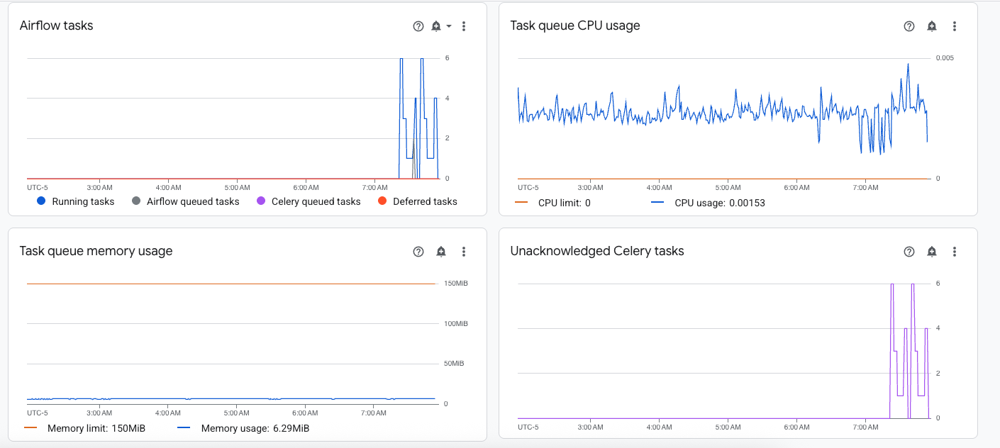   
<br><br>

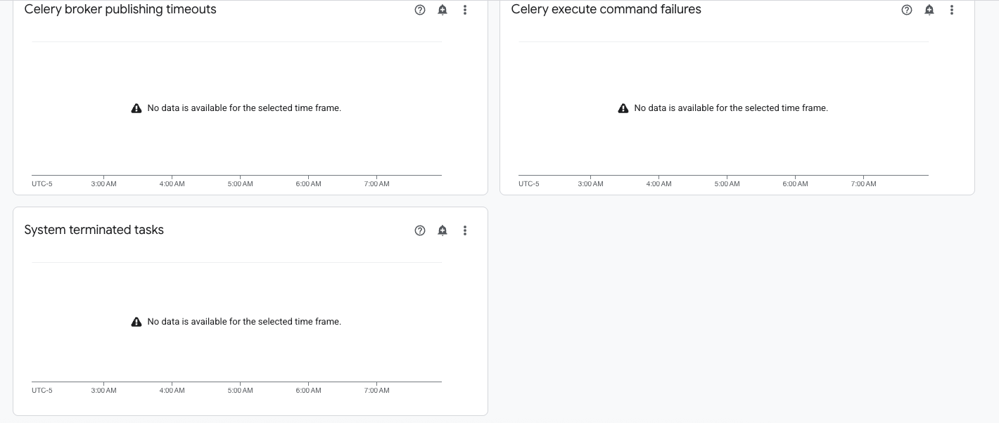   
<br><br>

<hr>

#### L5.11. Review the monitoring tab - triggerers

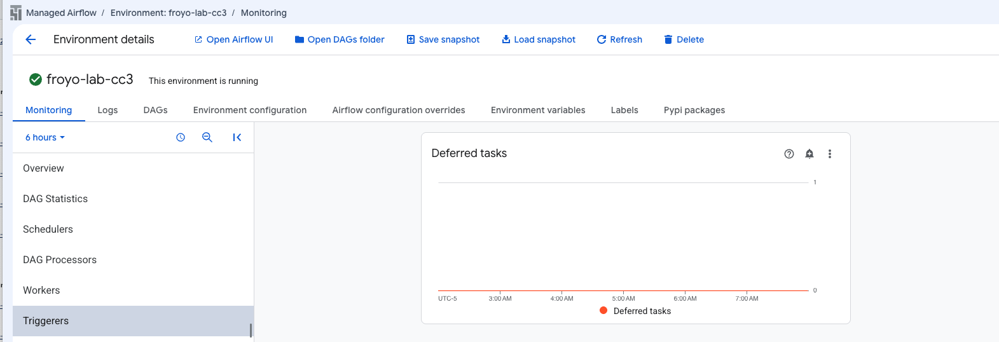   
<br><br>

   
<br><br>

   
<br><br>

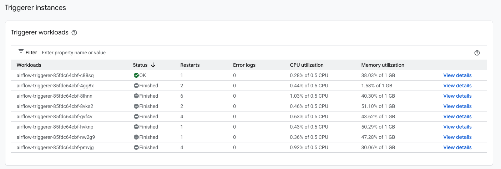   
<br><br>

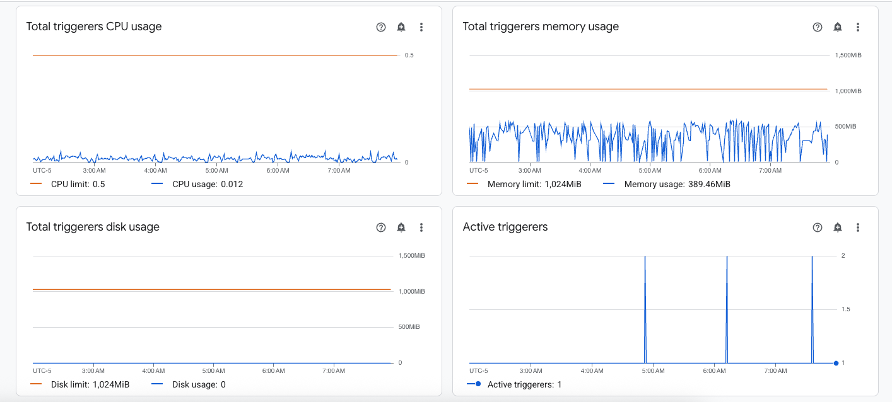   
<br><br>

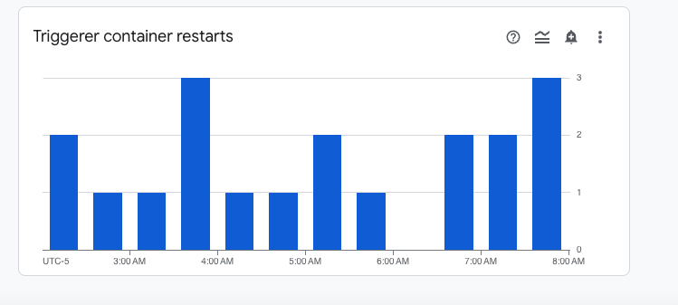   
<br><br>

<hr>

#### L5.12. Review the monitoring tab - webserver

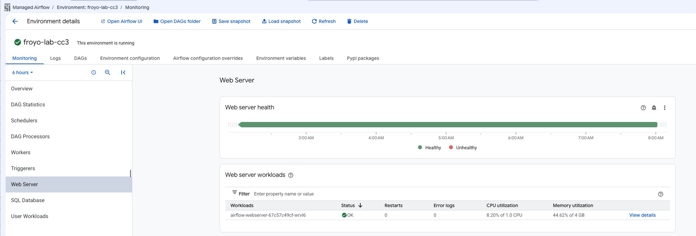   
<br><br>

   
<br><br>

<hr>

#### L5.13. Review the monitoring tab - SQL database

   
<br><br>

   
<br><br>

<hr>

#### L5.14. Review the monitoring tab - SQL database

   
<br><br>


<hr>

