# Technical Solution 4: Introduction to lakehouse pipeline orchestration with Managed Service for Apache Airflow


# LAB

## L1. [Optional] Run the Pyspark scripts for bronze layer ingestion 

### L1.1. Variables

```
# Google Cloud environment configuration
export PROJECT_ID=`gcloud config list --format "value(core.project)" 2>/dev/null`
export PROJECT_NBR=`gcloud projects describe $PROJECT_ID | grep projectNumber | cut -d':' -f2 |  tr -d "'" | xargs`
export REGION="us-central1"
export SUBNET_URI="projects/${PROJECT_ID}/regions/${REGION}/subnetworks/spark-froyo-snet"
export SERVICE_ACCOUNT="froyo-lab-umsa@${PROJECT_ID}.iam.gserviceaccount.com"
export SPARK_RUNTIME_VERSION="3.0"

# Bucket and script configuration
export CODE_BUCKET="froyo-lab-code-bucket-$PROJECT_NBR"
export BRONZE_LAYER_PROCESSING_SCRIPT_PATH="gs://${CODE_BUCKET}/scripts/pyspark/bronze_layer_ingestion.py"
export STAGING_BUCKET_NAME="froyo-lakehouse-staging-$PROJECT_NBR"
export LAKEHOUSE_BUCKET_NAME="froyo_iceberg_lakehouse_catalog_$PROJECT_NBR"
```

### L1.2. Test the script for customer data ingestion

```
export DATA_ENTITY_NAME="customers" 

gcloud dataproc batches submit pyspark ${BRONZE_LAYER_PROCESSING_SCRIPT_PATH} \
    --project=${PROJECT_ID} \
    --region=${REGION} \
    --batch="bronze-ingestion-${DATA_ENTITY_NAME}-$(date +%s)" \
    --version=${SPARK_RUNTIME_VERSION} \
    --subnet=${SUBNET_URI} \
    --service-account=${SERVICE_ACCOUNT} \
    --properties="spark.sql.adaptive.enabled=true,spark.sql.adaptive.advisoryPartitionSizeInBytes=128mb,spark.sql.adaptive.coalescePartitions.enabled=true" \
    -- \
    ${PROJECT_ID} \
    ${STAGING_BUCKET_NAME} \
    ${LAKEHOUSE_BUCKET_NAME} \
    ${DATA_ENTITY_NAME}

```

### L1.3. Test the script for customer sensitive data ingestion

```
export DATA_ENTITY_NAME="customers_sensitive" 
BATCH_ID=`echo $DATA_ENTITY_NAME | tr '_' '-'`


gcloud dataproc batches submit pyspark ${BRONZE_LAYER_PROCESSING_SCRIPT_PATH} \
    --project=${PROJECT_ID} \
    --region=${REGION} \
    --batch="bronze-ingestion-${BATCH_ID}-$(date +%s)" \
    --version=${SPARK_RUNTIME_VERSION} \
    --subnet=${SUBNET_URI} \
    --service-account=${SERVICE_ACCOUNT} \
    --properties="spark.sql.adaptive.enabled=true,spark.sql.adaptive.advisoryPartitionSizeInBytes=128mb,spark.sql.adaptive.coalescePartitions.enabled=true" \
    -- \
    ${PROJECT_ID} \
    ${STAGING_BUCKET_NAME} \
    ${LAKEHOUSE_BUCKET_NAME} \
    ${DATA_ENTITY_NAME}
```

### L1.4. Test the script for product data ingestion

```
export DATA_ENTITY_NAME="products" 
BATCH_ID=`echo $DATA_ENTITY_NAME | tr '_' '-'`

gcloud dataproc batches submit pyspark ${BRONZE_LAYER_PROCESSING_SCRIPT_PATH} \
    --project=${PROJECT_ID} \
    --region=${REGION} \
    --batch="bronze-ingestion-${BATCH_ID}-$(date +%s)" \
    --version=${SPARK_RUNTIME_VERSION} \
    --subnet=${SUBNET_URI} \
    --service-account=${SERVICE_ACCOUNT} \
    --properties="spark.sql.adaptive.enabled=true,spark.sql.adaptive.advisoryPartitionSizeInBytes=128mb,spark.sql.adaptive.coalescePartitions.enabled=true" \
    -- \
    ${PROJECT_ID} \
    ${STAGING_BUCKET_NAME} \
    ${LAKEHOUSE_BUCKET_NAME} \
    ${DATA_ENTITY_NAME}
```

### L1.5. Test the script for order data ingestion

```
export DATA_ENTITY_NAME="orders" 
BATCH_ID=`echo $DATA_ENTITY_NAME | tr '_' '-'`


gcloud dataproc batches submit pyspark ${BRONZE_LAYER_PROCESSING_SCRIPT_PATH} \
    --project=${PROJECT_ID} \
    --region=${REGION} \
    --batch="bronze-ingestion-${BATCH_ID}-$(date +%s)" \
    --version=${SPARK_RUNTIME_VERSION} \
    --subnet=${SUBNET_URI} \
    --service-account=${SERVICE_ACCOUNT} \
    --properties="spark.sql.adaptive.enabled=true,spark.sql.adaptive.advisoryPartitionSizeInBytes=128mb,spark.sql.adaptive.coalescePartitions.enabled=true" \
    -- \
    ${PROJECT_ID} \
    ${STAGING_BUCKET_NAME} \
    ${LAKEHOUSE_BUCKET_NAME} \
    ${DATA_ENTITY_NAME}
```


### L1.6. Test the script for order items data ingestion

```
export DATA_ENTITY_NAME="order_items" 
BATCH_ID=`echo $DATA_ENTITY_NAME | tr '_' '-'`


gcloud dataproc batches submit pyspark ${BRONZE_LAYER_PROCESSING_SCRIPT_PATH} \
    --project=${PROJECT_ID} \
    --region=${REGION} \
    --batch="bronze-ingestion-${BATCH_ID}-$(date +%s)" \
    --version=${SPARK_RUNTIME_VERSION} \
    --subnet=${SUBNET_URI} \
    --service-account=${SERVICE_ACCOUNT} \
    --properties="spark.sql.adaptive.enabled=true,spark.sql.adaptive.advisoryPartitionSizeInBytes=128mb,spark.sql.adaptive.coalescePartitions.enabled=true" \
    -- \
    ${PROJECT_ID} \
    ${STAGING_BUCKET_NAME} \
    ${LAKEHOUSE_BUCKET_NAME} \
    ${DATA_ENTITY_NAME}
```

### L1.7. Test the script for regions data ingestion

```
export DATA_ENTITY_NAME="regions" 
BATCH_ID=`echo $DATA_ENTITY_NAME | tr '_' '-'`


gcloud dataproc batches submit pyspark ${BRONZE_LAYER_PROCESSING_SCRIPT_PATH} \
    --project=${PROJECT_ID} \
    --region=${REGION} \
    --batch="bronze-ingestion-${BATCH_ID}-$(date +%s)" \
    --version=${SPARK_RUNTIME_VERSION} \
    --subnet=${SUBNET_URI} \
    --service-account=${SERVICE_ACCOUNT} \
    --properties="spark.sql.adaptive.enabled=true,spark.sql.adaptive.advisoryPartitionSizeInBytes=128mb,spark.sql.adaptive.coalescePartitions.enabled=true" \
    -- \
    ${PROJECT_ID} \
    ${STAGING_BUCKET_NAME} \
    ${LAKEHOUSE_BUCKET_NAME} \
    ${DATA_ENTITY_NAME} 
```

<hr>


## L2. [Optional] Run the Pyspark scripts for silver layer curation

### L2.1. Variables

```
# Google Cloud environment configuration
export PROJECT_ID=`gcloud config list --format "value(core.project)" 2>/dev/null`
export PROJECT_NBR=`gcloud projects describe $PROJECT_ID | grep projectNumber | cut -d':' -f2 |  tr -d "'" | xargs`
export REGION="us-central1"
export SUBNET_URI="projects/${PROJECT_ID}/regions/${REGION}/subnetworks/spark-froyo-snet"
export SERVICE_ACCOUNT="froyo-lab-umsa@${PROJECT_ID}.iam.gserviceaccount.com"
export SPARK_RUNTIME_VERSION="3.0"

# Bucket and script configuration
export CODE_BUCKET="froyo-lab-code-bucket-$PROJECT_NBR"
export SILVER_LAYER_PROCESSING_SCRIPT_PATH="gs://${CODE_BUCKET}/scripts/pyspark/silver_layer_curation.py"
export LAKEHOUSE_BUCKET_NAME="froyo_iceberg_lakehouse_catalog_$PROJECT_NBR"
export STAGING_BUCKET_NAME="froyo-lakehouse-staging-$PROJECT_NBR"
export ICEBERG_CATALOG_NAME="froyo_iceberg_lakehouse_catalog_$PROJECT_NBR"
export REST_API_VERSION="v1beta"
export SPARK_PROPERTIES="spark.sql.adaptive.enabled=true,spark.sql.adaptive.advisoryPartitionSizeInBytes=128mb,spark.sql.adaptive.coalescePartitions.enabled=true,spark.sql.defaultCatalog=$ICEBERG_CATALOG_NAME,spark.sql.catalog.$ICEBERG_CATALOG_NAME=org.apache.iceberg.spark.SparkCatalog,spark.sql.catalog.$ICEBERG_CATALOG_NAME.type=rest,spark.sql.catalog.$ICEBERG_CATALOG_NAME.uri=https://biglake.googleapis.com/iceberg/$REST_API_VERSION/restcatalog,spark.sql.catalog.$ICEBERG_CATALOG_NAME.warehouse=gs://$LAKEHOUSE_BUCKET_NAME,spark.sql.catalog.$ICEBERG_CATALOG_NAME.io-impl=org.apache.iceberg.gcp.gcs.GCSFileIO,spark.sql.catalog.$ICEBERG_CATALOG_NAME.header.x-goog-user-project=$PROJECT_ID,spark.sql.catalog.$ICEBERG_CATALOG_NAME.rest.auth.type=org.apache.iceberg.gcp.auth.GoogleAuthManager,spark.sql.extensions=org.apache.iceberg.spark.extensions.IcebergSparkSessionExtensions,
spark.sql.catalog.$ICEBERG_CATALOG_NAME.rest-metrics-reporting-enabled=false,spark.dataproc.lineage.enabled=true,spark.openlineage.transport.type=gcplineage,spark.extraListeners=io.openlineage.spark.agent.OpenLineageSparkListener,spark.sql.repl.eagerEval.enabled=True, spark.openlineage.namespace=froyo_spark_jobs"

```


### L2.1. Curate customer master data

```
export DATA_ENTITY_NAME="customers" 
BATCH_ID=`echo $DATA_ENTITY_NAME | tr '_' '-'`


gcloud dataproc batches submit pyspark ${SILVER_LAYER_PROCESSING_SCRIPT_PATH} \
    --project=${PROJECT_ID} \
    --region=${REGION} \
    --batch="silver-curation-${BATCH_ID}-$(date +%s)" \
    --version=${SPARK_RUNTIME_VERSION} \
    --subnet=${SUBNET_URI} \
    --service-account=${SERVICE_ACCOUNT} \
    --properties="${SPARK_PROPERTIES}" \
    -- \
    ${PROJECT_ID} \
    ${STAGING_BUCKET_NAME} \
    ${LAKEHOUSE_BUCKET_NAME} \
    ${DATA_ENTITY_NAME}
```

### L2.2. Curate customer sensitive data

```
export DATA_ENTITY_NAME="customers_sensitive" 
BATCH_ID=`echo $DATA_ENTITY_NAME | tr '_' '-'`


gcloud dataproc batches submit pyspark ${SILVER_LAYER_PROCESSING_SCRIPT_PATH} \
    --project=${PROJECT_ID} \
    --region=${REGION} \
    --batch="silver-curation-${BATCH_ID}-$(date +%s)" \
    --version=${SPARK_RUNTIME_VERSION} \
    --subnet=${SUBNET_URI} \
    --service-account=${SERVICE_ACCOUNT} \
    --properties="${SPARK_PROPERTIES}" \
    -- \
    ${PROJECT_ID} \
    ${STAGING_BUCKET_NAME} \
    ${LAKEHOUSE_BUCKET_NAME} \
    ${DATA_ENTITY_NAME}
```

### L2.3. Curate product data

```
export DATA_ENTITY_NAME="products" 
BATCH_ID=`echo $DATA_ENTITY_NAME | tr '_' '-'`


gcloud dataproc batches submit pyspark ${SILVER_LAYER_PROCESSING_SCRIPT_PATH} \
    --project=${PROJECT_ID} \
    --region=${REGION} \
    --batch="silver-curation-${BATCH_ID}-$(date +%s)" \
    --version=${SPARK_RUNTIME_VERSION} \
    --subnet=${SUBNET_URI} \
    --service-account=${SERVICE_ACCOUNT} \
    --properties="${SPARK_PROPERTIES}" \
    -- \
    ${PROJECT_ID} \
    ${STAGING_BUCKET_NAME} \
    ${LAKEHOUSE_BUCKET_NAME} \
    ${DATA_ENTITY_NAME}
```

### L2.4. Curate orders data

```
export DATA_ENTITY_NAME="orders" 
BATCH_ID=`echo $DATA_ENTITY_NAME | tr '_' '-'`


gcloud dataproc batches submit pyspark ${SILVER_LAYER_PROCESSING_SCRIPT_PATH} \
    --project=${PROJECT_ID} \
    --region=${REGION} \
    --batch="silver-curation-${BATCH_ID}-$(date +%s)" \
    --version=${SPARK_RUNTIME_VERSION} \
    --subnet=${SUBNET_URI} \
    --service-account=${SERVICE_ACCOUNT} \
    --properties="${SPARK_PROPERTIES}" \
    -- \
    ${PROJECT_ID} \
    ${STAGING_BUCKET_NAME} \
    ${LAKEHOUSE_BUCKET_NAME} \
    ${DATA_ENTITY_NAME}
```

<hr>

## L3. [Optional] Run the Pyspark scripts for gold layer aggregation

### L3.1. Variables

```
# Google Cloud environment configuration
export PROJECT_ID=`gcloud config list --format "value(core.project)" 2>/dev/null`
export PROJECT_NBR=`gcloud projects describe $PROJECT_ID | grep projectNumber | cut -d':' -f2 |  tr -d "'" | xargs`
export REGION="us-central1"
export SUBNET_URI="projects/${PROJECT_ID}/regions/${REGION}/subnetworks/spark-froyo-snet"
export SERVICE_ACCOUNT="froyo-lab-umsa@${PROJECT_ID}.iam.gserviceaccount.com"
export SPARK_RUNTIME_VERSION="3.0"
export REST_API_VERSION="v1beta"

# Bucket and script configuration
export CODE_BUCKET="froyo-lab-code-bucket-$PROJECT_NBR"
export GOLD_LAYER_PROCESSING_SCRIPT_PATH="gs://${CODE_BUCKET}/scripts/pyspark/gold_layer_aggregation.py"
export LAKEHOUSE_BUCKET_NAME="froyo_iceberg_lakehouse_catalog_$PROJECT_NBR"
export ICEBERG_CATALOG_NAME="froyo_iceberg_lakehouse_catalog_$PROJECT_NBR"
export SPARK_PROPERTIES="spark.sql.adaptive.enabled=true,spark.sql.adaptive.advisoryPartitionSizeInBytes=128mb,spark.sql.adaptive.coalescePartitions.enabled=true,spark.sql.defaultCatalog=$ICEBERG_CATALOG_NAME,spark.sql.catalog.$ICEBERG_CATALOG_NAME=org.apache.iceberg.spark.SparkCatalog,spark.sql.catalog.$ICEBERG_CATALOG_NAME.type=rest,spark.sql.catalog.$ICEBERG_CATALOG_NAME.uri=https://biglake.googleapis.com/iceberg/$REST_API_VERSION/restcatalog,spark.sql.catalog.$ICEBERG_CATALOG_NAME.warehouse=gs://$LAKEHOUSE_BUCKET_NAME,spark.sql.catalog.$ICEBERG_CATALOG_NAME.io-impl=org.apache.iceberg.gcp.gcs.GCSFileIO,spark.sql.catalog.$ICEBERG_CATALOG_NAME.header.x-goog-user-project=$PROJECT_ID,spark.sql.catalog.$ICEBERG_CATALOG_NAME.rest.auth.type=org.apache.iceberg.gcp.auth.GoogleAuthManager,spark.sql.extensions=org.apache.iceberg.spark.extensions.IcebergSparkSessionExtensions,
spark.sql.catalog.$ICEBERG_CATALOG_NAME.rest-metrics-reporting-enabled=false,spark.dataproc.lineage.enabled=true,spark.openlineage.transport.type=gcplineage,spark.extraListeners=io.openlineage.spark.agent.OpenLineageSparkListener,spark.sql.repl.eagerEval.enabled=True, spark.openlineage.namespace=froyo_spark_jobs"

```

### L3.2. Aggregate orders

```
BATCH_ID="gold-layer-aggregation"

gcloud dataproc batches submit pyspark ${GOLD_LAYER_PROCESSING_SCRIPT_PATH} \
    --project=${PROJECT_ID} \
    --region=${REGION} \
    --batch="${BATCH_ID}-$(date +%s)" \
    --version=${SPARK_RUNTIME_VERSION} \
    --subnet=${SUBNET_URI} \
    --service-account=${SERVICE_ACCOUNT} \
    --properties="${SPARK_PROPERTIES}" 
```

<hr>

## L4. [Optional] Run the Pyspark scripts for platinum layer reporting

### L4.1. Variables

```
# Google Cloud environment configuration
export PROJECT_ID=`gcloud config list --format "value(core.project)" 2>/dev/null`
export PROJECT_NBR=`gcloud projects describe $PROJECT_ID | grep projectNumber | cut -d':' -f2 |  tr -d "'" | xargs`
export REGION="us-central1"
export SUBNET_URI="projects/${PROJECT_ID}/regions/${REGION}/subnetworks/spark-froyo-snet"
export SERVICE_ACCOUNT="froyo-lab-umsa@${PROJECT_ID}.iam.gserviceaccount.com"
export SPARK_RUNTIME_VERSION="3.0"
export REST_API_VERSION="v1beta"

# Bucket and script configuration
export CODE_BUCKET="froyo-lab-code-bucket-$PROJECT_NBR"
export PLATINUM_LAYER_PROCESSING_SCRIPT_PATH="gs://${CODE_BUCKET}/scripts/pyspark/platinum_layer_reporting.py"
export LAKEHOUSE_BUCKET_NAME="froyo_iceberg_lakehouse_catalog_$PROJECT_NBR"
export ICEBERG_CATALOG_NAME="froyo_iceberg_lakehouse_catalog_$PROJECT_NBR"
export SPARK_PROPERTIES="spark.sql.adaptive.enabled=true,spark.sql.adaptive.advisoryPartitionSizeInBytes=128mb,spark.sql.adaptive.coalescePartitions.enabled=true,spark.sql.defaultCatalog=$ICEBERG_CATALOG_NAME,spark.sql.catalog.$ICEBERG_CATALOG_NAME=org.apache.iceberg.spark.SparkCatalog,spark.sql.catalog.$ICEBERG_CATALOG_NAME.type=rest,spark.sql.catalog.$ICEBERG_CATALOG_NAME.uri=https://biglake.googleapis.com/iceberg/$REST_API_VERSION/restcatalog,spark.sql.catalog.$ICEBERG_CATALOG_NAME.warehouse=gs://$LAKEHOUSE_BUCKET_NAME,spark.sql.catalog.$ICEBERG_CATALOG_NAME.io-impl=org.apache.iceberg.gcp.gcs.GCSFileIO,spark.sql.catalog.$ICEBERG_CATALOG_NAME.header.x-goog-user-project=$PROJECT_ID,spark.sql.catalog.$ICEBERG_CATALOG_NAME.rest.auth.type=org.apache.iceberg.gcp.auth.GoogleAuthManager,spark.sql.extensions=org.apache.iceberg.spark.extensions.IcebergSparkSessionExtensions,
spark.sql.catalog.$ICEBERG_CATALOG_NAME.rest-metrics-reporting-enabled=false,spark.dataproc.lineage.enabled=true,spark.openlineage.transport.type=gcplineage,spark.extraListeners=io.openlineage.spark.agent.OpenLineageSparkListener,spark.sql.repl.eagerEval.enabled=True, spark.openlineage.namespace=froyo_spark_jobs"

```

### L4.2. Generate 'Revenue By Month' report

```
REPORT_NAME="REVENUE_BY_MONTH"
BATCH_ID="platinum-layer-reporting"

gcloud dataproc batches submit pyspark ${PLATINUM_LAYER_PROCESSING_SCRIPT_PATH} \
    --project=${PROJECT_ID} \
    --region=${REGION} \
    --batch="${BATCH_ID}-$(date +%s)" \
    --version=${SPARK_RUNTIME_VERSION} \
    --subnet=${SUBNET_URI} \
    --service-account=${SERVICE_ACCOUNT} \
    --properties="${SPARK_PROPERTIES}"  -- \
    ${REPORT_NAME} 
```

### L4.3. Generate 'Average Order Value' report

```
REPORT_NAME="AVERAGE_ORDER_VALUE"
BATCH_ID="platinum-layer-reporting"

gcloud dataproc batches submit pyspark ${PLATINUM_LAYER_PROCESSING_SCRIPT_PATH} \
    --project=${PROJECT_ID} \
    --region=${REGION} \
    --batch="${BATCH_ID}-$(date +%s)" \
    --version=${SPARK_RUNTIME_VERSION} \
    --subnet=${SUBNET_URI} \
    --service-account=${SERVICE_ACCOUNT} \
    --properties="${SPARK_PROPERTIES}"  -- \
    ${REPORT_NAME} 
```


### L4.4. Generate 'Top Ten Products' report

```
REPORT_NAME="TOP_TEN_PRODUCTS"
BATCH_ID="platinum-layer-reporting"

gcloud dataproc batches submit pyspark ${PLATINUM_LAYER_PROCESSING_SCRIPT_PATH} \
    --project=${PROJECT_ID} \
    --region=${REGION} \
    --batch="${BATCH_ID}-$(date +%s)" \
    --version=${SPARK_RUNTIME_VERSION} \
    --subnet=${SUBNET_URI} \
    --service-account=${SERVICE_ACCOUNT} \
    --properties="${SPARK_PROPERTIES}"  -- \
    ${REPORT_NAME} 
```


### L4.5. Generate 'Customer Segmentation' report

```
REPORT_NAME="CUSTOMER_SEGMENTATION"
BATCH_ID="platinum-layer-reporting"

gcloud dataproc batches submit pyspark ${PLATINUM_LAYER_PROCESSING_SCRIPT_PATH} \
    --project=${PROJECT_ID} \
    --region=${REGION} \
    --batch="${BATCH_ID}-$(date +%s)" \
    --version=${SPARK_RUNTIME_VERSION} \
    --subnet=${SUBNET_URI} \
    --service-account=${SERVICE_ACCOUNT} \
    --properties="${SPARK_PROPERTIES}"  -- \
    ${REPORT_NAME} 
```

<hr>

## L5. Run the DAG in Managed Servive for Apache Airflow

### L5.1. Navigate to Managed Service for Apache Airflow
Search for Airflow in the [cloud console](https://console.cloud.google.com)

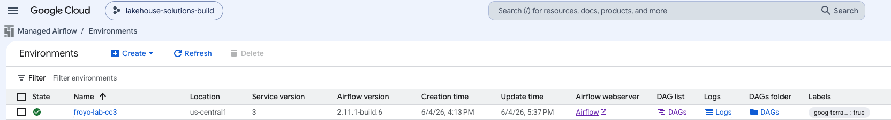   
<br><br>

### L5.2. Study the Airflow environment

Click on the various tabs to familairize yourself with the UI and the environment specs automatically created for you via Terraform in technical solution 3.

#### L5.2.1. Review the environment configuration tab

   
<br><br>

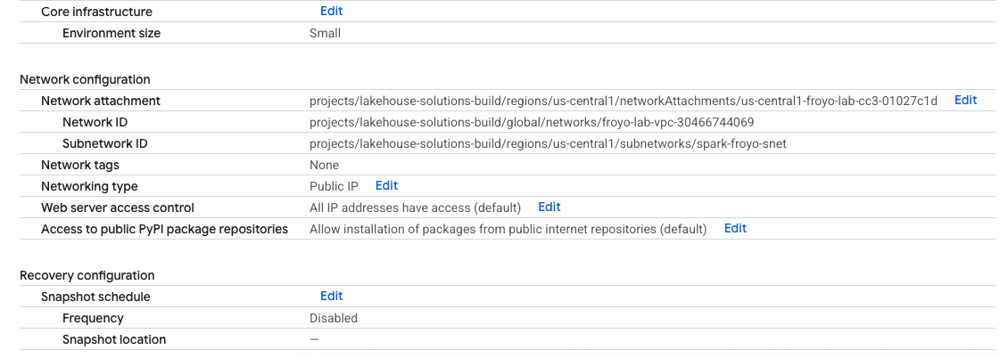   
<br><br>

<hr>


#### L5.2.2. Review the Airflow configuration overrides tab

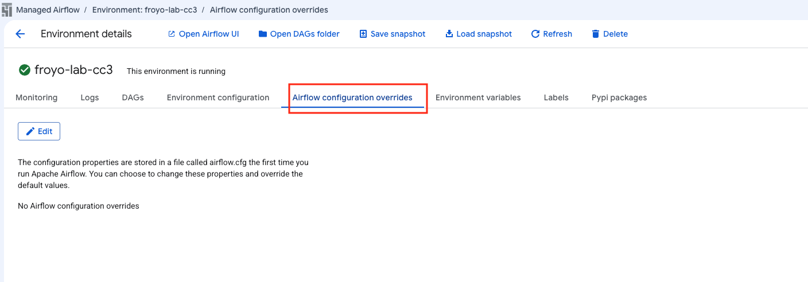   
<br><br>

<hr>

#### L5.2.3. Review the environment variables tab

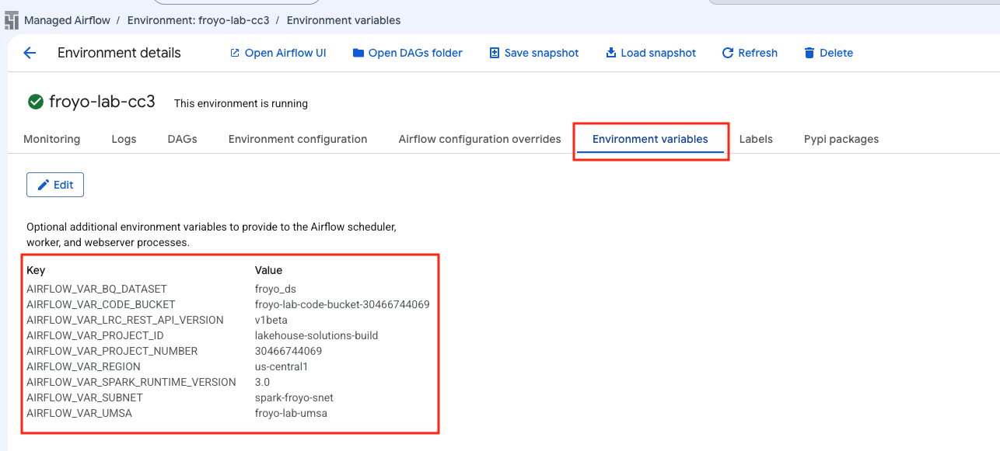   
<br><br>

<hr>


#### L5.2.4. Review the labels tab

   
<br><br>

<hr>


#### L52..5. Review the Pypi packages tab

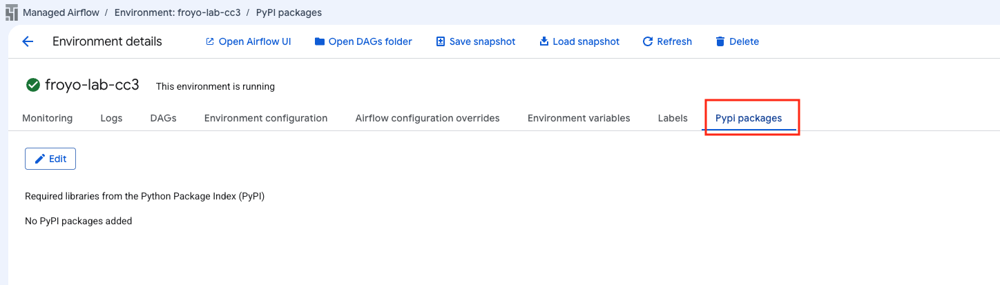   
<br><br>

<hr>


#### L5.2.6. Review the monitoring tab - overview

   
<br><br>

   
<br><br>

   
<br><br>

<hr>


#### L5.2.7. Review the monitoring tab - DAG statistics

   
<br><br>

   
<br><br>

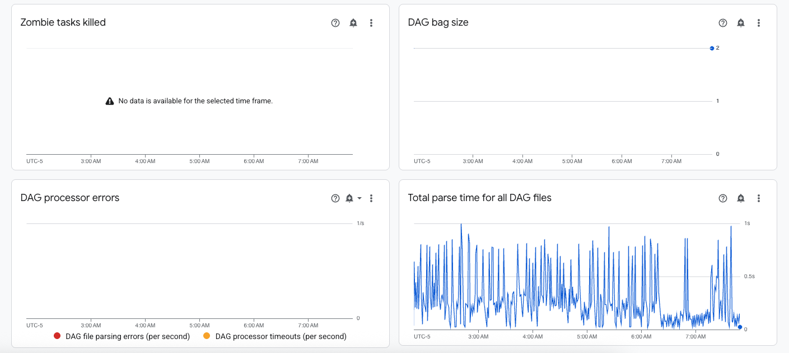   
<br><br>

<hr>

#### L5.2.8. Review the monitoring tab - schedulers

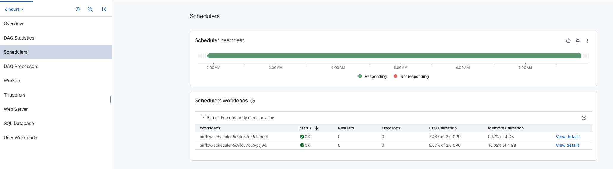   
<br><br>

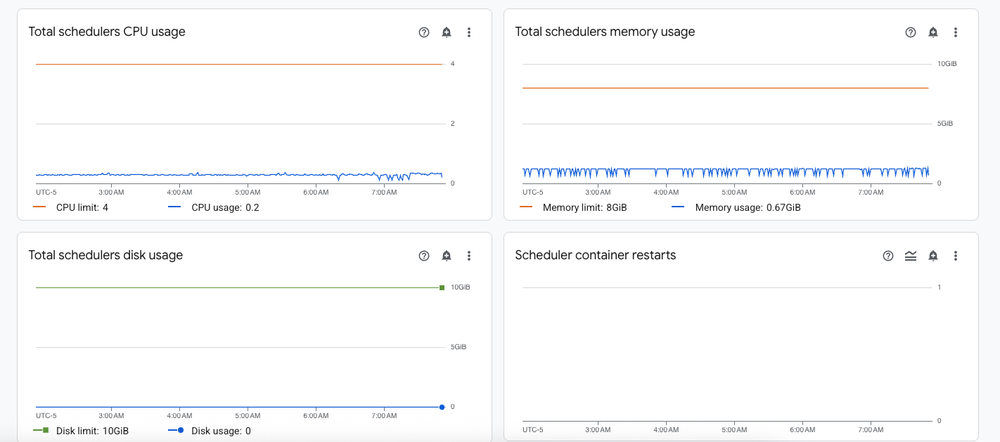   
<br><br>

   
<br><br>

<hr>

#### L5.2.9. Review the monitoring tab - DAG processors

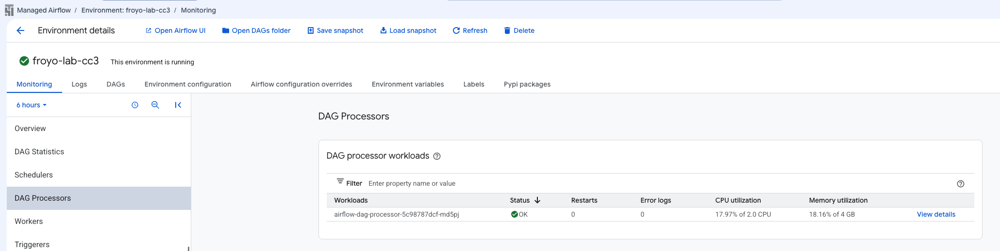   
<br><br>

   
<br><br>

<hr>

#### L5.2.10. Review the monitoring tab - workers

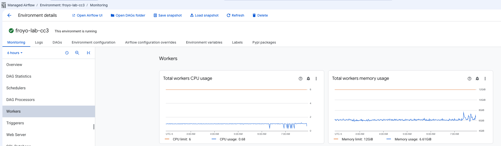   
<br><br>

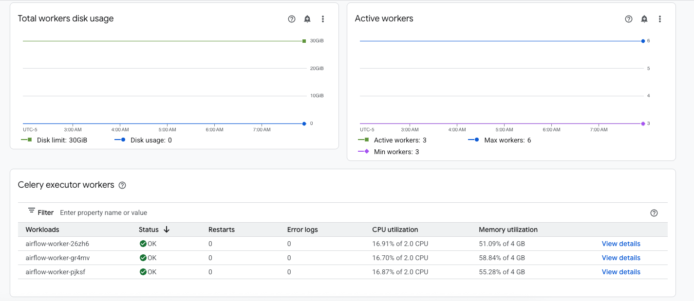   
<br><br>

   
<br><br>

   
<br><br>

   
<br><br>

<hr>

#### L5.2.11. Review the monitoring tab - triggerers

   
<br><br>

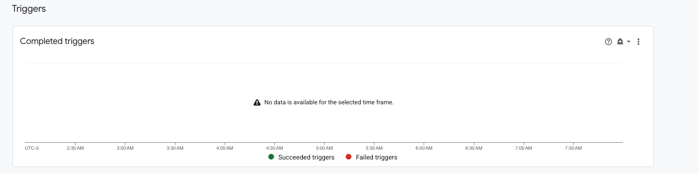   
<br><br>

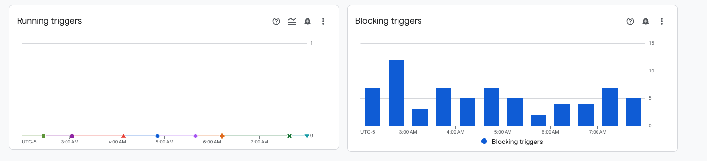   
<br><br>

   
<br><br>

   
<br><br>

   
<br><br>

<hr>

#### L5.2.12. Review the monitoring tab - webserver

   
<br><br>

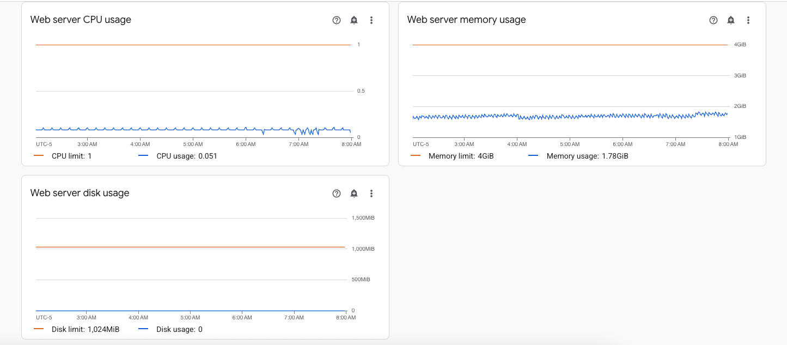   
<br><br>

<hr>

#### L5.2.13. Review the monitoring tab - SQL database

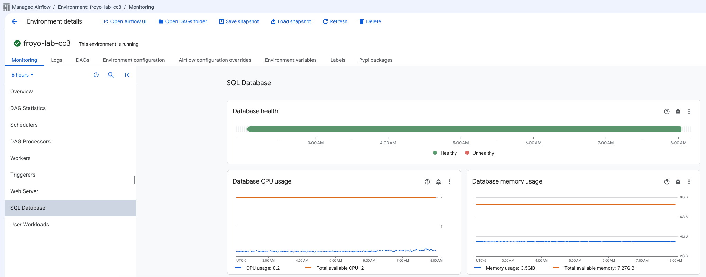   
<br><br>

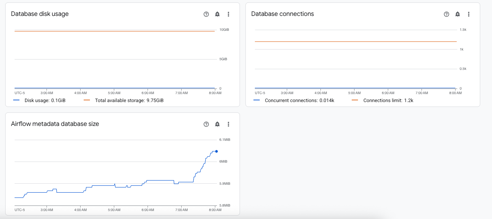   
<br><br>

<hr>

#### L5.2.14. Review the monitoring tab - SQL database

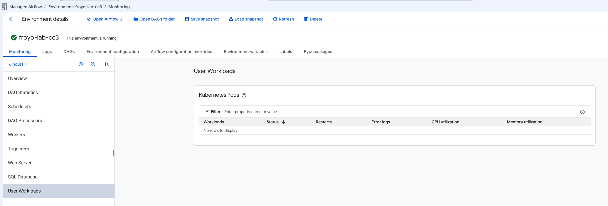   
<br><br>


<hr>

#### L5.2.15. Review the monitoring tab - logs

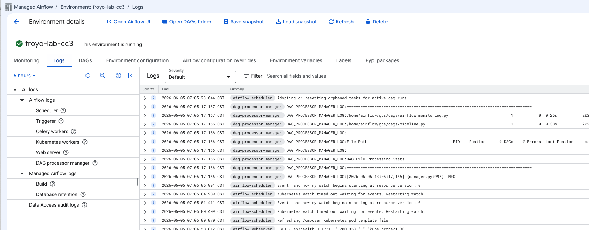   
<br><br>


<hr>

#### L5.2.16. Review the monitoring tab - DAGs

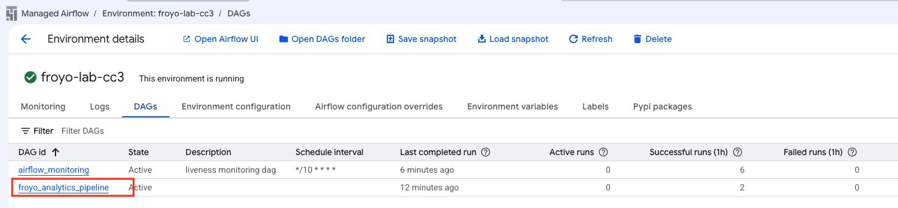   
<br><br>

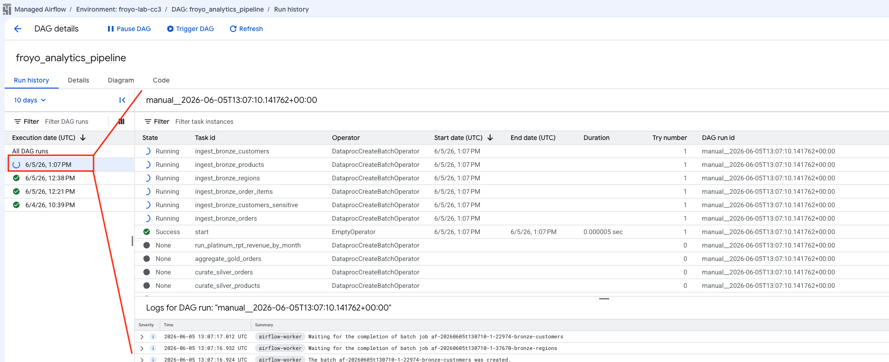   
<br><br>

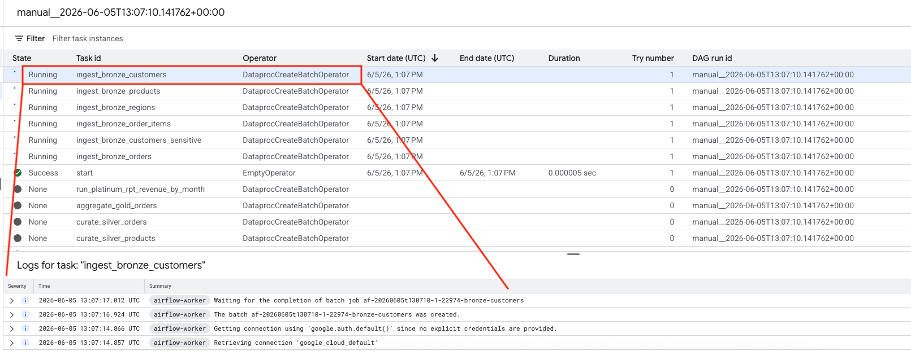   
<br><br>

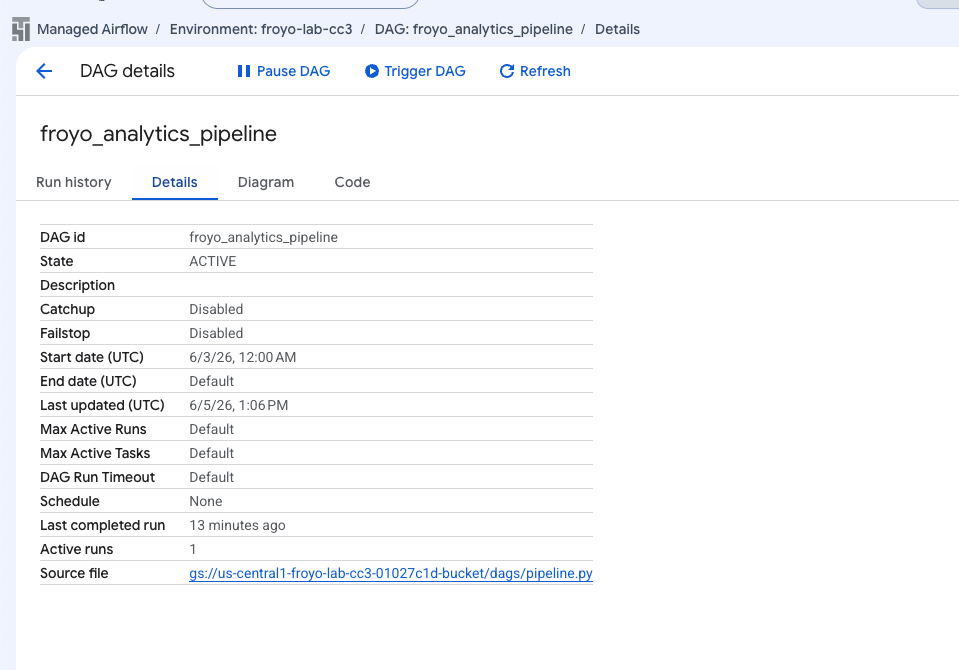   
<br><br>

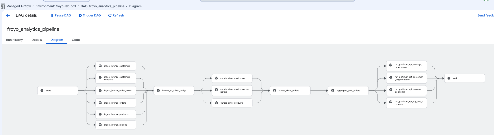   
<br><br>

   
<br><br>


<hr>

### L5.3. Review the monitoring tab - DAG code

```
# Copyright 2026 Google LLC
#
# Licensed under the Apache License, Version 2.0 (the "License");
# you may not use this file except in compliance with the License.
# You may obtain a copy of the License at
#
#     http://www.apache.org/licenses/LICENSE-2.0
#
# Unless required by applicable law or agreed to in writing, software
# distributed under the License is distributed on an "AS IS" BASIS,
# WITHOUT WARRANTIES OR CONDITIONS OF ANY KIND, either express or implied.
# See the License for the specific language governing permissions and
# limitations under the License.

# ======================================================================================
# ABOUT
# This script orchestrates the execution of the data engineering pipeline for froyo analytics
# ======================================================================================

import os
from airflow.models import Variable
from datetime import datetime
from airflow import models
from airflow.providers.google.cloud.operators.dataproc import (DataprocCreateBatchOperator,DataprocGetBatchOperator)
from airflow.operators.empty import EmptyOperator
from datetime import datetime
from airflow.utils.dates import days_ago
import string
import random 

# Read environment variables into local variables
project_id = models.Variable.get("project_id")
project_number = models.Variable.get("project_number")
region = models.Variable.get("region")
subnet=models.Variable.get("subnet")
umsa=models.Variable.get("umsa")
spark_runtime_version = models.Variable.get("spark_runtime_version")
lrc_rest_api_version= models.Variable.get("lrc_rest_api_version")

# Other varaiables
dag_name= "froyo_analytics_pipeline"
code_bucket=f"froyo-lab-code-bucket-{project_number}"
staging_bucket_name=f"froyo-lakehouse-staging-{project_number}"
lakehouse_bucket_name= f"froyo_iceberg_lakehouse_catalog_{project_number}"
iceberg_catalog_name = f"froyo_iceberg_lakehouse_catalog_{project_number}"

# User Managed Service Account FQN
service_account_id= umsa+"@"+project_id+".iam.gserviceaccount.com"

# PySpark script files in GCS, of the individual Spark applications in the pipeline
bronze_layer_ingestion_script= "gs://"+code_bucket+"/scripts/pyspark/bronze_layer_ingestion.py"
silver_layer_curation_script= "gs://"+code_bucket+"/scripts/pyspark/silver_layer_curation.py"
gold_layer_aggregation_script= "gs://"+code_bucket+"/scripts/pyspark/gold_layer_aggregation.py"
platinum_layer_reporting_script= "gs://"+code_bucket+"/scripts/pyspark/platinum_layer_reporting.py"

# This is to add a random value to the serverless Spark batch ID that needs to be unique each run 
num_digits_task_batch_id = 5  # number of digits in the random value.
unique_task_batch_id_suffix = ''.join(random.choices(string.digits, k = num_digits_task_batch_id))

def generate_unique_task_batch_id():
    return unique_task_batch_id_suffix

# Spark configurations for the serverless Spark batches
spark_properties_with_iceberg_catalog = {
    "spark.sql.adaptive.enabled": "true",
    "spark.sql.adaptive.advisoryPartitionSizeInBytes": "128mb",
    "spark.sql.adaptive.coalescePartitions.enabled": "true",
    f"spark.sql.defaultCatalog": iceberg_catalog_name,
    f"spark.sql.catalog.{iceberg_catalog_name}": "org.apache.iceberg.spark.SparkCatalog",
    f"spark.sql.catalog.{iceberg_catalog_name}.type": "rest",
    f"spark.sql.catalog.{iceberg_catalog_name}.uri": f"https://biglake.googleapis.com/iceberg/{lrc_rest_api_version}/restcatalog",
    f"spark.sql.catalog.{iceberg_catalog_name}.warehouse": f"gs://{lakehouse_bucket_name}",
    f"spark.sql.catalog.{iceberg_catalog_name}.io-impl": "org.apache.iceberg.gcp.gcs.GCSFileIO",
    f"spark.sql.catalog.{iceberg_catalog_name}.header.x-goog-user-project": project_id,
    f"spark.sql.catalog.{iceberg_catalog_name}.rest.auth.type": "org.apache.iceberg.gcp.auth.GoogleAuthManager",
    "spark.sql.extensions": "org.apache.iceberg.spark.extensions.IcebergSparkSessionExtensions",
    f"spark.sql.catalog.{iceberg_catalog_name}.rest-metrics-reporting-enabled": "false",
    "spark.dataproc.lineage.enabled": "true",
    "spark.openlineage.transport.type": "gcplineage",
    "spark.extraListeners": "io.openlineage.spark.agent.OpenLineageSparkListener",
    "spark.sql.repl.eagerEval.enabled": "True",
    "spark.openlineage.namespace": "froyo_spark_jobs"
}

spark_properties_foundational = {
    "spark.sql.adaptive.enabled": "true",
    "spark.sql.adaptive.advisoryPartitionSizeInBytes": "128mb",
    "spark.sql.adaptive.coalescePartitions.enabled": "true",
    "spark.dataproc.lineage.enabled": "true",
    "spark.openlineage.transport.type": "gcplineage",
    "spark.extraListeners": "io.openlineage.spark.agent.OpenLineageSparkListener",
    "spark.sql.repl.eagerEval.enabled": "True",
    "spark.openlineage.namespace": "froyo_spark_jobs"
}


def generate_batch_config(layer: str, entity_name: str):
    '''
    This function generates the batch config for a given layer and data entity. It uses the individual script files in GCS as templates and replaces the placeholder values with the actual values for each data entity and layer.
    '''
    if layer == "bronze" and entity_name in ["customers", "customers_sensitive", "products", "orders", "order_items", "regions"]:
        return {
            "pyspark_batch": {
                "main_python_file_uri": bronze_layer_ingestion_script,
                "args": [
                  project_id,
                  staging_bucket_name,
                  lakehouse_bucket_name,
                  entity_name
                ]
            },
            "environment_config":{
                "execution_config":{
                    "service_account": service_account_id,
                    "subnetwork_uri": subnet
                },
                
            },
            "runtime_config": {
                "version": spark_runtime_version,
                "properties": spark_properties_foundational
            },
        }
    elif layer == "silver" and entity_name in ["customers", "customers_sensitive", "products", "orders"]:
        return {
            "pyspark_batch": {
                "main_python_file_uri": silver_layer_curation_script,
                "args": [
                  project_id,
                  staging_bucket_name,
                  lakehouse_bucket_name,
                  entity_name
                ]
            },
            "environment_config":{
                "execution_config":{
                    "service_account": service_account_id,
                    "subnetwork_uri": subnet
                },
                
            },
            "runtime_config": {
                "version": spark_runtime_version,
                "properties": spark_properties_with_iceberg_catalog
            },
        }
    elif layer == "gold" and entity_name in ["orders"]:
        return {
            "pyspark_batch": {
                "main_python_file_uri": gold_layer_aggregation_script,
                "args": []
            },
            "environment_config":{
                "execution_config":{
                    "service_account": service_account_id,
                    "subnetwork_uri": subnet
                }, 
            },
            "runtime_config": {
                "version": spark_runtime_version,
                "properties": spark_properties_with_iceberg_catalog
            },
        }
    elif layer == "platinum" and entity_name in ["REVENUE_BY_MONTH","AVERAGE_ORDER_VALUE", "TOP_TEN_PRODUCTS", "CUSTOMER_SEGMENTATION"]:
        return {
            "pyspark_batch": {
                "main_python_file_uri": platinum_layer_reporting_script,
                "args": [
                    entity_name
                ]
            },
            "environment_config":{
                "execution_config":{
                    "service_account": service_account_id,
                    "subnetwork_uri": subnet
                },
                
            },
            "runtime_config": {
                "version": spark_runtime_version,
                "properties": spark_properties_with_iceberg_catalog
            },
        }
    else:
        raise ValueError(f"Invalid layer {layer} or data entity {data_entity_name}")
    
bronze_data_entities = [
    "customers",
    "customers_sensitive",
    "products",
    "orders",
    "order_items",
    "regions"
]

silver_data_entities = [
    "customers",
    "customers_sensitive",
    "products",
]

platinum_reporting_entities = [
    "REVENUE_BY_MONTH",
    "AVERAGE_ORDER_VALUE",
    "TOP_TEN_PRODUCTS",
    "CUSTOMER_SEGMENTATION"
]


with models.DAG(
    dag_name,
    schedule_interval=None,
    start_date = days_ago(2),
    catchup=False,
) as dag_serverless_batch:

    start_task = EmptyOperator(task_id="start")
    end_task = EmptyOperator(task_id="end")
    bronze_to_silver_bridge = EmptyOperator(task_id="bronze_to_silver_bridge")

    # Generate the batch config and create tasks for the bronze layer ingestion jobs in a loop, one for each data entity. These tasks will run in parallel.
    bronze_ingestion_parallel_tasks = []
    for data_entity_name in bronze_data_entities:
        task_id = f"ingest_bronze_{data_entity_name}"
        batch_id =  f"af-{{{{ ts_nodash | lower }}}}-{{{{ task_instance.try_number }}}}-" + generate_unique_task_batch_id()+  f"-bronze-{data_entity_name.replace('_', '-')}"
        batch_config = generate_batch_config("bronze", data_entity_name)

        task = DataprocCreateBatchOperator(
            task_id=task_id,
            project_id=project_id,
            region=region,
            batch=batch_config,
            batch_id=batch_id,
        )
        bronze_ingestion_parallel_tasks.append(task)

    # Generate the batch config and create tasks for the silver layer curation jobs in a loop, one for each data entity. These tasks will run in parallel.
    silver_curation_parallel_tasks = []
    for data_entity_name in silver_data_entities:
        task_id = f"curate_silver_{data_entity_name}"
        batch_id = f"af-{{{{ ts_nodash | lower }}}}-{{{{ task_instance.try_number }}}}-" + generate_unique_task_batch_id()+ f"-silver-{data_entity_name.replace('_', '-')}"
        batch_config = generate_batch_config("silver", data_entity_name)
    
        task = DataprocCreateBatchOperator(
            task_id=task_id,
            project_id=project_id,
            region=region,
            batch=batch_config,
            batch_id=batch_id,
        )
        silver_curation_parallel_tasks.append(task)

    # This silver curation task for orders is created separately, as the orders curation logic needs to reference the curated products data in the silver layer. Hence, we cannot run the silver curation task for orders in parallel with the other silver curation tasks. We need to run it sequentially after the other silver curation tasks are done, which is what we achieve by setting up the dependencies in the end of this code.
    task_id = f"curate_silver_orders"
    batch_id = f"af-{{{{ ts_nodash | lower }}}}-{{{{ task_instance.try_number }}}}-" + generate_unique_task_batch_id()+  f"-silver-orders"
    batch_config = generate_batch_config("silver", "orders")

    silver_curation_order_task = DataprocCreateBatchOperator(
        task_id=task_id,
        project_id=project_id,
        region=region,
        batch=batch_config,
        batch_id=batch_id,
    )

    # Generate the batch config and create task for the gold layer aggregation job
    task_id = f"aggregate_gold_orders"
    batch_id = f"af-{{{{ ts_nodash | lower }}}}-{{{{ task_instance.try_number }}}}-" + generate_unique_task_batch_id()+  f"-gold-orders"
    batch_config = generate_batch_config("gold", "orders")

    gold_aggregation_order_task = DataprocCreateBatchOperator(
        task_id=task_id,
        project_id=project_id,
        region=region,
        batch=batch_config,
        batch_id=batch_id,
    )

    platinum_reporting_parallel_tasks = []
    for entity_name in platinum_reporting_entities:
        task_id = f"run_platinum_rpt_{entity_name.lower()}"
        batch_id = f"af-{{{{ ts_nodash | lower }}}}-{{{{ task_instance.try_number }}}}-" + generate_unique_task_batch_id()+ f"-platinum-{entity_name.lower().replace('_', '-')}"
        batch_config = generate_batch_config("platinum", entity_name)
    
        task = DataprocCreateBatchOperator(
            task_id=task_id,
            project_id=project_id,
            region=region,
            batch=batch_config,
            batch_id=batch_id,
        )
        platinum_reporting_parallel_tasks.append(task)


    start_task >> bronze_ingestion_parallel_tasks >> bronze_to_silver_bridge >> silver_curation_parallel_tasks >> silver_curation_order_task >> gold_aggregation_order_task >> platinum_reporting_parallel_tasks >> end_task
```

<hr>

### L5.4. Understand the DAG code


#### 5.4.1. Read in the Airflow variables
Note the lines below. They read in the Airflow variables we set at the Airflow environment level. The variables were capitalized and have 'AIRFLOW_VAR' prefix. The below is the contruct to read them in.

```
# Read environment variables into local variables
project_id = models.Variable.get("project_id")
project_number = models.Variable.get("project_number")
region = models.Variable.get("region")
subnet=models.Variable.get("subnet")
umsa=models.Variable.get("umsa")
spark_runtime_version = models.Variable.get("spark_runtime_version")
lrc_rest_api_version= models.Variable.get("lrc_rest_api_version")
```

#### 5.4.2. Read in the Airflow variables


