*Copyright 2026 Google LLC*

*Licensed under the Apache License, Version 2.0 (the "License");
you may not use this file except in compliance with the License.
You may obtain a copy of the License at*

*http://www.apache.org/licenses/LICENSE-2.0*

*Unless required by applicable law or agreed to in writing, software
distributed under the License is distributed on an "AS IS" BASIS,
WITHOUT WARRANTIES OR CONDITIONS OF ANY KIND, either express or implied.
See the License for the specific language governing permissions and
limitations under the License.*


<hr>

# Technical Solution 4: Introduction to lakehouse pipeline orchestration with Managed Service for Apache Airflow on Google Cloud

## 1.0. About the lab

### 1.1. Abstract
This lab is **introductory** in nature and showcases orchestration of Apache Spark applications on Google Cloud Platform on the managed product - **Serverless Managed Service for Apache Spark**, with the serverless managed **Lakehouse runtime catalog** as the lakehouse Iceberg metastore on **Managed Service for Apache Airflow**. 

The goal of the lab is to demystify **Managed Servive for Apache Airflow** for lakehouse pipelines through a (zero fluff, zero dazzle) minimum viable end to end example of frozen yogurt (froyo) retail sales analysis to accelerate adoption. This lab builds on the lab in the previous module and operationalizes the froyo analytics medallion architecture in lab Spark notebook as a pipeline of serverless Spark batch jobs showcasing the development continuum. This hands-on lab complements the blog post [Lakehouse Demystified - Part 5: Just enough about Managed Service for Apache Airflow](TODO).

|  |  | 
| -- | :--- | 
| Technical Focus| **Managed Service for Apache Airflow** |
| Use case |  Frozen yogurt sales analysis |
| Domain |  Retail |
| Process | Data curation and analysis/reporting - medallion architecture |
| Dataset | Froyo sales - synthetically generated |
| Lakehouse compute engine | Apache Spark on Serverless Managed Service for Apache Spark |
| Lakehouse pipeline orchestration engine | Managed Service for Apache Airflow |


#### What to expect:

In this lab, you will use the environment provisioned in Technical Solution 3 and familiarize yourself with Airflow environments on Managed Service for Apache Airflow and running and monoitoring DAGs.

<hr>

### 1.2. Lab format

- Is fully scripted - the entire solution is provided, and with instructions
- Is self-paced/self-service

<hr>


### 1.3. Duration
The hands-on lab takes ~1 hour or less to complete

<hr>

### 1.4. Prerequisites

- Completion of Technical Solution 3 - hands-on lab

<hr>

### 1.5. Resources provisioned
Refer Technical Solution 3 - hands-on lab

<hr>

### 1.6. Audience

- A quick read for architects
- Targeted for hands on practitioners, especially data engineers

<hr>

### 1.7. What's covered

| Functionality | Feature | 
| -- | :--- | 
| Airflow environment | Visual walk through of the Managed Service for Apache Airflow |
| Airflow pipelines | Reference sample of an Airflow DAG and execution of the same on Managed Service for Apache Airflow |


<hr>

### 1.8. Lab Architecture

#### 1.8.1. Lakehouse Reference Architecture

Please refer to the [Lakehouse Demystified - Part 2](https://medium.com/google-cloud/lakehouse-demystified-part-2-just-enough-managed-spark-serverless-on-google-cloud-for-batch-6ac3e5051794) blog post for an explanation.

   
<br><br>

<hr>

#### 1.8.2. Lab Solution Architecture

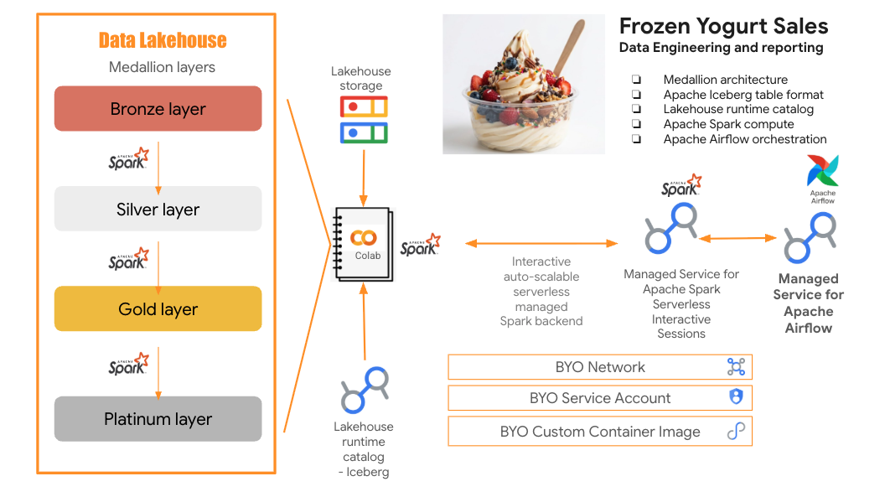   
<br><br>

We will build the medallion architecture with Apache Spark, and from silver layer and upwards, we will persist to Apache Iceberg format, with tables registered into Lakehouse Iceberg runtime catalog. We will use frozen yogurt retail sales data generated with Gemini for the lab, and the platinum layer will include a number of reports generated with code assistance from Data Science Agent in Colab notebooks.


<hr>

### 1.9. Lab Flow

In Technical Solution 3 lab, we built the medallion layers of the lakehouse in a Spark notebook. In this lab, we use four PySpark scripts - one for each layer - bronze, silver, gold and platinum. And execute a pre-constructed pipeline/DAG in Airflow.

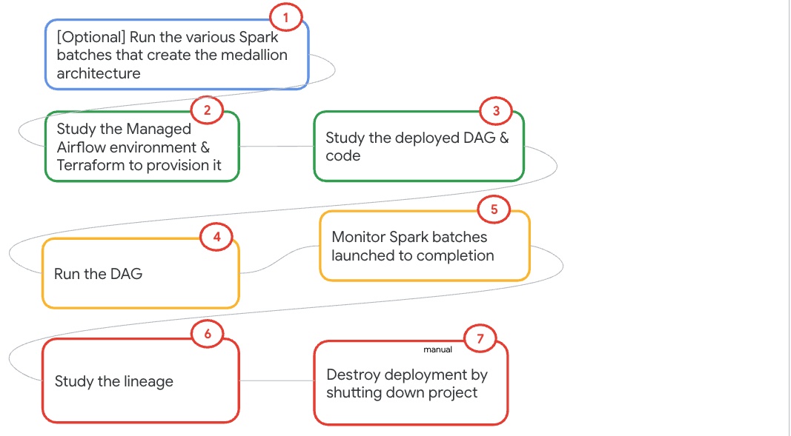   
<br><br>

<hr>

### 1.10. The data 

The data is the same as from the previous lab.

   
<br><br>

The unstructured data will be used in a subsequent hands-on lab.

<hr>


### 1.11. Table of contents

|#| Content | 
| -- | :--- | 
|1| [[INFORMATIONAL] Lakehouse reference architecture](./ts3-manual.md#181-lakehouse-reference-architecture) | 
|2| [[ABOUT THE LAB] Lab solution architecture](./ts3-manual.md#182-lab-solution-architecture) | 
|3| [[ABOUT THE LAB] Lab flow](./ts3-manual.md#19-lab-flow) | 
|4| [[ABOUT THE LAB] The data used in the lab](./ts3-manual.md#110-the-data) | 
|5| [[ABOUT THE LAB] ER diagram of the lab data](./ts3-manual.md#111-the-relationships-between-the-data-entities) | 
|6| [[ABOUT THE LAKEHOUSE RUNTIME CATALOG] Product highlights](./ts3-manual.md#2-product-highlights) | 
|7| [[LAB SETUP] Lab setup with Terraform](./ts3-manual.md#3-lab-setup) | 
|8| [[LAB SETUP] Lab resources provisioned](./ts3-manual.md#35-explore-the-resources-provisioned) | 
|9| [[INFORMATIONAL] Authentication modes for Lakehouse runtime catalog](./ts3-manual.md#451-authentication-modes-supported-with-lakehouse-runtime-catalog) | 
|10| [[INFORMATIONAL] Spark session configruation for **End User Credentials** authentication mode](./ts3-manual.md#451-end-user-credentials-authentication-mode)| 
|11| [[INFORMATIONAL] Spark session configruation for **Credential Vending** authentication mode](./ts3-manual.md#453-spark-session-configuration-for-credential-vending-authentication-mode)| 
|12| [[INFORMATIONAL] Authenticating with End User Credentials - what's involved](./ts3-manual.md#454-authenticating-with-end-user-credentials---whats-involved)|
|13| [[INFORMATIONAL] Authenticating with Credential Vending - what's involved](./ts3-manual.md#455-authenticating-with-credential-vending---whats-involved) |
|14| [[INFORMATIONAL] Authorization - out of the box IAM roles](./ts3-manual.md#461-authorization---out-of-the-box-iam-roles)|
|15| [[INFORMATIONAL] Access Control List (ACLs)](./ts3-manual.md#461-authorization---out-of-the-box-iam-roles)|
|16| [[INFORMATIONAL] Abolsutely minimal access with just read only to one table - what's involved](./ts3-manual.md#463-abolsutely-minimal-access-with-just-read-only-to-one-table---whats-involved) |
|17| [[ICEBERG CATALOG LAB] Lakehouse Iceberg runtime catalog lab - pictorial overview](./ts3-manual.md#43-lab-content---pictorial-overview) | 
|18| [[ICEBERG CATALOG LAB] Medallion architecture with Lakehouse runtime catalog for Iceberg with end user credentials](./ts3-manual.md#432-create-a-medallion-architecture-with-lakehouse-runtime-catalog-for-iceberg-as-the-metastore) | 
|21| [[ICEBERG CATALOG LAB] Out of the box data entry creation into Knowledge Catalog for Apache Iceberg tables in the Lakehouse runtime catalog](./ts3-manual.md#472-automated-knowledge-catalog-entry-creation) | 
|20| [[ICEBERG CATALOG LAB] Out of the box data lineage for Apache Iceberg tables in the Lakehouse runtime catalog](./ts3-manual.md#473-automated-lineage-capture-in-knowledge-catalog) | 
|21| [[ICEBERG CATALOG LAB] Apache Iceberg table format primer](./ts3-manual.md#433-optional-apache-iceberg-tutorial) | 
|22| [[BONUS] Prompt based data anaysis with Data Science Agent in Colab notebook - a primer](./ts3-manual.md#434-optional-data-analysis-lab-with-data-science-agent-in-colab-notebooks) | 
|23| [[HIVE CATALOG LAB] Lakehouse Hive runtime catalog lab](./ts3-manual.md#5-lab-for-hive-catalog) | 

<hr>

### 1.12. For success

Read the lab - narrative below, review the code, and then start trying out the lab.

<hr>


<hr>

# 2. Product Highlights


## Lakehouse runtime catalog

This hands-on lab complements the blog post [Lakehouse Demystified - Part 4: Just enough about Lakehouse runtime catalog](TODO) - reading the blog is recommended for full understanding of the product. The product documentation can be found [here](https://docs.cloud.google.com/lakehouse/docs/about-lakehouse-catalogs).

<hr>


# 3. Lab setup

<hr>

## 3.1. Clone this repo in Cloud Shell

```
git clone git@github.com:GoogleCloudPlatform/lakehouse-solutions.git
```

<hr>

## 3.2. Initialize active gcloud configuration

Run the following commands in Cloud Shell to authenticate and configure your active project:

1. Initialization:
```
gcloud init
```

2. Set the active project target:
```
gcloud config set project <YOUR_PROJECT_ID>
```

3. Set the quota project for ADC (Application Default Credentials):
```
gcloud auth application-default set-quota-project <YOUR_PROJECT_ID>
```

<hr>

## 3.3. Provisioning automation of foundational services with Terraform 

The Terraform in this section updates organization policies and enables Google APIs. The organization policy updates are needed for the Google Argolis environment but may not be needed in your environment - check with your administrator. If not needed, remove the section for organization policy updates.

1. Paste this in Cloud Shell
```
PROJECT_ID=`gcloud config list --format "value(core.project)" 2>/dev/null`

cd ~/lakehouse-solutions-build/solutions/spark-serverless-features/provisioning-automation/foundations-tf
```

2. Run the Terraform for organization policy edits and enabling Google APIs
```
terraform init
terraform apply \
  -var="project_id=${PROJECT_ID}" \
  -auto-approve >> spark-serverless-features-tf-foundations.output
```

Wait till the provisioning completes - ~5 minutes. In a separate cloud shell tab, you can tail the output file for execution state through completion-

```
tail -f  ~/lakehouse-solutions-build/solutions/spark-serverless-features/provisioning-automation/foundations-tf/spark-serverless-features-tf-foundations.output
```

<hr>

## 3.4. Provisioning automation of compute and data services with Terraform

### 3.4.1. Resources provisioned
In this section, we will provision-

#### 3.4.1.1. Network, subnet, firewall rule

   
<br><br>

   
<br><br>

   
<br><br>

<hr>


#### 3.4.1.2. Storage buckets for code, datasets, and for use with the services

   
<br><br>

<hr>

#### 3.4.1.3. User Managed Service Account (UMSA)

   
<br><br>


<hr>

#### 3.4.1.4. Requisite IAM permissions for the UMSA and yourself* 
*IAM permissions for yourself in case you want to go the console route instead of the programmatic route.<br>


   
<br><br>

Permissions for you to act as service account.

   
<br><br>

   
<br><br>

   
<br><br>


<hr>

#### 3.4.1.5. Copy of code, data, etc into buckets


   
<br><br>


   
<br><br>

<hr>

#### 3.4.1.6. Iceberg catalog in Lakehouse runtime catalog service


   
<br><br>

<hr>

#### 3.4.1.7. Hive catalog in Lakehouse runtime catalog service

This is a private preview feature and there is no UI component yet and the list command is yet to be released. You can however check the catalog out via Spark - this is part of the lab.

<hr>

#### 3.4.1.8. Managed Service for Apache Airflow** 
**Aiflow environment has been set up for the next solution that features data engineering pipeline on Managed Service for Apache Airflow

   
<br><br>

<hr>


### 3.4.2. Run the terraform scripts
Paste this in Cloud Shell after editing the GCP region variable to match your nearest region-
```
cd ~/lakehouse-solutions-build/solutions/spark-serverless-features/provisioning-automation/core-tf/terraform

PROJECT_ID=`gcloud config list --format "value(core.project)" 2>/dev/null`
PROJECT_NBR=`gcloud projects describe $PROJECT_ID | grep projectNumber | cut -d':' -f2 |  tr -d "'" | xargs`
PROJECT_NAME=`gcloud projects describe ${PROJECT_ID} | grep name | cut -d':' -f2 | xargs`
GCP_ACCOUNT_NAME=`gcloud auth list --filter=status:ACTIVE --format="value(account)"`
GCP_REGION="us-central1"
DEPLOYER_ACCOUNT_NAME=$GCP_ACCOUNT_NAME
ORG_ID=`gcloud organizations list --format="value(name)"`
S8S_SPARK_RUNTIME_VERSION="3.0"
MANAGED_AIRFLOW_SERVICE_VERSION="composer-3-airflow-2.11.1-build.6"
LAKEHOUSE_RUNTIME_CATALOG_REST_API_VERSION="v1beta"

```

2. Run the Terraform for provisioning the rest of the environment
```
terraform init
terraform apply \
  -var="project_id=${PROJECT_ID}" \
  -var="project_name=${PROJECT_NAME}" \
  -var="project_number=${PROJECT_NBR}" \
  -var="gcp_account_name=${GCP_ACCOUNT_NAME}" \
  -var="deployment_service_account_name=${DEPLOYER_ACCOUNT_NAME}" \
  -var="org_id=${ORG_ID}" \
  -var="spark_runtime_version=${S8S_SPARK_RUNTIME_VERSION}" \
  -var="gcp_region=${GCP_REGION}" \
  -var="managed_airflow_image_version=${MANAGED_AIRFLOW_SERVICE_VERSION}" \
  -var="lrc_rest_api_version=${LAKEHOUSE_RUNTIME_CATALOG_REST_API_VERSION}" \
  -auto-approve >> spark-serverless-features-tf-core.output
  
```

Takes ~50 minutes to complete. In a separate cloud shell tab, you can tail the output file for execution state through completion-

```
tail -f ~/lakehouse-solutions-build/solutions/spark-serverless-features/provisioning-automation/core-tf/terraform/spark-serverless-features-tf-core.output
```

<br>

<hr>

## 3.5. Explore the resources provisioned

Refer section 3.4 and browse all the services provisioned. In this section we will just explore the data and code.


Paste the following variables in Cloud Shell-
```
PROJECT_ID=`gcloud config list --format "value(core.project)" 2>/dev/null`
PROJECT_NBR=`gcloud projects describe $PROJECT_ID | grep projectNumber | cut -d':' -f2 |  tr -d "'" | xargs`
DATA_BUCKET="froyo-lakehouse-staging-${PROJECT_NBR}"
CODE_BUCKET="froyo-lab-code-bucket-${PROJECT_NBR}"
```

<br>

<hr>

### 3.5.1. GCS bucket for code

Run this command in Cloud Shell-
```
gcloud storage ls -r "gs://froyo-lab-code-bucket-$PROJECT_NBR"
```

   
<br><br>

<hr>

### 3.5.2. GCS bucket for structured data

Run this command in Cloud Shell-
```
gcloud storage  ls -r "gs://$DATA_BUCKET/froyo-data"
```

   
<br><br>

<hr>


### 3.5.3. GCS bucket for unstructured data - froyo recipes

Run this command in Cloud Shell-
```
gcloud storage  ls -r  "gs://$DATA_BUCKET/froyo-recipe-pdfs"
```


   
<br><br>


   
<br><br>

   
<br><br>

<hr>

### 3.5.4. GCS bucket for unstructured data - froyo recipe ingredients*
We will use this in a future lab.<br>

Run this command in Cloud Shell-
```
gcloud storage  ls -r  "gs://$DATA_BUCKET/froyo-recipe-ingredients-pdfs"
```


   
<br><br>


   
<br><br>


   
<br><br>

<hr>
<hr>


#==========


# LAB

## L1. [Optional] Run the Pyspark scripts for bronze layer ingestion 

### L1.1. Variables

```
# Google Cloud environment configuration
export PROJECT_ID=`gcloud config list --format "value(core.project)" 2>/dev/null`
export PROJECT_NBR=`gcloud projects describe $PROJECT_ID | grep projectNumber | cut -d':' -f2 |  tr -d "'" | xargs`
export REGION="us-central1"
export SUBNET_URI="projects/${PROJECT_ID}/regions/${REGION}/subnetworks/spark-froyo-snet"
export SERVICE_ACCOUNT="froyo-lab-umsa@${PROJECT_ID}.iam.gserviceaccount.com"
export SPARK_RUNTIME_VERSION="3.0"

# Bucket and script configuration
export CODE_BUCKET="froyo-lab-code-bucket-$PROJECT_NBR"
export BRONZE_LAYER_PROCESSING_SCRIPT_PATH="gs://${CODE_BUCKET}/scripts/pyspark/bronze_layer_ingestion.py"
export STAGING_BUCKET_NAME="froyo-lakehouse-staging-$PROJECT_NBR"
export LAKEHOUSE_BUCKET_NAME="froyo_iceberg_lakehouse_catalog_$PROJECT_NBR"
```

### L1.2. Test the script for customer data ingestion

```
export DATA_ENTITY_NAME="customers" 

gcloud dataproc batches submit pyspark ${BRONZE_LAYER_PROCESSING_SCRIPT_PATH} \
    --project=${PROJECT_ID} \
    --region=${REGION} \
    --batch="bronze-ingestion-${DATA_ENTITY_NAME}-$(date +%s)" \
    --version=${SPARK_RUNTIME_VERSION} \
    --subnet=${SUBNET_URI} \
    --service-account=${SERVICE_ACCOUNT} \
    --properties="spark.sql.adaptive.enabled=true,spark.sql.adaptive.advisoryPartitionSizeInBytes=128mb,spark.sql.adaptive.coalescePartitions.enabled=true" \
    -- \
    ${PROJECT_ID} \
    ${STAGING_BUCKET_NAME} \
    ${LAKEHOUSE_BUCKET_NAME} \
    ${DATA_ENTITY_NAME}

```

### L1.3. Test the script for customer sensitive data ingestion

```
export DATA_ENTITY_NAME="customers_sensitive" 
BATCH_ID=`echo $DATA_ENTITY_NAME | tr '_' '-'`


gcloud dataproc batches submit pyspark ${BRONZE_LAYER_PROCESSING_SCRIPT_PATH} \
    --project=${PROJECT_ID} \
    --region=${REGION} \
    --batch="bronze-ingestion-${BATCH_ID}-$(date +%s)" \
    --version=${SPARK_RUNTIME_VERSION} \
    --subnet=${SUBNET_URI} \
    --service-account=${SERVICE_ACCOUNT} \
    --properties="spark.sql.adaptive.enabled=true,spark.sql.adaptive.advisoryPartitionSizeInBytes=128mb,spark.sql.adaptive.coalescePartitions.enabled=true" \
    -- \
    ${PROJECT_ID} \
    ${STAGING_BUCKET_NAME} \
    ${LAKEHOUSE_BUCKET_NAME} \
    ${DATA_ENTITY_NAME}
```

### L1.4. Test the script for product data ingestion

```
export DATA_ENTITY_NAME="products" 
BATCH_ID=`echo $DATA_ENTITY_NAME | tr '_' '-'`

gcloud dataproc batches submit pyspark ${BRONZE_LAYER_PROCESSING_SCRIPT_PATH} \
    --project=${PROJECT_ID} \
    --region=${REGION} \
    --batch="bronze-ingestion-${BATCH_ID}-$(date +%s)" \
    --version=${SPARK_RUNTIME_VERSION} \
    --subnet=${SUBNET_URI} \
    --service-account=${SERVICE_ACCOUNT} \
    --properties="spark.sql.adaptive.enabled=true,spark.sql.adaptive.advisoryPartitionSizeInBytes=128mb,spark.sql.adaptive.coalescePartitions.enabled=true" \
    -- \
    ${PROJECT_ID} \
    ${STAGING_BUCKET_NAME} \
    ${LAKEHOUSE_BUCKET_NAME} \
    ${DATA_ENTITY_NAME}
```

### L1.5. Test the script for order data ingestion

```
export DATA_ENTITY_NAME="orders" 
BATCH_ID=`echo $DATA_ENTITY_NAME | tr '_' '-'`


gcloud dataproc batches submit pyspark ${BRONZE_LAYER_PROCESSING_SCRIPT_PATH} \
    --project=${PROJECT_ID} \
    --region=${REGION} \
    --batch="bronze-ingestion-${BATCH_ID}-$(date +%s)" \
    --version=${SPARK_RUNTIME_VERSION} \
    --subnet=${SUBNET_URI} \
    --service-account=${SERVICE_ACCOUNT} \
    --properties="spark.sql.adaptive.enabled=true,spark.sql.adaptive.advisoryPartitionSizeInBytes=128mb,spark.sql.adaptive.coalescePartitions.enabled=true" \
    -- \
    ${PROJECT_ID} \
    ${STAGING_BUCKET_NAME} \
    ${LAKEHOUSE_BUCKET_NAME} \
    ${DATA_ENTITY_NAME}
```


### L1.6. Test the script for order items data ingestion

```
export DATA_ENTITY_NAME="order_items" 
BATCH_ID=`echo $DATA_ENTITY_NAME | tr '_' '-'`


gcloud dataproc batches submit pyspark ${BRONZE_LAYER_PROCESSING_SCRIPT_PATH} \
    --project=${PROJECT_ID} \
    --region=${REGION} \
    --batch="bronze-ingestion-${BATCH_ID}-$(date +%s)" \
    --version=${SPARK_RUNTIME_VERSION} \
    --subnet=${SUBNET_URI} \
    --service-account=${SERVICE_ACCOUNT} \
    --properties="spark.sql.adaptive.enabled=true,spark.sql.adaptive.advisoryPartitionSizeInBytes=128mb,spark.sql.adaptive.coalescePartitions.enabled=true" \
    -- \
    ${PROJECT_ID} \
    ${STAGING_BUCKET_NAME} \
    ${LAKEHOUSE_BUCKET_NAME} \
    ${DATA_ENTITY_NAME}
```

### L1.7. Test the script for regions data ingestion

```
export DATA_ENTITY_NAME="regions" 
BATCH_ID=`echo $DATA_ENTITY_NAME | tr '_' '-'`


gcloud dataproc batches submit pyspark ${BRONZE_LAYER_PROCESSING_SCRIPT_PATH} \
    --project=${PROJECT_ID} \
    --region=${REGION} \
    --batch="bronze-ingestion-${BATCH_ID}-$(date +%s)" \
    --version=${SPARK_RUNTIME_VERSION} \
    --subnet=${SUBNET_URI} \
    --service-account=${SERVICE_ACCOUNT} \
    --properties="spark.sql.adaptive.enabled=true,spark.sql.adaptive.advisoryPartitionSizeInBytes=128mb,spark.sql.adaptive.coalescePartitions.enabled=true" \
    -- \
    ${PROJECT_ID} \
    ${STAGING_BUCKET_NAME} \
    ${LAKEHOUSE_BUCKET_NAME} \
    ${DATA_ENTITY_NAME} 
```

<hr>


## L2. [Optional] Run the Pyspark scripts for silver layer curation

### L2.1. Variables

```
# Google Cloud environment configuration
export PROJECT_ID=`gcloud config list --format "value(core.project)" 2>/dev/null`
export PROJECT_NBR=`gcloud projects describe $PROJECT_ID | grep projectNumber | cut -d':' -f2 |  tr -d "'" | xargs`
export REGION="us-central1"
export SUBNET_URI="projects/${PROJECT_ID}/regions/${REGION}/subnetworks/spark-froyo-snet"
export SERVICE_ACCOUNT="froyo-lab-umsa@${PROJECT_ID}.iam.gserviceaccount.com"
export SPARK_RUNTIME_VERSION="3.0"

# Bucket and script configuration
export CODE_BUCKET="froyo-lab-code-bucket-$PROJECT_NBR"
export SILVER_LAYER_PROCESSING_SCRIPT_PATH="gs://${CODE_BUCKET}/scripts/pyspark/silver_layer_curation.py"
export LAKEHOUSE_BUCKET_NAME="froyo_iceberg_lakehouse_catalog_$PROJECT_NBR"
export STAGING_BUCKET_NAME="froyo-lakehouse-staging-$PROJECT_NBR"
export ICEBERG_CATALOG_NAME="froyo_iceberg_lakehouse_catalog_$PROJECT_NBR"
export REST_API_VERSION="v1beta"
export SPARK_PROPERTIES="spark.sql.adaptive.enabled=true,spark.sql.adaptive.advisoryPartitionSizeInBytes=128mb,spark.sql.adaptive.coalescePartitions.enabled=true,spark.sql.defaultCatalog=$ICEBERG_CATALOG_NAME,spark.sql.catalog.$ICEBERG_CATALOG_NAME=org.apache.iceberg.spark.SparkCatalog,spark.sql.catalog.$ICEBERG_CATALOG_NAME.type=rest,spark.sql.catalog.$ICEBERG_CATALOG_NAME.uri=https://biglake.googleapis.com/iceberg/$REST_API_VERSION/restcatalog,spark.sql.catalog.$ICEBERG_CATALOG_NAME.warehouse=gs://$LAKEHOUSE_BUCKET_NAME,spark.sql.catalog.$ICEBERG_CATALOG_NAME.io-impl=org.apache.iceberg.gcp.gcs.GCSFileIO,spark.sql.catalog.$ICEBERG_CATALOG_NAME.header.x-goog-user-project=$PROJECT_ID,spark.sql.catalog.$ICEBERG_CATALOG_NAME.rest.auth.type=org.apache.iceberg.gcp.auth.GoogleAuthManager,spark.sql.extensions=org.apache.iceberg.spark.extensions.IcebergSparkSessionExtensions,
spark.sql.catalog.$ICEBERG_CATALOG_NAME.rest-metrics-reporting-enabled=false,spark.dataproc.lineage.enabled=true,spark.openlineage.transport.type=gcplineage,spark.extraListeners=io.openlineage.spark.agent.OpenLineageSparkListener,spark.sql.repl.eagerEval.enabled=True, spark.openlineage.namespace=froyo_spark_jobs"

```


### L2.1. Curate customer master data

```
export DATA_ENTITY_NAME="customers" 
BATCH_ID=`echo $DATA_ENTITY_NAME | tr '_' '-'`


gcloud dataproc batches submit pyspark ${SILVER_LAYER_PROCESSING_SCRIPT_PATH} \
    --project=${PROJECT_ID} \
    --region=${REGION} \
    --batch="silver-curation-${BATCH_ID}-$(date +%s)" \
    --version=${SPARK_RUNTIME_VERSION} \
    --subnet=${SUBNET_URI} \
    --service-account=${SERVICE_ACCOUNT} \
    --properties="${SPARK_PROPERTIES}" \
    -- \
    ${PROJECT_ID} \
    ${STAGING_BUCKET_NAME} \
    ${LAKEHOUSE_BUCKET_NAME} \
    ${DATA_ENTITY_NAME}
```

### L2.2. Curate customer sensitive data

```
export DATA_ENTITY_NAME="customers_sensitive" 
BATCH_ID=`echo $DATA_ENTITY_NAME | tr '_' '-'`


gcloud dataproc batches submit pyspark ${SILVER_LAYER_PROCESSING_SCRIPT_PATH} \
    --project=${PROJECT_ID} \
    --region=${REGION} \
    --batch="silver-curation-${BATCH_ID}-$(date +%s)" \
    --version=${SPARK_RUNTIME_VERSION} \
    --subnet=${SUBNET_URI} \
    --service-account=${SERVICE_ACCOUNT} \
    --properties="${SPARK_PROPERTIES}" \
    -- \
    ${PROJECT_ID} \
    ${STAGING_BUCKET_NAME} \
    ${LAKEHOUSE_BUCKET_NAME} \
    ${DATA_ENTITY_NAME}
```

### L2.3. Curate product data

```
export DATA_ENTITY_NAME="products" 
BATCH_ID=`echo $DATA_ENTITY_NAME | tr '_' '-'`


gcloud dataproc batches submit pyspark ${SILVER_LAYER_PROCESSING_SCRIPT_PATH} \
    --project=${PROJECT_ID} \
    --region=${REGION} \
    --batch="silver-curation-${BATCH_ID}-$(date +%s)" \
    --version=${SPARK_RUNTIME_VERSION} \
    --subnet=${SUBNET_URI} \
    --service-account=${SERVICE_ACCOUNT} \
    --properties="${SPARK_PROPERTIES}" \
    -- \
    ${PROJECT_ID} \
    ${STAGING_BUCKET_NAME} \
    ${LAKEHOUSE_BUCKET_NAME} \
    ${DATA_ENTITY_NAME}
```

### L2.4. Curate orders data

```
export DATA_ENTITY_NAME="orders" 
BATCH_ID=`echo $DATA_ENTITY_NAME | tr '_' '-'`


gcloud dataproc batches submit pyspark ${SILVER_LAYER_PROCESSING_SCRIPT_PATH} \
    --project=${PROJECT_ID} \
    --region=${REGION} \
    --batch="silver-curation-${BATCH_ID}-$(date +%s)" \
    --version=${SPARK_RUNTIME_VERSION} \
    --subnet=${SUBNET_URI} \
    --service-account=${SERVICE_ACCOUNT} \
    --properties="${SPARK_PROPERTIES}" \
    -- \
    ${PROJECT_ID} \
    ${STAGING_BUCKET_NAME} \
    ${LAKEHOUSE_BUCKET_NAME} \
    ${DATA_ENTITY_NAME}
```

<hr>

## L3. [Optional] Run the Pyspark scripts for gold layer aggregation

### L3.1. Variables

```
# Google Cloud environment configuration
export PROJECT_ID=`gcloud config list --format "value(core.project)" 2>/dev/null`
export PROJECT_NBR=`gcloud projects describe $PROJECT_ID | grep projectNumber | cut -d':' -f2 |  tr -d "'" | xargs`
export REGION="us-central1"
export SUBNET_URI="projects/${PROJECT_ID}/regions/${REGION}/subnetworks/spark-froyo-snet"
export SERVICE_ACCOUNT="froyo-lab-umsa@${PROJECT_ID}.iam.gserviceaccount.com"
export SPARK_RUNTIME_VERSION="3.0"
export REST_API_VERSION="v1beta"

# Bucket and script configuration
export CODE_BUCKET="froyo-lab-code-bucket-$PROJECT_NBR"
export GOLD_LAYER_PROCESSING_SCRIPT_PATH="gs://${CODE_BUCKET}/scripts/pyspark/gold_layer_aggregation.py"
export LAKEHOUSE_BUCKET_NAME="froyo_iceberg_lakehouse_catalog_$PROJECT_NBR"
export ICEBERG_CATALOG_NAME="froyo_iceberg_lakehouse_catalog_$PROJECT_NBR"
export SPARK_PROPERTIES="spark.sql.adaptive.enabled=true,spark.sql.adaptive.advisoryPartitionSizeInBytes=128mb,spark.sql.adaptive.coalescePartitions.enabled=true,spark.sql.defaultCatalog=$ICEBERG_CATALOG_NAME,spark.sql.catalog.$ICEBERG_CATALOG_NAME=org.apache.iceberg.spark.SparkCatalog,spark.sql.catalog.$ICEBERG_CATALOG_NAME.type=rest,spark.sql.catalog.$ICEBERG_CATALOG_NAME.uri=https://biglake.googleapis.com/iceberg/$REST_API_VERSION/restcatalog,spark.sql.catalog.$ICEBERG_CATALOG_NAME.warehouse=gs://$LAKEHOUSE_BUCKET_NAME,spark.sql.catalog.$ICEBERG_CATALOG_NAME.io-impl=org.apache.iceberg.gcp.gcs.GCSFileIO,spark.sql.catalog.$ICEBERG_CATALOG_NAME.header.x-goog-user-project=$PROJECT_ID,spark.sql.catalog.$ICEBERG_CATALOG_NAME.rest.auth.type=org.apache.iceberg.gcp.auth.GoogleAuthManager,spark.sql.extensions=org.apache.iceberg.spark.extensions.IcebergSparkSessionExtensions,
spark.sql.catalog.$ICEBERG_CATALOG_NAME.rest-metrics-reporting-enabled=false,spark.dataproc.lineage.enabled=true,spark.openlineage.transport.type=gcplineage,spark.extraListeners=io.openlineage.spark.agent.OpenLineageSparkListener,spark.sql.repl.eagerEval.enabled=True, spark.openlineage.namespace=froyo_spark_jobs"

```

### L3.2. Aggregate orders

```
BATCH_ID="gold-layer-aggregation"

gcloud dataproc batches submit pyspark ${GOLD_LAYER_PROCESSING_SCRIPT_PATH} \
    --project=${PROJECT_ID} \
    --region=${REGION} \
    --batch="${BATCH_ID}-$(date +%s)" \
    --version=${SPARK_RUNTIME_VERSION} \
    --subnet=${SUBNET_URI} \
    --service-account=${SERVICE_ACCOUNT} \
    --properties="${SPARK_PROPERTIES}" 
```

<hr>

## L4. [Optional] Run the Pyspark scripts for platinum layer reporting

### L4.1. Variables

```
# Google Cloud environment configuration
export PROJECT_ID=`gcloud config list --format "value(core.project)" 2>/dev/null`
export PROJECT_NBR=`gcloud projects describe $PROJECT_ID | grep projectNumber | cut -d':' -f2 |  tr -d "'" | xargs`
export REGION="us-central1"
export SUBNET_URI="projects/${PROJECT_ID}/regions/${REGION}/subnetworks/spark-froyo-snet"
export SERVICE_ACCOUNT="froyo-lab-umsa@${PROJECT_ID}.iam.gserviceaccount.com"
export SPARK_RUNTIME_VERSION="3.0"
export REST_API_VERSION="v1beta"

# Bucket and script configuration
export CODE_BUCKET="froyo-lab-code-bucket-$PROJECT_NBR"
export PLATINUM_LAYER_PROCESSING_SCRIPT_PATH="gs://${CODE_BUCKET}/scripts/pyspark/platinum_layer_reporting.py"
export LAKEHOUSE_BUCKET_NAME="froyo_iceberg_lakehouse_catalog_$PROJECT_NBR"
export ICEBERG_CATALOG_NAME="froyo_iceberg_lakehouse_catalog_$PROJECT_NBR"
export SPARK_PROPERTIES="spark.sql.adaptive.enabled=true,spark.sql.adaptive.advisoryPartitionSizeInBytes=128mb,spark.sql.adaptive.coalescePartitions.enabled=true,spark.sql.defaultCatalog=$ICEBERG_CATALOG_NAME,spark.sql.catalog.$ICEBERG_CATALOG_NAME=org.apache.iceberg.spark.SparkCatalog,spark.sql.catalog.$ICEBERG_CATALOG_NAME.type=rest,spark.sql.catalog.$ICEBERG_CATALOG_NAME.uri=https://biglake.googleapis.com/iceberg/$REST_API_VERSION/restcatalog,spark.sql.catalog.$ICEBERG_CATALOG_NAME.warehouse=gs://$LAKEHOUSE_BUCKET_NAME,spark.sql.catalog.$ICEBERG_CATALOG_NAME.io-impl=org.apache.iceberg.gcp.gcs.GCSFileIO,spark.sql.catalog.$ICEBERG_CATALOG_NAME.header.x-goog-user-project=$PROJECT_ID,spark.sql.catalog.$ICEBERG_CATALOG_NAME.rest.auth.type=org.apache.iceberg.gcp.auth.GoogleAuthManager,spark.sql.extensions=org.apache.iceberg.spark.extensions.IcebergSparkSessionExtensions,
spark.sql.catalog.$ICEBERG_CATALOG_NAME.rest-metrics-reporting-enabled=false,spark.dataproc.lineage.enabled=true,spark.openlineage.transport.type=gcplineage,spark.extraListeners=io.openlineage.spark.agent.OpenLineageSparkListener,spark.sql.repl.eagerEval.enabled=True, spark.openlineage.namespace=froyo_spark_jobs"

```

### L4.2. Generate 'Revenue By Month' report

```
REPORT_NAME="REVENUE_BY_MONTH"
BATCH_ID="platinum-layer-reporting"

gcloud dataproc batches submit pyspark ${PLATINUM_LAYER_PROCESSING_SCRIPT_PATH} \
    --project=${PROJECT_ID} \
    --region=${REGION} \
    --batch="${BATCH_ID}-$(date +%s)" \
    --version=${SPARK_RUNTIME_VERSION} \
    --subnet=${SUBNET_URI} \
    --service-account=${SERVICE_ACCOUNT} \
    --properties="${SPARK_PROPERTIES}"  -- \
    ${REPORT_NAME} 
```

### L4.3. Generate 'Average Order Value' report

```
REPORT_NAME="AVERAGE_ORDER_VALUE"
BATCH_ID="platinum-layer-reporting"

gcloud dataproc batches submit pyspark ${PLATINUM_LAYER_PROCESSING_SCRIPT_PATH} \
    --project=${PROJECT_ID} \
    --region=${REGION} \
    --batch="${BATCH_ID}-$(date +%s)" \
    --version=${SPARK_RUNTIME_VERSION} \
    --subnet=${SUBNET_URI} \
    --service-account=${SERVICE_ACCOUNT} \
    --properties="${SPARK_PROPERTIES}"  -- \
    ${REPORT_NAME} 
```


### L4.4. Generate 'Top Ten Products' report

```
REPORT_NAME="TOP_TEN_PRODUCTS"
BATCH_ID="platinum-layer-reporting"

gcloud dataproc batches submit pyspark ${PLATINUM_LAYER_PROCESSING_SCRIPT_PATH} \
    --project=${PROJECT_ID} \
    --region=${REGION} \
    --batch="${BATCH_ID}-$(date +%s)" \
    --version=${SPARK_RUNTIME_VERSION} \
    --subnet=${SUBNET_URI} \
    --service-account=${SERVICE_ACCOUNT} \
    --properties="${SPARK_PROPERTIES}"  -- \
    ${REPORT_NAME} 
```


### L4.5. Generate 'Customer Segmentation' report

```
REPORT_NAME="CUSTOMER_SEGMENTATION"
BATCH_ID="platinum-layer-reporting"

gcloud dataproc batches submit pyspark ${PLATINUM_LAYER_PROCESSING_SCRIPT_PATH} \
    --project=${PROJECT_ID} \
    --region=${REGION} \
    --batch="${BATCH_ID}-$(date +%s)" \
    --version=${SPARK_RUNTIME_VERSION} \
    --subnet=${SUBNET_URI} \
    --service-account=${SERVICE_ACCOUNT} \
    --properties="${SPARK_PROPERTIES}"  -- \
    ${REPORT_NAME} 
```

<hr>

## L5. Run the DAG in Managed Servive for Apache Airflow

### L5.1. Navigate to Managed Service for Apache Airflow
Search for Airflow in the [cloud console](https://console.cloud.google.com)

   
<br><br>

### L5.2. Study the Airflow environment

Click on the various tabs to familairize yourself with the UI and the environment specs automatically created for you via Terraform in technical solution 3.

#### L5.2.1. Review the environment configuration tab

   
<br><br>

   
<br><br>

<hr>


#### L5.2.2. Review the Airflow configuration overrides tab

   
<br><br>

<hr>

#### L5.2.3. Review the environment variables tab

   
<br><br>

<hr>


#### L5.2.4. Review the labels tab

   
<br><br>

<hr>


#### L52..5. Review the Pypi packages tab

   
<br><br>

<hr>


#### L5.2.6. Review the monitoring tab - overview

   
<br><br>

   
<br><br>

   
<br><br>

<hr>


#### L5.2.7. Review the monitoring tab - DAG statistics

   
<br><br>

   
<br><br>

   
<br><br>

<hr>

#### L5.2.8. Review the monitoring tab - schedulers

   
<br><br>

   
<br><br>

   
<br><br>

<hr>

#### L5.2.9. Review the monitoring tab - DAG processors

   
<br><br>

   
<br><br>

<hr>

#### L5.2.10. Review the monitoring tab - workers

   
<br><br>

   
<br><br>

   
<br><br>

   
<br><br>

   
<br><br>

<hr>

#### L5.2.11. Review the monitoring tab - triggerers

   
<br><br>

   
<br><br>

   
<br><br>

   
<br><br>

   
<br><br>

   
<br><br>

<hr>

#### L5.2.12. Review the monitoring tab - webserver

   
<br><br>

   
<br><br>

<hr>

#### L5.2.13. Review the monitoring tab - SQL database

   
<br><br>

   
<br><br>

<hr>

#### L5.2.14. Review the monitoring tab - SQL database

   
<br><br>


<hr>

#### L5.2.15. Review the monitoring tab - logs

   
<br><br>


<hr>

#### L5.2.16. Review the monitoring tab - DAGs

   
<br><br>

   
<br><br>

   
<br><br>

   
<br><br>

   
<br><br>

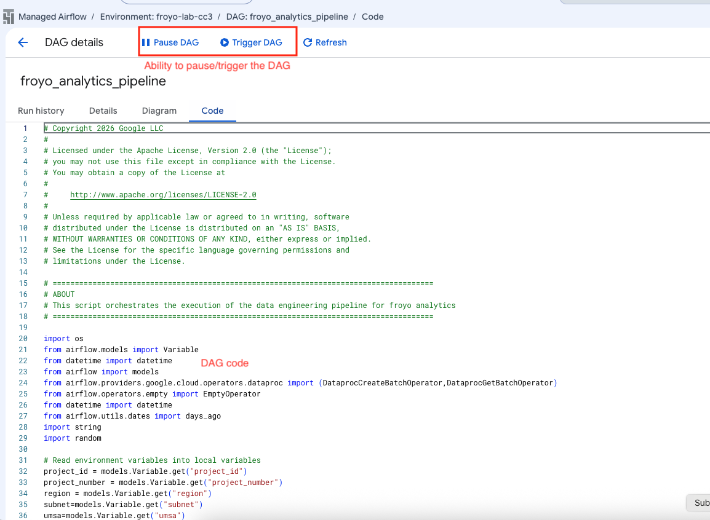   
<br><br>


<hr>

### L5.3. Review the monitoring tab - DAG code

```
# Copyright 2026 Google LLC
#
# Licensed under the Apache License, Version 2.0 (the "License");
# you may not use this file except in compliance with the License.
# You may obtain a copy of the License at
#
#     http://www.apache.org/licenses/LICENSE-2.0
#
# Unless required by applicable law or agreed to in writing, software
# distributed under the License is distributed on an "AS IS" BASIS,
# WITHOUT WARRANTIES OR CONDITIONS OF ANY KIND, either express or implied.
# See the License for the specific language governing permissions and
# limitations under the License.

# ======================================================================================
# ABOUT
# This script orchestrates the execution of the data engineering pipeline for froyo analytics
# ======================================================================================

import os
from airflow.models import Variable
from datetime import datetime
from airflow import models
from airflow.providers.google.cloud.operators.dataproc import (DataprocCreateBatchOperator,DataprocGetBatchOperator)
from airflow.operators.empty import EmptyOperator
from datetime import datetime
from airflow.utils.dates import days_ago
import string
import random 

# Read environment variables into local variables
project_id = models.Variable.get("project_id")
project_number = models.Variable.get("project_number")
region = models.Variable.get("region")
subnet=models.Variable.get("subnet")
umsa=models.Variable.get("umsa")
spark_runtime_version = models.Variable.get("spark_runtime_version")
lrc_rest_api_version= models.Variable.get("lrc_rest_api_version")

# Other varaiables
dag_name= "froyo_analytics_pipeline"
code_bucket=f"froyo-lab-code-bucket-{project_number}"
staging_bucket_name=f"froyo-lakehouse-staging-{project_number}"
lakehouse_bucket_name= f"froyo_iceberg_lakehouse_catalog_{project_number}"
iceberg_catalog_name = f"froyo_iceberg_lakehouse_catalog_{project_number}"

# User Managed Service Account FQN
service_account_id= umsa+"@"+project_id+".iam.gserviceaccount.com"

# PySpark script files in GCS, of the individual Spark applications in the pipeline
bronze_layer_ingestion_script= "gs://"+code_bucket+"/scripts/pyspark/bronze_layer_ingestion.py"
silver_layer_curation_script= "gs://"+code_bucket+"/scripts/pyspark/silver_layer_curation.py"
gold_layer_aggregation_script= "gs://"+code_bucket+"/scripts/pyspark/gold_layer_aggregation.py"
platinum_layer_reporting_script= "gs://"+code_bucket+"/scripts/pyspark/platinum_layer_reporting.py"

# This is to add a random value to the serverless Spark batch ID that needs to be unique each run 
num_digits_task_batch_id = 5  # number of digits in the random value.
unique_task_batch_id_suffix = ''.join(random.choices(string.digits, k = num_digits_task_batch_id))

def generate_unique_task_batch_id():
    return unique_task_batch_id_suffix

# Spark configurations for the serverless Spark batches
spark_properties_with_iceberg_catalog = {
    "spark.sql.adaptive.enabled": "true",
    "spark.sql.adaptive.advisoryPartitionSizeInBytes": "128mb",
    "spark.sql.adaptive.coalescePartitions.enabled": "true",
    f"spark.sql.defaultCatalog": iceberg_catalog_name,
    f"spark.sql.catalog.{iceberg_catalog_name}": "org.apache.iceberg.spark.SparkCatalog",
    f"spark.sql.catalog.{iceberg_catalog_name}.type": "rest",
    f"spark.sql.catalog.{iceberg_catalog_name}.uri": f"https://biglake.googleapis.com/iceberg/{lrc_rest_api_version}/restcatalog",
    f"spark.sql.catalog.{iceberg_catalog_name}.warehouse": f"gs://{lakehouse_bucket_name}",
    f"spark.sql.catalog.{iceberg_catalog_name}.io-impl": "org.apache.iceberg.gcp.gcs.GCSFileIO",
    f"spark.sql.catalog.{iceberg_catalog_name}.header.x-goog-user-project": project_id,
    f"spark.sql.catalog.{iceberg_catalog_name}.rest.auth.type": "org.apache.iceberg.gcp.auth.GoogleAuthManager",
    "spark.sql.extensions": "org.apache.iceberg.spark.extensions.IcebergSparkSessionExtensions",
    f"spark.sql.catalog.{iceberg_catalog_name}.rest-metrics-reporting-enabled": "false",
    "spark.dataproc.lineage.enabled": "true",
    "spark.openlineage.transport.type": "gcplineage",
    "spark.extraListeners": "io.openlineage.spark.agent.OpenLineageSparkListener",
    "spark.sql.repl.eagerEval.enabled": "True",
    "spark.openlineage.namespace": "froyo_spark_jobs"
}

spark_properties_foundational = {
    "spark.sql.adaptive.enabled": "true",
    "spark.sql.adaptive.advisoryPartitionSizeInBytes": "128mb",
    "spark.sql.adaptive.coalescePartitions.enabled": "true",
    "spark.dataproc.lineage.enabled": "true",
    "spark.openlineage.transport.type": "gcplineage",
    "spark.extraListeners": "io.openlineage.spark.agent.OpenLineageSparkListener",
    "spark.sql.repl.eagerEval.enabled": "True",
    "spark.openlineage.namespace": "froyo_spark_jobs"
}


def generate_batch_config(layer: str, entity_name: str):
    '''
    This function generates the batch config for a given layer and data entity. It uses the individual script files in GCS as templates and replaces the placeholder values with the actual values for each data entity and layer.
    '''
    if layer == "bronze" and entity_name in ["customers", "customers_sensitive", "products", "orders", "order_items", "regions"]:
        return {
            "pyspark_batch": {
                "main_python_file_uri": bronze_layer_ingestion_script,
                "args": [
                  project_id,
                  staging_bucket_name,
                  lakehouse_bucket_name,
                  entity_name
                ]
            },
            "environment_config":{
                "execution_config":{
                    "service_account": service_account_id,
                    "subnetwork_uri": subnet
                },
                
            },
            "runtime_config": {
                "version": spark_runtime_version,
                "properties": spark_properties_foundational
            },
        }
    elif layer == "silver" and entity_name in ["customers", "customers_sensitive", "products", "orders"]:
        return {
            "pyspark_batch": {
                "main_python_file_uri": silver_layer_curation_script,
                "args": [
                  project_id,
                  staging_bucket_name,
                  lakehouse_bucket_name,
                  entity_name
                ]
            },
            "environment_config":{
                "execution_config":{
                    "service_account": service_account_id,
                    "subnetwork_uri": subnet
                },
                
            },
            "runtime_config": {
                "version": spark_runtime_version,
                "properties": spark_properties_with_iceberg_catalog
            },
        }
    elif layer == "gold" and entity_name in ["orders"]:
        return {
            "pyspark_batch": {
                "main_python_file_uri": gold_layer_aggregation_script,
                "args": []
            },
            "environment_config":{
                "execution_config":{
                    "service_account": service_account_id,
                    "subnetwork_uri": subnet
                }, 
            },
            "runtime_config": {
                "version": spark_runtime_version,
                "properties": spark_properties_with_iceberg_catalog
            },
        }
    elif layer == "platinum" and entity_name in ["REVENUE_BY_MONTH","AVERAGE_ORDER_VALUE", "TOP_TEN_PRODUCTS", "CUSTOMER_SEGMENTATION"]:
        return {
            "pyspark_batch": {
                "main_python_file_uri": platinum_layer_reporting_script,
                "args": [
                    entity_name
                ]
            },
            "environment_config":{
                "execution_config":{
                    "service_account": service_account_id,
                    "subnetwork_uri": subnet
                },
                
            },
            "runtime_config": {
                "version": spark_runtime_version,
                "properties": spark_properties_with_iceberg_catalog
            },
        }
    else:
        raise ValueError(f"Invalid layer {layer} or data entity {data_entity_name}")
    
bronze_data_entities = [
    "customers",
    "customers_sensitive",
    "products",
    "orders",
    "order_items",
    "regions"
]

silver_data_entities = [
    "customers",
    "customers_sensitive",
    "products",
]

platinum_reporting_entities = [
    "REVENUE_BY_MONTH",
    "AVERAGE_ORDER_VALUE",
    "TOP_TEN_PRODUCTS",
    "CUSTOMER_SEGMENTATION"
]


with models.DAG(
    dag_name,
    schedule_interval=None,
    start_date = days_ago(2),
    catchup=False,
) as dag_serverless_batch:

    start_task = EmptyOperator(task_id="start")
    end_task = EmptyOperator(task_id="end")
    bronze_to_silver_bridge = EmptyOperator(task_id="bronze_to_silver_bridge")

    # Generate the batch config and create tasks for the bronze layer ingestion jobs in a loop, one for each data entity. These tasks will run in parallel.
    bronze_ingestion_parallel_tasks = []
    for data_entity_name in bronze_data_entities:
        task_id = f"ingest_bronze_{data_entity_name}"
        batch_id =  f"af-{{{{ ts_nodash | lower }}}}-{{{{ task_instance.try_number }}}}-" + generate_unique_task_batch_id()+  f"-bronze-{data_entity_name.replace('_', '-')}"
        batch_config = generate_batch_config("bronze", data_entity_name)

        task = DataprocCreateBatchOperator(
            task_id=task_id,
            project_id=project_id,
            region=region,
            batch=batch_config,
            batch_id=batch_id,
        )
        bronze_ingestion_parallel_tasks.append(task)

    # Generate the batch config and create tasks for the silver layer curation jobs in a loop, one for each data entity. These tasks will run in parallel.
    silver_curation_parallel_tasks = []
    for data_entity_name in silver_data_entities:
        task_id = f"curate_silver_{data_entity_name}"
        batch_id = f"af-{{{{ ts_nodash | lower }}}}-{{{{ task_instance.try_number }}}}-" + generate_unique_task_batch_id()+ f"-silver-{data_entity_name.replace('_', '-')}"
        batch_config = generate_batch_config("silver", data_entity_name)
    
        task = DataprocCreateBatchOperator(
            task_id=task_id,
            project_id=project_id,
            region=region,
            batch=batch_config,
            batch_id=batch_id,
        )
        silver_curation_parallel_tasks.append(task)

    # This silver curation task for orders is created separately, as the orders curation logic needs to reference the curated products data in the silver layer. Hence, we cannot run the silver curation task for orders in parallel with the other silver curation tasks. We need to run it sequentially after the other silver curation tasks are done, which is what we achieve by setting up the dependencies in the end of this code.
    task_id = f"curate_silver_orders"
    batch_id = f"af-{{{{ ts_nodash | lower }}}}-{{{{ task_instance.try_number }}}}-" + generate_unique_task_batch_id()+  f"-silver-orders"
    batch_config = generate_batch_config("silver", "orders")

    silver_curation_order_task = DataprocCreateBatchOperator(
        task_id=task_id,
        project_id=project_id,
        region=region,
        batch=batch_config,
        batch_id=batch_id,
    )

    # Generate the batch config and create task for the gold layer aggregation job
    task_id = f"aggregate_gold_orders"
    batch_id = f"af-{{{{ ts_nodash | lower }}}}-{{{{ task_instance.try_number }}}}-" + generate_unique_task_batch_id()+  f"-gold-orders"
    batch_config = generate_batch_config("gold", "orders")

    gold_aggregation_order_task = DataprocCreateBatchOperator(
        task_id=task_id,
        project_id=project_id,
        region=region,
        batch=batch_config,
        batch_id=batch_id,
    )

    platinum_reporting_parallel_tasks = []
    for entity_name in platinum_reporting_entities:
        task_id = f"run_platinum_rpt_{entity_name.lower()}"
        batch_id = f"af-{{{{ ts_nodash | lower }}}}-{{{{ task_instance.try_number }}}}-" + generate_unique_task_batch_id()+ f"-platinum-{entity_name.lower().replace('_', '-')}"
        batch_config = generate_batch_config("platinum", entity_name)
    
        task = DataprocCreateBatchOperator(
            task_id=task_id,
            project_id=project_id,
            region=region,
            batch=batch_config,
            batch_id=batch_id,
        )
        platinum_reporting_parallel_tasks.append(task)


    start_task >> bronze_ingestion_parallel_tasks >> bronze_to_silver_bridge >> silver_curation_parallel_tasks >> silver_curation_order_task >> gold_aggregation_order_task >> platinum_reporting_parallel_tasks >> end_task
```

<hr>

### L5.4. Understand the DAG code


#### 5.4.1. Read in the Airflow variables

If you recall the Airflow variables tab in the UI (autocreated via Terraform), we defined Airflow variables in uppercase and prefixed them with 'AIRFLOW_VAR' prefix. 

   
<br><br>


The below is the contruct to read them into the DAG.
```
# Read environment variables into local variables
project_id = models.Variable.get("project_id")
project_number = models.Variable.get("project_number")
region = models.Variable.get("region")
subnet=models.Variable.get("subnet")
umsa=models.Variable.get("umsa")
spark_runtime_version = models.Variable.get("spark_runtime_version")
lrc_rest_api_version= models.Variable.get("lrc_rest_api_version")
```

#### 5.4.2. Specify the User Managed Service Account to run the DAG as

This is a best practice.

```
# User Managed Service Account FQN
service_account_id= umsa+"@"+project_id+".iam.gserviceaccount.com"
```

#### 5.4.3. Specify the PySpark scripts and their full path

We will reference this further on.
```
# PySpark script files in GCS, of the individual Spark applications in the pipeline
bronze_layer_ingestion_script= "gs://"+code_bucket+"/scripts/pyspark/bronze_layer_ingestion.py"
silver_layer_curation_script= "gs://"+code_bucket+"/scripts/pyspark/silver_layer_curation.py"
gold_layer_aggregation_script= "gs://"+code_bucket+"/scripts/pyspark/gold_layer_aggregation.py"
platinum_layer_reporting_script= "gs://"+code_bucket+"/scripts/pyspark/platinum_layer_reporting.py"
```

#### 5.4.4. Specify the Spark configuration required at Spark session start time

These need to be passed to the Serverless Spark batch job.

```
# Spark configurations for the serverless Spark batches
spark_properties_with_iceberg_catalog = {
    "spark.sql.adaptive.enabled": "true",
    "spark.sql.adaptive.advisoryPartitionSizeInBytes": "128mb",
    "spark.sql.adaptive.coalescePartitions.enabled": "true",
    f"spark.sql.defaultCatalog": iceberg_catalog_name,
    f"spark.sql.catalog.{iceberg_catalog_name}": "org.apache.iceberg.spark.SparkCatalog",
    f"spark.sql.catalog.{iceberg_catalog_name}.type": "rest",
    f"spark.sql.catalog.{iceberg_catalog_name}.uri": f"https://biglake.googleapis.com/iceberg/{lrc_rest_api_version}/restcatalog",
    f"spark.sql.catalog.{iceberg_catalog_name}.warehouse": f"gs://{lakehouse_bucket_name}",
    f"spark.sql.catalog.{iceberg_catalog_name}.io-impl": "org.apache.iceberg.gcp.gcs.GCSFileIO",
    f"spark.sql.catalog.{iceberg_catalog_name}.header.x-goog-user-project": project_id,
    f"spark.sql.catalog.{iceberg_catalog_name}.rest.auth.type": "org.apache.iceberg.gcp.auth.GoogleAuthManager",
    "spark.sql.extensions": "org.apache.iceberg.spark.extensions.IcebergSparkSessionExtensions",
    f"spark.sql.catalog.{iceberg_catalog_name}.rest-metrics-reporting-enabled": "false",
    "spark.dataproc.lineage.enabled": "true",
    "spark.openlineage.transport.type": "gcplineage",
    "spark.extraListeners": "io.openlineage.spark.agent.OpenLineageSparkListener",
    "spark.sql.repl.eagerEval.enabled": "True",
    "spark.openlineage.namespace": "froyo_spark_jobs"
}
```

#### 5.4.5. Define the serverless Spark batch configuration

This is covered in the snippet below -
```
...
def generate_batch_config(layer: str, entity_name: str):
    '''
    This function generates the batch config for a given layer and data entity. It uses the individual script files in GCS as templates and replaces the placeholder values with the actual values for each data entity and layer.
    '''
    if layer == "bronze" and entity_name in ["customers", "customers_sensitive", "products", "orders", "order_items", "regions"]:
        return {
            "pyspark_batch": {
                "main_python_file_uri": bronze_layer_ingestion_script,
                "args": [
                  project_id,
                  staging_bucket_name,
                  lakehouse_bucket_name,
                  entity_name
                ]
            },
            "environment_config":{
                "execution_config":{
                    "service_account": service_account_id,
                    "subnetwork_uri": subnet
                },
                
            },
            "runtime_config": {
                "version": spark_runtime_version,
                "properties": spark_properties_foundational
            },
        }...
```


#### 5.4.6. Define the DAG

This is covered in the snippet below -
```
...
with models.DAG(
    dag_name,
    schedule_interval=None,
    start_date = days_ago(2),
    catchup=False,
) as dag_serverless_batch:
...

```

#### 5.4.7. Define the tasks

This is covered in the snippet below -
```
...
 start_task = EmptyOperator(task_id="start")
    end_task = EmptyOperator(task_id="end")
    bronze_to_silver_bridge = EmptyOperator(task_id="bronze_to_silver_bridge")

    # Generate the batch config and create tasks for the bronze layer ingestion jobs in a loop, one for each data entity. These tasks will run in parallel.
    bronze_ingestion_parallel_tasks = []
    for data_entity_name in bronze_data_entities:
        task_id = f"ingest_bronze_{data_entity_name}"
        batch_id =  f"af-{{{{ ts_nodash | lower }}}}-{{{{ task_instance.try_number }}}}-" + generate_unique_task_batch_id()+  f"-bronze-{data_entity_name.replace('_', '-')}"
        batch_config = generate_batch_config("bronze", data_entity_name)

        task = DataprocCreateBatchOperator(
            task_id=task_id,
            project_id=project_id,
            region=region,
            batch=batch_config,
            batch_id=batch_id,
        )
        bronze_ingestion_parallel_tasks.append(task)

    # Generate the batch config and create tasks for the silver layer curation jobs in a loop, one for each data entity. These tasks will run in parallel.
    silver_curation_parallel_tasks = []
    for data_entity_name in silver_data_entities:
        task_id = f"curate_silver_{data_entity_name}"
        batch_id = f"af-{{{{ ts_nodash | lower }}}}-{{{{ task_instance.try_number }}}}-" + generate_unique_task_batch_id()+ f"-silver-{data_entity_name.replace('_', '-')}"
        batch_config = generate_batch_config("silver", data_entity_name)
    
        task = DataprocCreateBatchOperator(
            task_id=task_id,
            project_id=project_id,
            region=region,
            batch=batch_config,
            batch_id=batch_id,
        )
        silver_curation_parallel_tasks.append(task)

    # This silver curation task for orders is created separately, as the orders curation logic needs to reference the curated products data in the silver layer. Hence, we cannot run the silver curation task for orders in parallel with the other silver curation tasks. We need to run it sequentially after the other silver curation tasks are done, which is what we achieve by setting up the dependencies in the end of this code.
    task_id = f"curate_silver_orders"
    batch_id = f"af-{{{{ ts_nodash | lower }}}}-{{{{ task_instance.try_number }}}}-" + generate_unique_task_batch_id()+  f"-silver-orders"
    batch_config = generate_batch_config("silver", "orders")

    silver_curation_order_task = DataprocCreateBatchOperator(
        task_id=task_id,
        project_id=project_id,
        region=region,
        batch=batch_config,
        batch_id=batch_id,
    )

    # Generate the batch config and create task for the gold layer aggregation job
    task_id = f"aggregate_gold_orders"
    batch_id = f"af-{{{{ ts_nodash | lower }}}}-{{{{ task_instance.try_number }}}}-" + generate_unique_task_batch_id()+  f"-gold-orders"
    batch_config = generate_batch_config("gold", "orders")

    gold_aggregation_order_task = DataprocCreateBatchOperator(
        task_id=task_id,
        project_id=project_id,
        region=region,
        batch=batch_config,
        batch_id=batch_id,
    )

    platinum_reporting_parallel_tasks = []
    for entity_name in platinum_reporting_entities:
        task_id = f"run_platinum_rpt_{entity_name.lower()}"
        batch_id = f"af-{{{{ ts_nodash | lower }}}}-{{{{ task_instance.try_number }}}}-" + generate_unique_task_batch_id()+ f"-platinum-{entity_name.lower().replace('_', '-')}"
        batch_config = generate_batch_config("platinum", entity_name)
    
        task = DataprocCreateBatchOperator(
            task_id=task_id,
            project_id=project_id,
            region=region,
            batch=batch_config,
            batch_id=batch_id,
        )
        platinum_reporting_parallel_tasks.append(task)
...

```

#### 5.4.8. Chain the tasks together

This is covered in the snippet below -
```
start_task >> bronze_ingestion_parallel_tasks >> bronze_to_silver_bridge >> silver_curation_parallel_tasks >> silver_curation_order_task >> gold_aggregation_order_task >> platinum_reporting_parallel_tasks >> end_task
```

<hr>

### 5.5. Trigger the DAG from the Airflow UI snd monitor execution

The Airflow UI is the OSS UI.

#### 5.5.1. Navigate to the Airflow UI


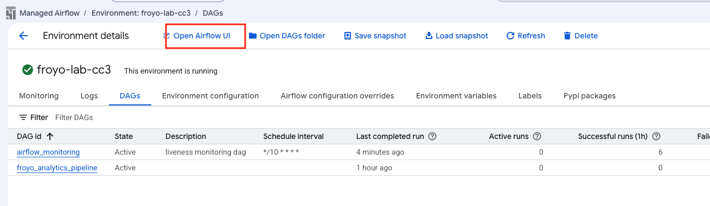   
<br><br>

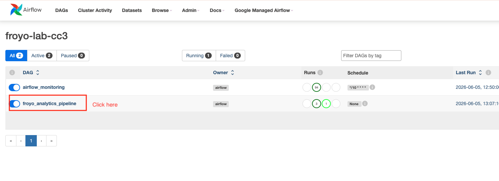   
<br><br>

<hr>


#### 5.5.2. Trigger the DAG

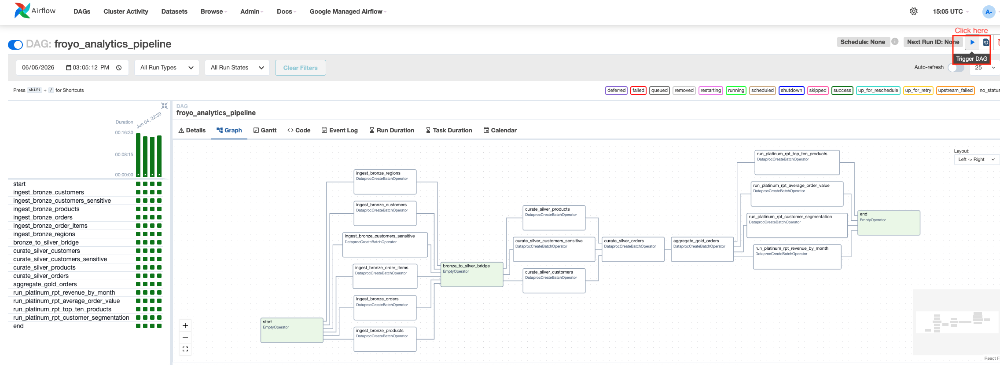   
<br><br>

<hr>

#### 5.5.3. Parallel execution of bronzer layer ingestion tasks

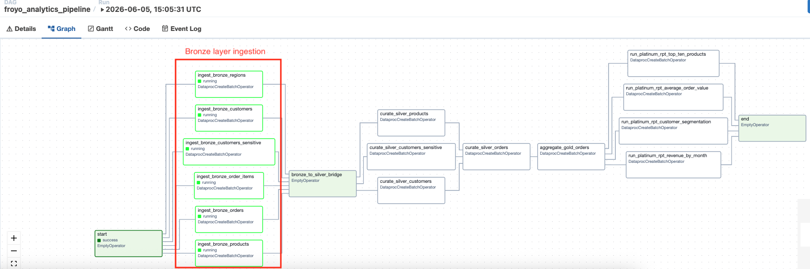   
<br><br>

Click on one of the tasks to get to the logs and trace it to the batch job:
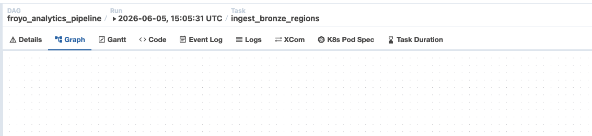   
<br><br>

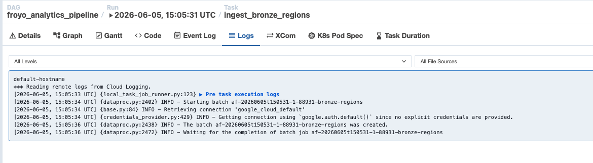   
<br><br>

Navigate to Managed Spark Serverless Batches UI and look up the batch

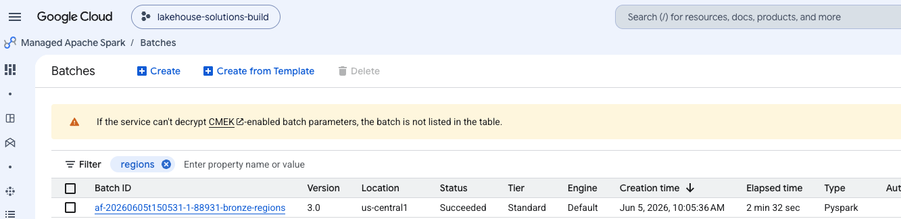   
<br><br>

And the complete list of bronze layer ingestion tasks mapped to Spark batches..

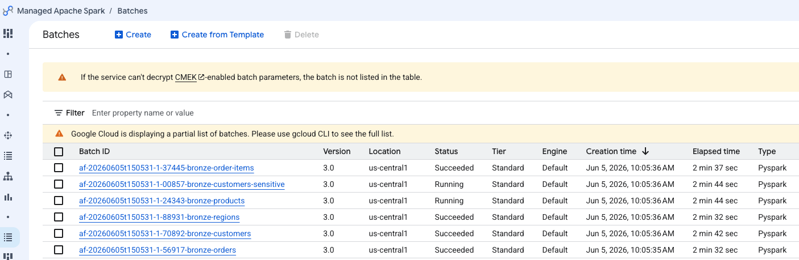   
<br><br>


<hr>


#### 5.5.4. Parallel execution of silver layer curation tasks

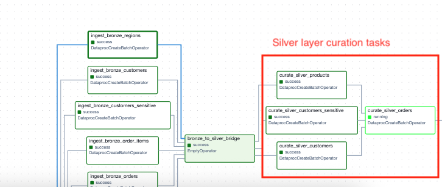   
<br><br>

<hr>

#### 5.5.5. Execution of gold layer aggregation task

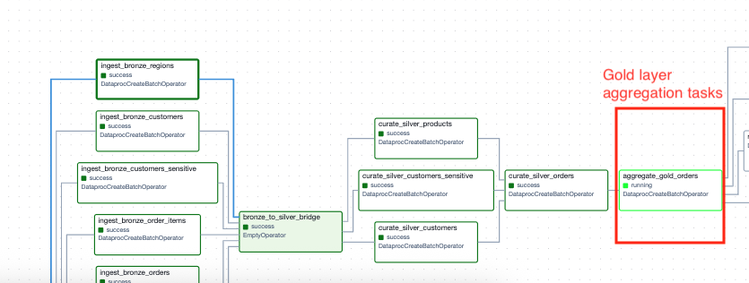   
<br><br>

<hr>

#### 5.5.6. Parallel execution of platinum layer reporting tasks

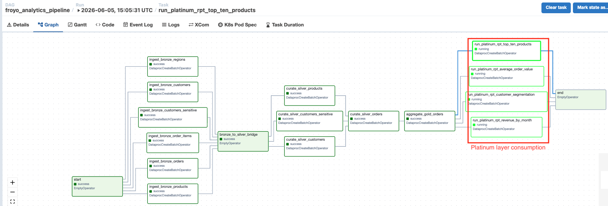   
<br><br>

<hr>

#### 5.5.7. Successfully completed DAG

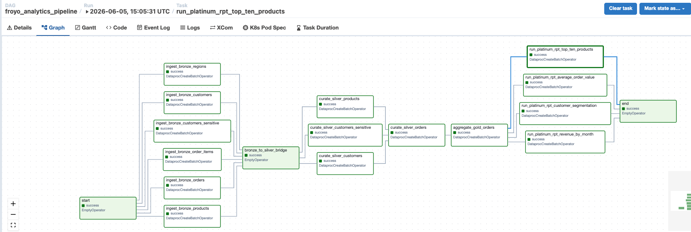   
<br><br>

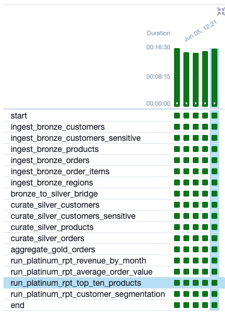   
<br><br>

<hr>

#### 5.5.8. Successfully completed corressponding serverless Spark batches

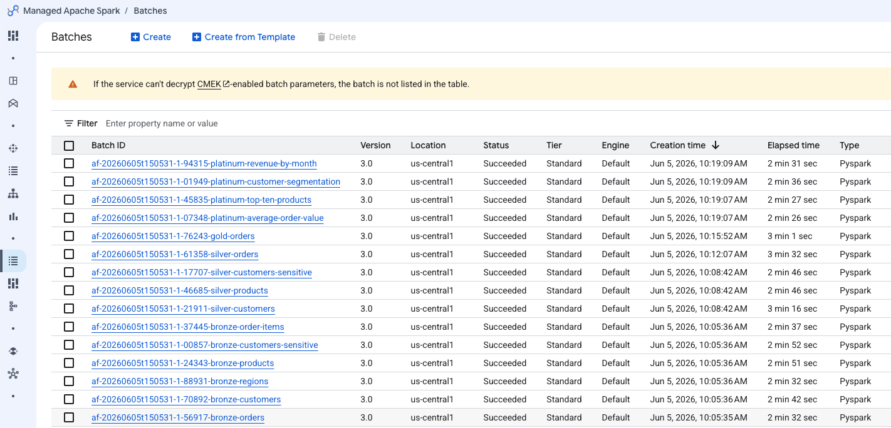   
<br><br>

<hr>

### 5.6. Review a Spark batch job

When you execute a Spark batch via Airflow, the cohort property is automatically added. This can be used for autotuning the Spark batches.

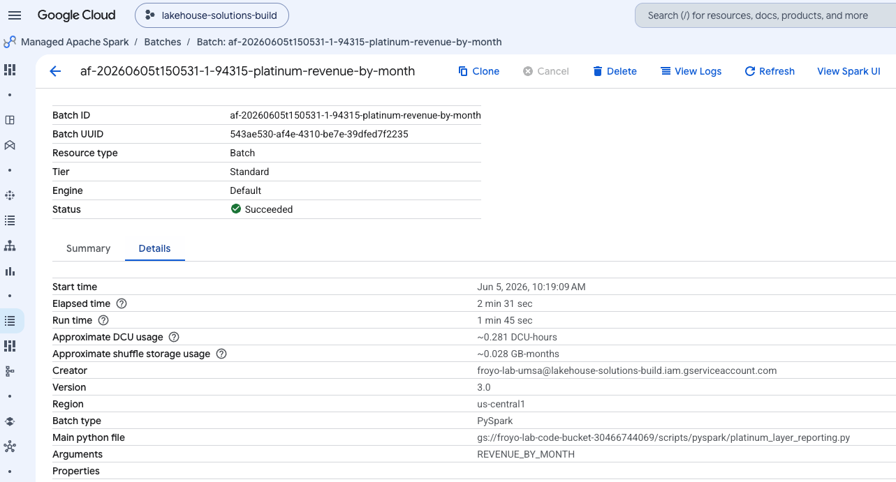   
<br><br>

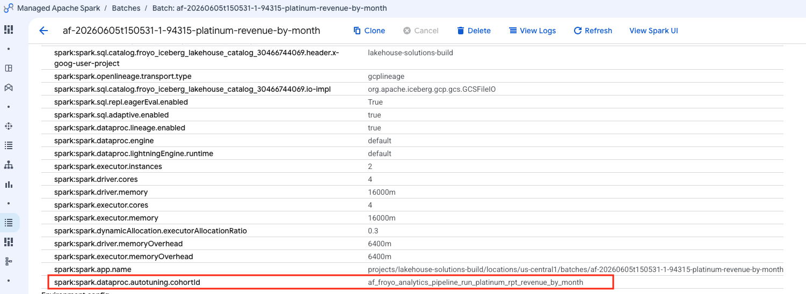   
<br><br>

<hr>

### 5.7. Review lineage of the Iceberg tables in the lakehouse in Knowledge Catalog

When you execute a Spark batch via Airflow, the cohort property is automatically added. This can be used for autotuning the Spark batches.

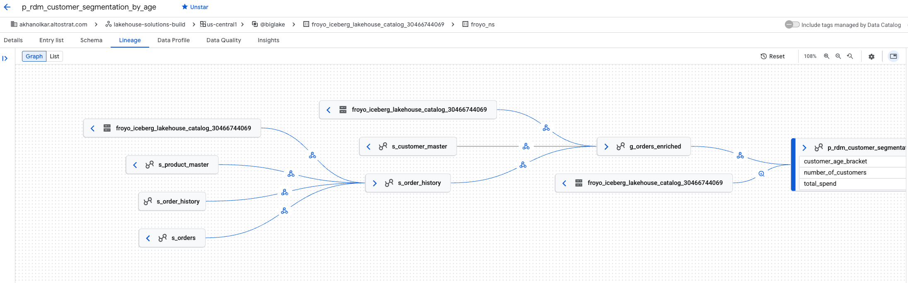   
<br><br>


<hr>


##### =====================================================================================================
##### THIS CONCLUDES THE LAB FOR MANAGED AIRFLOW SERVICE
##### SHUT DOWN THE LAB TO AVOID BILLING UNLESS YOU ARE WORKING ON SUBSEQUENT LABS
##### =====================================================================================================

